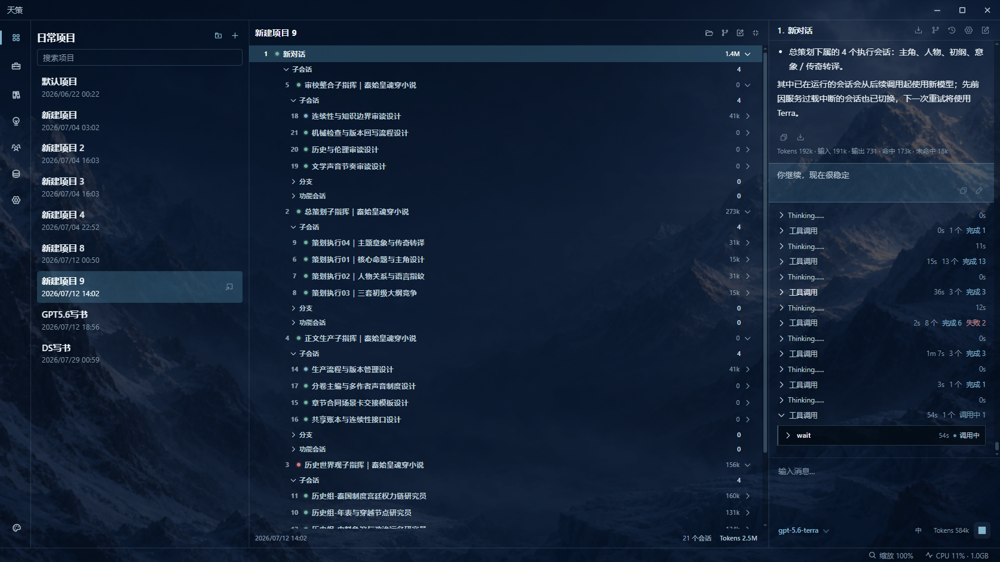
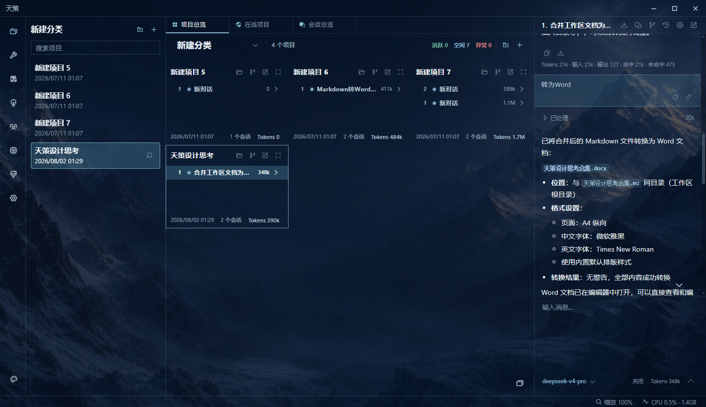

# 天策 Tiance

> 本地优先、过程透明的多项目 Multi-Agent 工作台与 Agent Harness。

让多个 AI 在真实项目中协作，同时把请求、思考、工具、分支、记忆、文件和最终产物留在用户眼前。天策不是藏在聊天框背后的自动化黑箱，而是一套可以查看、介入、追溯和继续工作的桌面环境。不仅仅是前端透明，后端程序结构也一样统一清晰。

[](https://github.com/LikeMirage/Tiance/releases/latest)
[](LICENSE)
[](#当前阶段)
[](#立即开始)

**[下载最新 Windows 版](https://github.com/LikeMirage/Tiance/releases/latest/download/Tiance.zip)** · [查看发布说明](https://github.com/LikeMirage/Tiance/releases/latest) · [阅读设计文档](#继续阅读)



## 为什么是天策

- **多 AI 协作保持可见。** 主会话可以创建、配置和调度多个真实子会话；用户能随时打开任一参与者，查看完整请求、工具调用、回复、失败和 Token 用量。
- **项目不只是聊天容器。** 文件、会话、分支、记忆、工具和生成产物留在同一个工作范围内，AI 可以围绕真实资料持续工作。
- **复杂工具不必侵入核心。** Python 工具、实时前端动作和供应商原生能力分别通过明确的能力桥接入，拥有独立合同、权限和生命周期。
- **本地优先，没有隐藏数据云。** 项目、会话、工具和配置保存在本地可查看目录中；模型请求仍由用户选择的供应商处理。
- **从分析到正式文件交付。** 内置 Markdown 转 Word、Word 精确编辑、Excel、PPT、Git、GitHub、网络搜索和文件工作区工具，不只停留在聊天答案。
- **不同模型可以共同工作。** 每个会话可以选择不同供应商、模型、角色和工具，并继续进入统一的会话关系和用量记录。

## 多智能体协作，不是后台任务列表

天策把普通对话、AI 子任务、会话分支和系统功能会话统一成真实会话。一个 AI 可以创建多个子会话，给它们分配不同模型、角色与工具，并行发送任务、等待结果、读取历史，再继续汇总或交接。

这些参与者不会消失在一个不可见的调度器里：

- 会话树展示父子关系和多级协作；
- 分支看板保留用户编辑、重试和派生路径；
- 请求、思考片段、工具调用、执行时间和用量沿消息顺序展开；
- 后台工作的会话仍可打开、暂停、继续和追溯；
- 长会话通过累计摘要、项目记忆和全局记忆继续向前，而不是到达上下文上限后突然失忆。

项目总览、编辑器与当前对话共同组成三栏工作台：



## Markdown 一键交付为可编辑 Word

内置 **Markdown 转 DOCX** 工具面向正式文档交付，而不是把网页截图塞进 Word。AI 写好 Markdown 后，可以直接转换为 `.docx`；也可以从现有 Word 样本提取模板，继承纸张、页边距、分节、标题与正文样式、字体字号、段落间距、页眉页脚和表格外观。

当前支持：

- 标题、目录、段落、原生列表、任务列表和引用；
- 普通表格、复杂 Excel 表格引用、本地图片与网络图片；
- 链接、脚注、尾注、Mermaid 和块级 HTML；
- 行内公式、块级公式、上下标、分式、根式、极限、积分、求和、矩阵等多种 LaTeX 数学结构；
- 可选 Word 模板与内置默认排版。

### 数学公式优先成为 Word 原生对象

公式会经过 LaTeX 规范化、MathML 转换、Microsoft MML2OMML 变换、结构修复与校验，优先写成 Word 原生 OMML 数学对象。它们可以在 Word 中继续编辑、复制和调整，不是只能观看的公式图片。

对于 Word 难以忠实表达的二维图式，工具会转成高质量图片；仍无法可靠转换时则保留源码并返回警告。转换遵循明确的保真顺序：**原生可编辑优先，视觉保真其次，最后保证信息不被静默丢弃。**

### 表格宽度由内容真正决定

表格不会机械平均分列。转换器使用实际字体和字号测量表头、正文、代码、链接与公式，计算每列最低宽度和理想宽度，再反复模拟“多给某一列一点空间”能够减少多少换行、溢出和行高。

短编号列因此保持紧凑，长说明列和复杂公式获得更多空间；最终宽度会写入 Word 的固定表格网格，避免打开文档后再次被自动布局打乱。这套算法处理的不只是字符数量，而是整张表真正的阅读和排版成本。

当前实现和限制见：[文档转换、预览与文件监听](docs/08_文档转换与文件监听.md)。

## 在界面中查看、引用并精确修改 Word

生成或已有的 `.docx` 可以直接在天策中预览。用户在预览中选中内容并引用到对话后，引用不只有一段模糊文字，还会携带页码、表格行列、单元格段落、字符偏移、前后文和文档版本指纹等结构信息。

**Word 制作编辑**工具可以直接消费这类预览坐标：

- 判断引用是普通文字、Word 原生公式还是混合选区；
- 返回 Markdown 语义内容、稳定公式引用和文档指纹；
- 使用文字锚点、LaTeX、公式引用或表格坐标局部定位；
- 在文档发生变化、旧引用可能失效时明确拒绝，而不是悄悄改到别处；
- 编辑前必须先 `dry_run`，再使用验证令牌提交完全相同的写入；
- 支持带格式文字、正文 Markdown 和 Word 原生公式；
- 默认写入新文件，原位编辑时把备份集中放入工作区工具备份目录。

这使 AI 不必每次扫描整份 Word 再猜测目标。即使目标位于表格单元格中的复杂数学公式，也可以通过稳定引用精确重写内容与格式，并在写入前验证定位结果。

## 使用当前模型的供应商内置网络搜索

天策的 **模型内置网络搜索**不是绑定某一家搜索 API 的特殊按钮。普通工具通过统一的后端供应商能力桥，请求当前会话所用模型、当前协议和当前供应商已经提供的原生网络搜索能力。

当前适配覆盖 OpenAI Responses、Anthropic 和 Gemini 的供应商内置搜索形式。后端负责：

- 选择当前供应商、模型与协议适配器；
- 使用已保存且加密的 API Key；
- 构造各协议真实需要的搜索请求；
- 解析答案、搜索词、来源和引用；
- 独立记录供应商搜索用量；
- 把不同上游错误转换成稳定结果。

工具只获得绑定本次调用的一次性授权，看不到 API Key、供应商配置文件或数据库。供应商不支持当前能力时会明确失败，也不会在用户不知情时偷换模型或搜索服务。

详细设计见：[LLM 协议与供应商](docs/04_LLM协议与供应商.md)。

## 前端能力也通过统一工具桥进入 AI

切换标签页、打开会话、读取当前选择、管理可见会话等动作依赖实时界面状态，不适合硬塞进后端；但让模型执行任意 JavaScript 又会失去安全边界。

天策通过统一的**前端能力桥**解决这个问题：模型仍发起标准工具调用，后端生成唯一请求，前端只把它交给已经登记的白名单执行器，完成后再把结构化结果送回工具循环。

目前这套机制承载的能力包括：

- 查询、创建、配置、停止、删除和显示 AI 会话；
- 向另一个会话发送任务，选择立即返回或等待结果；
- 切换项目、会话与编辑器标签页等实时界面动作；
- 把 AI 创建的任务继续纳入真实会话树、分支、状态和用量体系。

前端桥不依赖某个页面偷偷暴露函数，也不允许工具提交任意脚本。调用名必须预先登记，重复、未知、过期或已经完成的请求会被明确拒绝。页面只负责界面编排，真正的数据权限仍由后端保证。

详细设计见：[前端能力桥与桌面壳](docs/06_前端能力桥与桌面壳.md)。

## 三条能力桥，各自保持边界

| 能力桥 | 连接范围 | 解决的问题 |
| --- | --- | --- |
| Python 工具运行桥 | 后端工具循环 ↔ 独立 Python 进程 | 独立运行、JSON 合同、依赖隔离和超时控制 |
| 前端能力桥 | 后端工具循环 ↔ 前端白名单执行器 | 安全使用标签页、会话和实时界面状态 |
| 后端供应商能力桥 | 工具进程 ↔ 供应商协议适配层 | 不暴露密钥地复用当前供应商原生能力 |

三条桥共享标准工具结果，但不共享信任边界。新增能力优先扩展对应桥与适配器，不把供应商判断、页面状态或任意系统操作散落进聊天流程。这也是天策作为 Agent Harness 的核心：能力可以组合，边界不能糊成一团。

## 工具、项目和在线市场

工具是拥有清单、参数 Schema、案例、程序、资源、依赖和测试的独立项目。每个 Python 工具可以拥有自己的依赖目录，避免把所有包混进同一个共享环境；动态工具还可以先注入简要目录，等 AI 真正需要时再读取完整参数和案例。

天策目前把普通项目、知识、经验、角色、主题、工具和供应商放入统一的 GitHub 在线市场结构。公开内容可以从共享仓库获取，私人内容可以通过 GitHub 授权读取；下载后的内容仍然是本地可查看、修改、对话和版本管理的真实项目。

软件自身也通过 GitHub Releases 发布。独立更新器只替换程序文件，不覆盖项目、会话、密钥、工具配置和主题等用户数据。

## 立即开始

当前正式发布主线为 Windows。发布包已经包含内置 Python、后端依赖和编译后的前端，无需另外安装 Python 或 Node.js。

1. 下载并解压 [最新 Windows 发布包](https://github.com/LikeMirage/Tiance/releases/latest/download/Tiance.zip)。
2. 保留完整目录结构，双击根目录的 `Tiance.exe`。
3. 在模型集中添加自己的供应商与 API Key，然后创建项目和会话。

也可以直接克隆源码运行：

```powershell
git clone https://github.com/LikeMirage/Tiance.git
cd Tiance
```

随后双击 `Tiance.exe`。通过 Git 克隆的源码工作区应继续使用 Git 更新；带有 `.git` 的目录不会被软件覆盖安装。

## 当前阶段

天策仍在持续开发，更适合希望试用、研究或共同改进本地 AI Agent 工作台的人，还不是接口和数据格式已经长期冻结的稳定产品。当前没有可直接运行的 macOS 或 Linux 发布包。

项目从 2026 年 4 月底开始迭代，2026 年 8 月 2 日首次系统整理并开放源码。项目由业余产品经理主导，主要借助 AI 编程完成；现有自动化测试与 AI 审查不能替代专业人工安全审计。

当前测试覆盖项目与会话、并发运行、工具调用、分支、引用、供应商协议、文档转换和更新流程等关键路径。测试数量会随代码变化，因此不在 README 固定记录；测试通过不等于没有缺陷，但所有正式发布都应先通过对应验证。

知识集和经验集目前沿用普通项目骨架，专用功能尚未开始；README 只描述当前已经存在的能力，不用未来规划填充功能清单。

## 源码开发

天策没有另做一套与正式运行割裂的“开发版”。桌面壳启动时会优先连接本机前端开发服务；没有检测到开发服务时，才使用 `2_ReactWeb/dist` 中的构建结果。后端和桌面壳默认继续使用仓库内置环境。

前端要求 Node.js `>= 22.12.0`，包管理器统一使用 pnpm：

```powershell
cd 2_ReactWeb
pnpm install
pnpm dev
```

基础验证：

```powershell
cd 2_ReactWeb
pnpm check
pnpm test:conversation-state
pnpm build
```

后端和桌面壳分别使用 Python `>= 3.11`。真实环境变量以三个示例文件为准：

- `1_PythonServer/.env.example`
- `2_ReactWeb/.env.example`
- `3_PyWebView/.env.example`

## 仓库结构

| 目录 | 职责 |
| --- | --- |
| `1_PythonServer/` | FastAPI 后端：项目、会话、模型、工具、记忆、市场和文件业务 |
| `2_ReactWeb/` | React 前端：三栏工作台、看板、编辑器、预览和前端能力桥 |
| `3_PyWebView/` | 桌面壳：窗口、后端生命周期和有限操作系统能力 |
| `Data/` | 内置项目、主题、工具与供应商定义；本地运行时承载用户数据 |

三个部分的边界是有意保留的：后端保存业务事实，前端组织人的视线，桌面壳只承担浏览器做不到的系统能力。统一不靠把所有职责塞进同一个进程。

## 像晶体一样生长

天策采用一种近似晶体生长的结构。不同项目集共享同一个基本单元，也遵循相同的连接规则。新的能力不是作为附件挂在系统外面，而是从已经成立的项目、会话、工具和关系中继续生长。

这种统一不等于抹平差异。角色、主题、工具和供应商使用适合自己的文件与界面，项目层只提供共同的身份、生命周期和 AI 工作空间。普通用户、专业用户和开发者看到的是不同“晶面”，下面连接的仍是同一批真实项目、会话、文件、工具和运行状态。

## 继续阅读

- [文档索引](docs/00_文档索引.md)
- [系统架构与运行边界](docs/01_系统架构与运行边界.md)
- [项目、会话与存储](docs/02_项目会话与存储.md)
- [模型上下文、压缩与记忆](docs/03_模型上下文与记忆.md)
- [LLM 协议与供应商](docs/04_LLM协议与供应商.md)
- [工具系统、动态加载与权限](docs/05_工具系统与权限.md)
- [前端能力桥与桌面壳](docs/06_前端能力桥与桌面壳.md)
- [在线市场与 GitHub](docs/07_在线市场与GitHub.md)
- [文档转换、预览与文件监听](docs/08_文档转换与文件监听.md)
- [开发、验证与发布](docs/09_开发验证与发布.md)
- [当前限制与风险边界](docs/11_当前限制与风险边界.md)

## 许可

本项目使用 [Apache License 2.0](LICENSE)。
