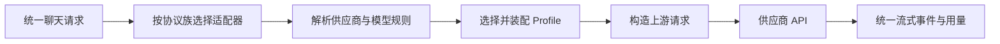

# LLM 协议适配：协议、供应商与模型差异如何共存

> 实现基线：2026-08-15。

“兼容 OpenAI”经常只意味着接口长得相似。真实接入时，URL、认证、消息结构、思考参数、最大输出字段、工具调用、流式事件和用量统计都可能不同；同一供应商的不同模型还会继续分化。如果把这些判断散落在聊天业务中，增加一个小供应商就会修改整条调用链。

天策把差异拆成三层：协议适配器、供应商 Profile、声明式规则。三层共同工作，但各自只解决一种问题。

## 第一层：协议适配器

协议适配器回答“请求和响应长什么样”。当前主要协议族包括：

- OpenAI Chat Completions 兼容协议；
- OpenAI Responses 协议；
- Anthropic Messages 协议；
- Gemini GenerateContent 协议。

适配器把天策内部统一的消息、工具、思考、输出格式和生成参数转换为上游请求，再把普通响应或流式事件还原成统一的文本增量、思考增量、工具调用、用量和错误。

聊天、记忆、工具循环不应该知道 Anthropic 的 `tool_use`、Gemini 的 `functionCall` 或 Responses 的 output item。它们只消费统一领域对象。

工具调用续传有一个明确例外：Responses 的加密 reasoning item、Anthropic 的 thinking signature / redacted block、Gemini 的 thought signature 都是继续同一工具轮所必需的协议状态。天策用内部 `protocol_continuation` 保存这些不透明内容，并随助手工具调用消息一起持久化。它不会进入前端消息合同、导出正文或普通预览；只有协议族、供应商 ID、模型 ID 和版本全部匹配时，适配器才会回放。切换供应商或模型后只重组公共消息和工具历史，不会转发旧上游的私有状态。

流式完成也由协议证据决定，而不是由“连接已经结束”决定：OpenAI Compatible 需要 `[DONE]` 或明确的 `finish_reason`，Responses 需要 completed 事件，Anthropic 需要 `message_stop`，Gemini 需要候选结果的 `finishReason`。提前 EOF 会返回稳定错误码 `upstream_stream_incomplete`，不会把部分回答保存成正常完成。

## 第二层：供应商 Profile

同一种协议下仍有无法靠几个开关表达的结构转换。例如 DeepSeek 或火山引擎的思考参数转换、Responses 的消息阶段、特殊用量解析和供应商特有请求结构。

Profile 是少量代码执行器。它可以：

- 改写 OpenAI 兼容或 Responses 请求体；
- 解析供应商特殊用量；
- 控制思考内容是否回传；
- 处理必须由程序完成的结构变化。

Profile 不再是所有差异的杂物间。能用数据声明的差异应该离开代码，进入供应商自己的规则文件。

## 第三层：声明式规则

每个供应商项目可以包含：

```text
provider.json
credentials.json
models.json
cloud-model-cache.json
provider-rules.json
model-rules.json
```

其中 `provider-rules.json` 声明供应商级差异，`model-rules.json` 声明模型家族与精确模型的覆盖。当前合并顺序为：

```text
供应商规则 → 模型家族规则 → 精确模型规则
```

后面的明确值覆盖前面的值，未声明字段继续继承。模型通过 `models.json` 的 `familyGroup` 连接家族规则；不需要家族差异时可以完全不配置这一层。

规则分为三组：

- **能力规则**：思考模式、采样参数、最大输出、工具调用、输入模态、输出格式；
- **请求规则**：删除参数、最大输出字段名、JSON 输出、流式用量；
- **行为规则**：思考内容回传、Responses 消息阶段、联网来源字段、提示词缓存有效期。

未知字段会被拒绝，避免拼写错误被静默忽略。供应商项目声明的 `profileId` 也必须与正在使用的 Profile 匹配，防止一份规则误套到另一种转换器上。

聊天请求在真正调用上游前还会用合并后的能力做后端校验。输出格式、思考档位、采样参数、最大输出范围和工具调用若超出能力合同，请求会在边界处失败；前端禁用控件只是交互提示，不再承担最终约束。生成参数只有 `generation` 一个事实源，旧的顶层 `temperature` / `max_tokens` 已退出请求合同，避免同一设置出现两种值时被静默择一。

## 一次请求如何经过三层



以 OpenAI 兼容请求为例：适配器先按模型解析 Profile；声明规则可删除不支持的采样参数、选择输出 Token 字段并开启流式用量；Profile 再完成需要代码的思考结构转换；响应返回后由同一个 Profile 解释用量和思考字段。

## 为什么供应商在线市场有意义

供应商项目不再只是地址和模型名单。它可以流通：

- 正式名称、协议族和 Profile 身份；
- 默认 API 地址与认证方式；
- 模型清单及能力标签；
- 供应商、家族和精确模型的声明式适配知识。

因此社区可以共同补齐小供应商和特殊模型，而不必每次修改聊天核心代码。市场包不包含 `credentials.json`；更新时保留本地加密密钥、本地启用状态和不受市场管理的本地模型。

## 当前边界

四种聊天协议现在共享统一生成参数、能力校验、终态错误合同和工具续传状态合同。声明式能力规则会进入聊天前的最终校验；OpenAI Compatible 与 Responses 的请求规则继续在各自出站阶段执行。

Anthropic 与 Gemini 仍由各自适配器构造原生字段，不能把当前 OpenAI 形状的请求规则（例如 `max_tokens` 字段改名或 `stream_options`）机械套入。模型发现、探测和部分内置联网行为也是独立操作，尚未共享全部聊天请求规则。因此准确结论是：**聊天合同已经收口；规则按协议执行，不存在一个把所有操作和协议强塞进去的总网关，非聊天操作的规则覆盖仍需按真实需求继续补齐。**

## 实现索引

- 规则领域对象：`1_PythonServer/app/domain/llm/provider_adaptation.py`
- 规则解析与合并：`1_PythonServer/app/repositories/llm/provider_adaptation_rules_repository.py`
- Profile 注册：`1_PythonServer/app/infra/llm/provider_profiles/registry.py`
- 声明规则执行：`1_PythonServer/app/infra/llm/provider_profiles/declared_rules.py`
- 协议适配器：`1_PythonServer/app/infra/llm/chat_adapters/`
- 续传状态匹配：`1_PythonServer/app/infra/llm/chat_adapters/continuation.py`
- 聊天能力强校验：`1_PythonServer/app/services/llm/chat/request_validation.py`
- 会话续传状态持久化：`1_PythonServer/app/repositories/project/conversation_serialization.py`
- 供应商项目：`Data/providers/<provider_id>/`
