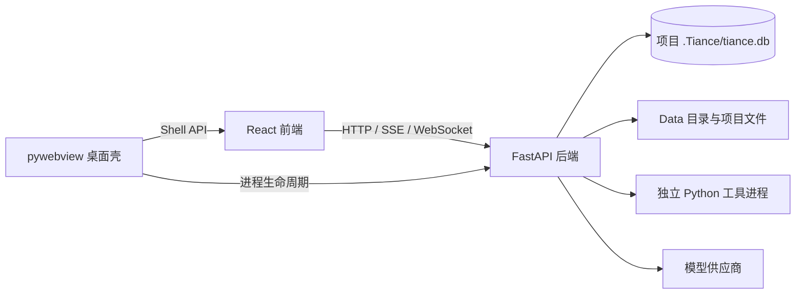

# 系统架构与运行边界

> 当前实现基线：`0.3.23`。

## 三个运行部分

| 部分 | 目录 | 当前职责 |
| --- | --- | --- |
| FastAPI 后端 | `1_PythonServer/` | 项目、会话、模型请求、工具、记忆、市场、文件和持久化 |
| React 前端 | `2_ReactWeb/` | 工作台、编辑器、预览、页面状态、会话流和 client tool 执行器 |
| pywebview 桌面壳 | `3_PyWebView/` | 创建窗口、选择后端端口、管理后端进程、系统托盘、更新器和有限本机能力 |

`Data/` 保存预置与本地内容，`runtime/` 保存随包运行时，`system/` 保存版本和更新相关文件。正式安装包会包含这些目录以及编译后的 `2_ReactWeb/dist/`。

## 启动流程

1. `Tiance.exe`/launcher 确认安装目录和版本文件。
2. 桌面壳按配置选择嵌入式 Python，并在 `18000-18020` 中选择后端端口。
3. 后端通过 `/health` 对外提供就绪检查。
4. 桌面壳优先尝试 `TIANCE_FRONTEND_DEV_URL`（默认 `127.0.0.1:18100`）；不可用时加载 `2_ReactWeb/dist`。
5. 前端通过启动参数或环境配置确定 API 根地址，随后建立 HTTP、SSE 或 WebSocket 连接。

开发服务器优先属于当前实现，不是文档建议。正式打包或安全敏感环境不应在同一端口运行无关服务，具体限制见[当前限制与风险边界](11_当前限制与风险边界.md)。

## 职责边界

- 后端保存业务事实；前端状态只是展示和交互投影。
- 前端分页、折叠、虚拟列表和缓存不得改变模型上下文或持久化事实。
- 桌面壳只提供浏览器无法完成的本机能力，不应承载项目业务规则。
- 供应商差异放在协议适配器、Profile 和声明规则中，不应散落到页面或通用会话流程。
- 具体工具不应通过特殊消息类型或数据库字段获得通用层特权。

## 主要连接

## 配置来源

三个 `.env.example` 只展示可配置项，不是版本事实源：

- `1_PythonServer/.env.example`
- `2_ReactWeb/.env.example`
- `3_PyWebView/.env.example`

下层不得在收到上层显式值后再自行替换。生产运行至少应固定回环监听、前端来源、更新来源和 GitHub App 配置。

## 实现索引

- 后端入口：`1_PythonServer/app/main.py`
- 后端设置：`1_PythonServer/app/core/config.py`
- 路由汇总：`1_PythonServer/app/api/router.py`
- 前端入口：`2_ReactWeb/src/main.tsx`
- 前端应用组合：`2_ReactWeb/src/app/App.tsx`
- 桌面入口：`3_PyWebView/app/main.py`
- 桌面运行时：`3_PyWebView/app/runtime.py`
- 桌面配置：`3_PyWebView/app/config.py`
