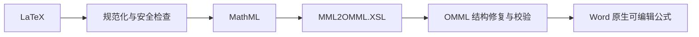

# Markdown 转 Word：从 LaTeX 到原生可编辑公式

> 实现基线：2026-08-02。对应内置工具 `md2docx`。

Markdown 转 Word 很容易做成“看起来成功”：解析几种标题，把公式截图塞进去，遇到复杂内容静默跳过。真正困难的是交付一个仍然可以在 Word 中继续编辑、排版和审阅的文档，并在不能可靠转换时明确告诉用户。

天策的转换器把问题拆成三部分：理解 Markdown、继承 Word 排版、为特殊内容选择最合适的表示。数学公式是其中最能体现这一思路的一环。

## 转换目标

当前工具支持标题、目录、段落、原生列表、任务列表、引用、表格、本地和网络图片、链接、脚注、尾注、Mermaid、块级 HTML 与数学公式。它还可以从现有 DOCX 样本提取模板，包括纸张、页边距、分节、正文与标题样式、字体字号、行距缩进、分页控制、页眉页脚、文档设置和表格样本。

这意味着转换不是把 Markdown 套进一份固定白纸，而是可以沿用组织已有的 Word 外观。

## 公式为什么不能一律转图片

公式截图在视觉上最省事，但会丢掉：

- Word 内继续编辑公式的能力；
- 字号、行内/块级位置和版式适配；
- 搜索、复制和辅助技术读取；
- 与正文一致的数学字体和对象结构。

Word 的原生数学对象使用 OMML，而 Markdown 常见输入是 LaTeX。两者并不是简单字符串替换。天策采用一条中间语义链：

### 第一步：先判断能否忠实转换

转换器先检查括号、环境、`left/right` 配对和不适合直接进入 Word 的命令。常见扩展会被规范化，例如前置上下标、广义分式、颜色、边框和取消线。无法可靠解释的命令不会被假装成功。

### 第二步：借 MathML 过桥

成熟的 LaTeX 解析器先把公式变成 MathML。随后使用 Microsoft 的 `MML2OMML.XSL` 转成 Word 所需的 OMML。这样不需要手写一套不完整的 LaTeX 到 Word 语法树转换器。

### 第三步：修复并验证 Word 结构

机械 XSLT 结果仍可能包含空的求和操作数、缺失的必需节点或不符合 Word 内容模型的结构。转换器会补齐可确定的必要节点，再用专门的 OMML 校验器检查。只有通过校验的对象才进入文档。

## 三层保真降级

真正巧妙之处不只是“能转”，而是失败路径也有明确层次：

1. **优先原生 OMML**：普通数学公式成为可编辑 Word 对象。
2. **复杂图式转高质量图片**：如交换图、`tikzcd`、`xymatrix` 等 Word 难以忠实编辑的二维结构，交给 KaTeX/浏览器渲染。
3. **保留 LaTeX 源码并报警告**：解析或校验仍失败时，不静默丢失，不伪造一个看似正确的公式。

这是一条“可编辑优先、视觉保真其次、信息不丢失兜底”的交付阶梯。

## Mermaid、HTML 和图片

Mermaid 与块级 HTML 天生更适合浏览器布局。工具使用内置浏览器渲染资源生成图片，再写入 DOCX。远程图片下载会限制协议、大小和超时；本地图片按工作区规则读取。图片失败时会留下占位或警告，而不是生成一份表面完整但缺图的文件。

## Word 模板不是简单复制样式名

同名的“标题 1”在不同模板中可能拥有完全不同的字体、段前段后、编号和分页规则。模板提取会读取真实样式与页面设置，再由转换器把 Markdown 语义映射到这些样式。表格还要考虑单元格宽度、跨列、长文本和页面可用宽度，不能只把二维数组写进文档。

## 包级后处理与验证

DOCX 本质是一个包含多份 XML、关系和媒体资源的 ZIP 包。生成完成后，工具会检查关系引用、包结构和关键内容，执行必要后处理并汇总警告。测试覆盖公式结构、复杂边界、模板、表格布局、远程图片、回归样例和包安全。

## 为什么它也是标准工具示例

`md2docx` 自己拥有 `.tool/tool.json`、输入输出 Schema、案例、程序、资源、依赖和测试。天策后端只负责按标准工具合同启动它、传入 JSON 并收回结果，不在聊天服务里硬编码“Word 转换”。这使复杂业务仍能保持为一个可分享、可更新的工具项目。

## 当前边界

- Word 目录字段可能需要在 Word 中刷新后显示最终页码。
- 浏览器渲染的复杂图式不是可编辑 OMML。
- 不能保证任意第三方 LaTeX 宏或任意 HTML/CSS 都能等价转换。
- “生成成功”与“版面符合特定组织标准”是两件事，正式交付仍应打开检查。

## 实现索引

- 工具项目：`Data/tools/e76a4e0a-205d-50c4-8415-081cdaa49d39/`
- 转换服务：`1_PythonServer/app/services/document_conversion/markdown_docx/`
- 公式转换：`formula_converter.py`
- 公式写入与降级：`formula_writer.py`
- LaTeX 扩展：`latex_extensions.py`、`latex_diagrams.py`
- OMML 校验：`omml_validation.py`
