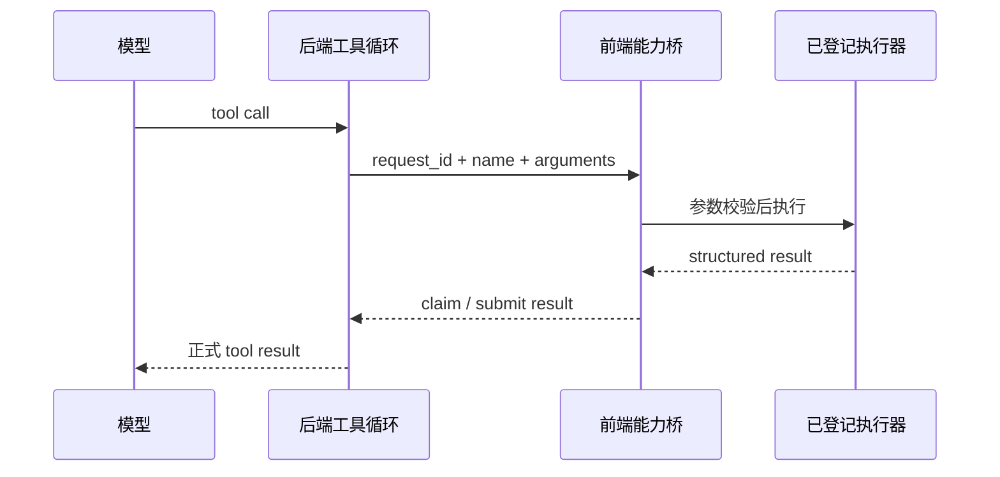

# 前端能力桥与桌面壳

## client tool 链路

有些能力依赖实时界面状态，例如打开标签、显示会话或读取当前编辑器选择。模型仍发起标准工具调用，后端创建 `client_tool_request`，前端按预先登记的能力名执行并提交结果。

能力名不是任意 JavaScript 函数名。前端注册表拒绝重复能力，未登记能力失败。项目归属必须来自工具调用上下文；当前可见项目只能影响纯 UI 展示，不能作为业务写入的兜底身份。

## 生命周期

后端维护等待请求、领取和结果提交。前端用单飞表避免同一进程内重放造成重复执行。取消等待不等于回滚已经完成的文件、会话或界面动作。

当前实现仍需要加强多执行器身份、请求租约和断线收敛。任何网页或窗口都不能仅凭自报 `executor_id` 获得高权限结果提交能力。

## 桌面 Shell API

pywebview 向前端暴露有限本机接口，包括窗口控制、原生文件/目录选择、路径显示或打开、托盘和更新相关动作。前端业务不应在各 feature 中直接读取 `window.pywebview`；应通过共享 desktop bridge 统一检测能力、处理失败和约束参数。

## 桌面启动和关闭

- 桌面壳选择后端端口并管理后端子进程。
- 前端开发服务可用时优先加载，否则使用 `dist`。
- 关闭时依次停止看门狗、托盘、后端、HTTP 客户端和安装锁。
- 每个清理动作都应独立保护，前一项失败不能跳过后续资源释放。

## 信任边界

回环地址不是身份认证。正式运行必须把前端页面、当前后端实例和 Shell API 绑定到同一次启动，不能只信任 `localhost`、`file://` 或某个固定开发端口。

HTTP CORS 不保护 WebSocket。WebSocket、client tool claim/result、供应商配置和本机文件接口需要自己的会话身份与来源校验。

## 实现索引

- 后端 client bridge：`1_PythonServer/app/services/tools/client_tool_bridge.py`
- client 路由：`1_PythonServer/app/api/routes/llm/client_tools.py`
- 前端注册表：`2_ReactWeb/src/features/client-tools/model/clientToolBridge.ts`
- 前端桌面能力组合：`2_ReactWeb/src/features/desktop-shell/`
- 桌面 HTTP 服务：`2_ReactWeb/src/services/desktop/`
- 桌面 API：`3_PyWebView/app/api.py`
- 桌面运行时：`3_PyWebView/app/runtime.py`
- 桌面启动：`3_PyWebView/app/main.py`
