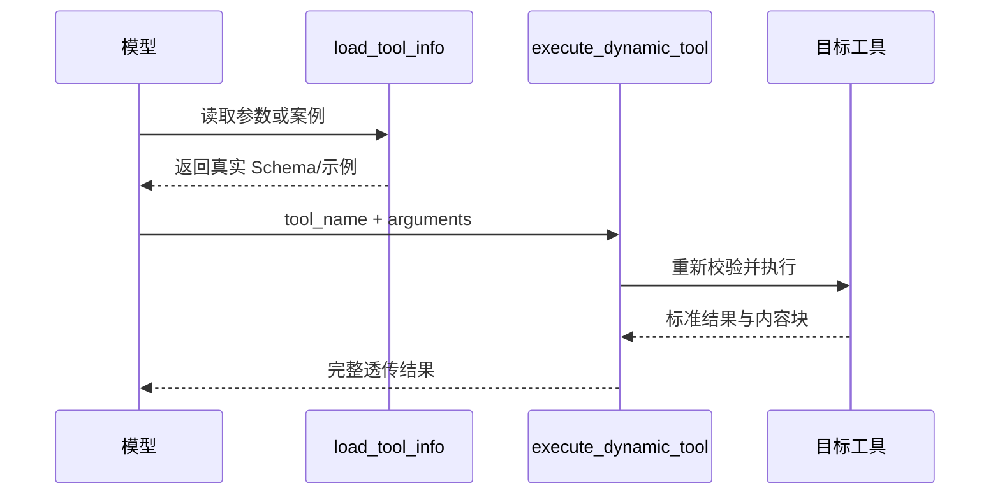

# 动态工具加载：缩小上下文而不绕过合同

> 实现基线：2026-08-02。

工具越多，模型每轮请求携带的工具说明和 JSON Schema 越大。把几十个复杂工具全部放进协议的 `tools` 字段，会消耗上下文、增加选择噪音，也会降低提示词缓存的稳定性。

动态加载的目标只是减少这部分初始体积。它不是新的权限系统，也不是让模型用文本偷偷调用未声明工具。

## 两种注入方式

普通工具 `loading.dynamic=false` 时，完整名称、说明和输入 Schema直接进入模型协议。

动态工具 `loading.dynamic=true` 时，初始请求只加入一份轻量目录：显示名称、摘要、参数名和案例标题。完整参数与案例不进入正式工具列表。

如果当前会话启用了动态目标，系统会自动加入两个基础设施工具：

- `load_tool_info`：读取目标的完整参数或案例；
- `execute_dynamic_tool`：以目标调用名和真实参数对象执行目标。

## 完整调用闭环

模型已经在本会话历史中读取过完整参数时，可以直接执行；否则应先加载。轻量目录中的参数名只用于判断相关性，不能作为参数结构、默认值和必填规则的依据。

## 为什么不能直接动态注册工具

一种看似更自然的方案，是模型说“加载 X”后让后端在下一轮临时把 X 塞进 `tools`。但这会改变请求前缀、增加协议状态机，也要求不同供应商都可靠支持中途变化的工具集合。

天策选择稳定的包装入口：模型始终调用正式存在的 `execute_dynamic_tool`，目标工具名只是经过校验的参数。这样所有协议适配器仍然只处理标准 tool call。

## 不可绕过的校验

动态执行仍然检查：

- 目标确实标记为动态；
- 工具全局启用；
- 当前会话启用；
- 调用名存在且唯一；
- 参数符合目标 `input.schema.json`；
- 运行入口、超时和结果合同有效。

包装层还必须保留目标结果的 `content` 与 `structuredContent`，否则图片等富媒体会在动态路径中丢失。

## 什么时候适合动态加载

适合：

- Schema 很大，但使用频率不高；
- 案例很多，只有在选中工具后才有价值；
- 多个复杂办公工具同时启用；
- 工具意图容易通过短摘要区分。

不适合：

- 每轮几乎都要调用的核心工具；
- 参数极少，动态包装反而增加一次调用；
- 工具之间摘要高度相似，模型必须看到完整 Schema 才能选择；
- 基础设施工具自身。

## 当前边界

动态加载减少的是初始说明和 Schema Token，不会减少目标执行本身的时间，也不保证模型一定遵循“先读取再执行”。可靠性来自执行器拒绝无效调用，而不是只依靠提示词。

## 实现索引

- 动态合同：`1_PythonServer/app/services/tools/dynamic_tool_contract.py`
- 聊天注入：`1_PythonServer/app/services/tools/chat_tool_injection.py`
- 工具注册索引：`1_PythonServer/app/services/tools/tool_registry.py`
- 基础设施工具：`Data/tools/` 中的 `load_tool_info` 与 `execute_dynamic_tool`
