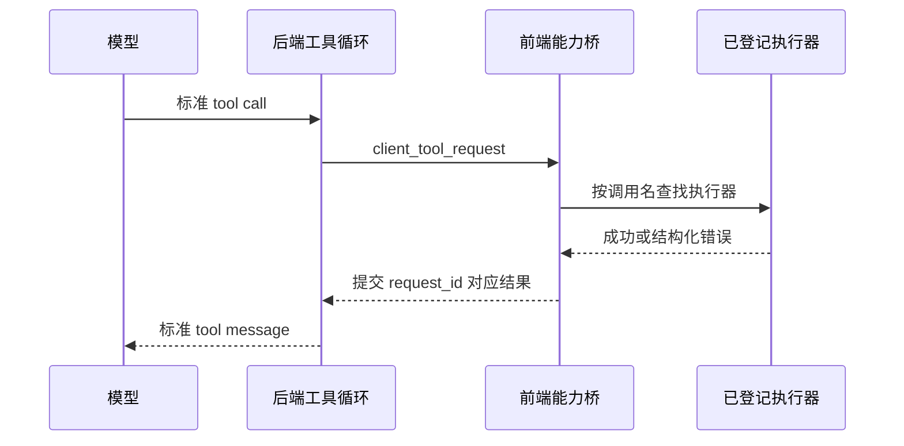

# 前端能力桥与会话管理工具

> 实现基线：2026-08-02。

有些能力只能在浏览器界面里完成：切换编辑器标签、打开某个会话、读取当前工作区选择、让另一个可见会话开始运行。把这些动作搬进后端会失去真实前端状态；让模型直接执行任意 JavaScript 又会失去安全边界。

天策使用“前端能力桥”：模型仍然发起标准工具调用，后端只把经过登记的 client 工具请求送到前端，前端执行后再提交标准结果，工具循环随后继续。

## 一次 client 工具调用

后端为每次请求生成唯一 `request_id`，保存调用 ID、工具名、参数以及项目、会话和模型上下文，并等待结果。提交只能成功一次；未知、超时、已经提交或已经结束的请求会被拒绝。连接恢复时，只有仍在等待且未提交的请求才允许重放。

client 工具在进入前端能力桥之前先经过与 Python 工具相同的参数权限检查。策略为禁止时不会创建前端请求；策略为询问时，用户允许后才向前端发送请求，拒绝则直接形成标准工具失败结果。权限判断因此位于通用执行边界，不依赖某个前端执行器自己记得弹窗。

前端在启动时建立显式注册表。调用名重复会立即失败，未登记的名字返回明确错误，不会被当作任意函数名执行。

## 会话管理为什么属于前端工具

会话的持久化接口在后端，但“当前用户正在看哪个项目、应该把哪个会话展开、切换后如何刷新界面”属于前端状态。`manage_ai_conversations` 把稳定后端操作与真实界面反馈编排在一起。

当前支持的主要动作包括：

- 查询可用模型；
- 为父会话自动命名；
- 列出相关会话或整个项目会话；
- 读取会话摘要、完整消息和用量；
- 以当前会话为父节点创建 AI 子会话；
- 配置目标会话的模型、角色和工具；
- 停止、删除或显示目标会话。

删除必须显式确认；工具调用尚未返回时不能停止或删除自己。创建的会话会标记为 AI 创建并进入真实分支图，不是隐藏任务 ID。

`interact_ai_conversation` 负责向目标会话发送消息。它可以只发出任务立即返回，也可以等待目标会话完成本轮回复。来源会话会被记录，目标会话按普通后台运行机制启动或恢复，运行状态和用量仍然进入统一会话体系。

## 多 AI 协作因此保持可见

主会话可以：

1. 创建多个子会话；
2. 为它们选择不同模型、角色或工具；
3. 分别发送任务；
4. 等待其中部分结果；
5. 读取其它会话完整历史；
6. 汇总后继续调度。

用户可以随时在会话树或分支看板中打开这些子会话，查看请求、工具调用、回复和失败。协作能力来自会话间关系，不来自一个不可见的“多智能体黑箱”。

## 安全边界

- client 工具必须预先登记；
- 前端只执行确定动作，不解析任意脚本；
- 后端保持唯一等待请求与超时；
- 结果按标准工具合同回填；
- 前端隐藏按钮不是权限，真正数据操作仍调用后端接口；
- 自停止、自删除、重复提交等生命周期风险有明确拒绝逻辑。

## 当前边界

前端能力桥依赖当前桌面/网页前端保持连接。窗口关闭、刷新或网络中断会让等待中的 client 工具失败或等待重连；它不适合承担必须在无人值守后端长期执行的任务。

## 实现索引

- 后端等待与提交：`1_PythonServer/app/services/tools/client_tool_bridge.py`
- 前端注册表：`2_ReactWeb/src/features/client-tools/model/clientToolBridge.ts`
- 会话管理执行器：`2_ReactWeb/src/features/client-tools/model/conversationManagementClientTool.ts`
- 会话交互执行器：`2_ReactWeb/src/features/client-tools/model/conversationInteractionClientTool.ts`
