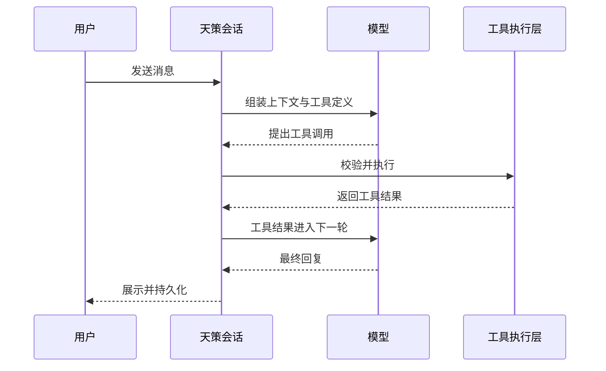
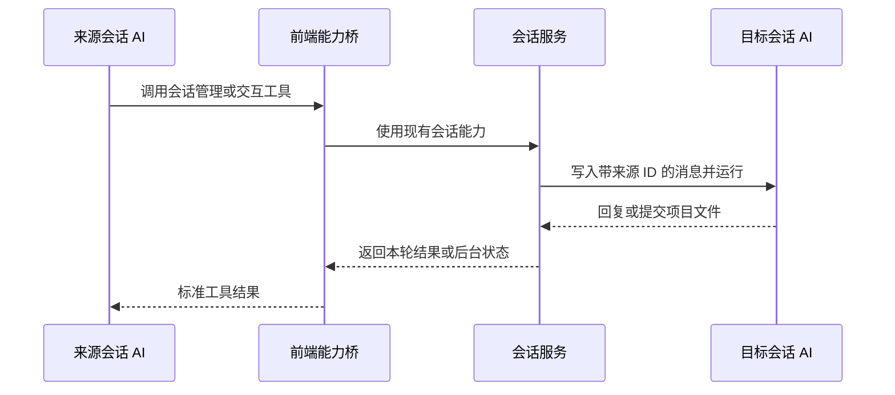
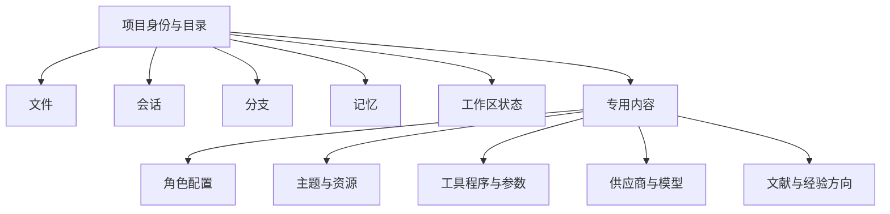
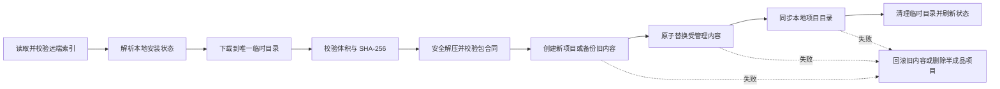

# 目录

# 《天策设计思考》目录

> 本目录用于控制全书叙事范围。正文围绕设计问题和真实演进展开，产品功能作为设计选择的证据，不写成操作手册。

## 开场　为什么要做天策

从给客户远程讲解 AI 的经历出发，说明天策所回应的问题：术语越来越多，产品过程越来越难以观察，而复杂 AI 应用仍然建立在一轮轮模型交互之上。交代天策为什么同时重视后端结构、前端交互、透明度和人的控制权，并引出贯穿全书的晶体生长意象：不同能力沿相同基本结构和连接规则生长，不在系统外围不断增加附件。

## 第一章　从“你一句，我一句”出发

还原常见文本模型的基本工作方式，讨论工具、工作流、技能和多 AI 协作怎样从一轮轮输入输出中生长出来，以及理解这一点为什么有助于判断 AI 的能力边界。

## 第二章　项目：AI 工作发生的地方

说明项目为什么是天策最小的 AI 工作单元。一个项目同时承载真实文件、会话、分支、记忆和工作区状态，人与 AI 在同一个空间里留下工作过程和实际产物。

## 第三章　同一种项目结构怎样长出各种项目集

普通项目、文献、经验、角色、主题、工具和供应商共享项目骨架，各自只增加专用内容和专用看板。记录这套近似晶体生长的结构如何形成、当前统一到什么程度，也讨论各集怎样直接把自己的数据根目录作为普通项目，用普通会话管理整集，而不再发明一种“总管会话”；设定集、基础角色集和各集默认角色则作为后续方向明确区分。

## 第四章　会话成为公共结构

普通对话、AI 子会话、对话分支、自动命名、记忆压缩以及项目与全局记忆管理都落入可见会话。集的总管工作同样由普通项目中的普通根会话承担。讨论模型工作为什么应当留下可以进入、检查和继续处理的过程，也说明为什么会话级记忆不再另建一条提取流程。

## 第五章　人和 AI 共用一条路径

以 AI 会话管理和会话通信工具为核心案例，说明 AI 怎样沿用人操作会话的同一套能力，创建会话、发送消息、等待结果或让任务在后台继续。讨论前端能力桥在统一路径中的作用。

## 第六章　把不同选择保留下来

从编辑历史消息发展到会话分支、消息版本和分支关系图。讨论原历史保留、关系墓碑、缓存谱系和物理复制所体现的产品判断，以及这种方案主动接受的存储代价。

## 第七章　多 AI 工作时，人站在哪里

分析项目总览、会话树、分支图和运行状态如何组织多 AI 协作。前端保留过程，同时为观察、切换和介入提供稳定结构，避免把未经组织的复杂度直接倾倒给用户。

## 第八章　工具系统怎样避免例外

工具项目、参数合同、动态加载、执行记录、独立依赖和多种运行位置如何形成统一工具系统。Markdown 转 Word、联网搜索和 AI 会话工具作为不同类型的真实案例穿插其中。

## 第九章　三条桥各自跨过什么

梳理前端能力桥、后端供应商能力桥和桌面壳桥的职责。讨论为什么模型跨越运行边界时需要受控通道，以及明确的能力范围怎样保持系统可审计、可扩展。

## 第十章　供应商差异应该放在哪里

协议、声明式供应商与模型规则、复杂转换代码分别处理不同层次的差异。结合实际兼容问题，记录规则存放怎样统一、模型家族怎样覆盖，以及规则执行尚未覆盖所有协议与操作的现状。

## 第十一章　记忆机制的几次推倒重来

完整记录连续退化、时间分辨率、两层递归压缩、缓存分支实验和当前累计摘要方案。说明累计摘要为什么同时承担一条会话自己的长期延续，而项目与全局记忆为什么仍需独立管理和投递；也记录已经运行的变更通知，以及它怎样继续升级为按供应商、模型家族和具体模型缓存时长更新旧快照。

## 第十二章　文件怎样成为产品底座

讨论本地项目文件、会话记录、记忆、配置和工具为什么尽量保持可查看、可编辑。编辑器、预览、文件引用和文档产出作为这套文件结构的自然延伸出现。

## 第十三章　主题市场先走一遍

主题集如何成为在线市场的第一轮实践，以及这条路后来怎样覆盖普通项目、知识、经验、角色、模型、主题与工具。记录公共市场来源、GitHub 开放与私人仓库、下载校验和失败恢复，也讨论统一市场为什么仍要保留每类内容自己的合同。

## 第十四章　知识集与经验集准备怎样生长

区分两类项目集当前的原始状态与已经明确的产品方向。知识项目侧重资料管理与跨项目查询，经验项目侧重受控步骤、工具指令、检查节点和递归会话。

## 第十五章　从开发现场到客户电脑

说明内置运行环境、后端、前端和桌面壳怎样衔接，开发、运行、修改和发布之间如何缩短距离；同时准确保留源码运行与前端构建产物之间的现状边界。

## 结语　优雅从哪里来

回看全书反复出现的选择：共用基本结构、减少特殊路径、把差异放在合适的层、让模型工作留下真实会话和文件。天策的优雅由这些具体结构共同构成，不依靠抽象口号证明。

## 附录

1. 当前实现、开发中、明确方向与历史方案对照表
2. 项目目录与 `.Tiance` 工作目录说明
3. 会话关系、工具调用和三条能力桥示意图
4. 记忆机制设计演进时间线
5. 项目集与专用内容对照表
6. 常见 AI 名词在天策中的实际对应物

---

# 为什么要做天策

# 开场　为什么要做天策

我给客户远程讲 AI 时，经常会先讲一件看起来很简单的事：常见的文本模型，基础交互就是你一句、它一句。

用户写下一段话，程序把相关内容整理好发给模型，模型返回下一段内容。对话继续进行，新的消息再和前面的内容一起送过去。如今围绕 AI 已经有了大量新名词，产品形态也比聊天框复杂得多，但只要面对的还是文本模型，这个基本过程就没有消失。

理解它很重要。它能帮助人判断模型做了什么，也能帮助人判断模型没有做什么。

比如模型需要读取一个文件。它通常不会像人一样走到电脑前，把文件拿起来翻看。程序把一个“读取文件”的能力提供给模型，模型返回要读取的路径，程序执行，再把文件内容送回模型。模型需要搜索网络、修改文档、运行命令时，道理相同。一次回复中间可以来回很多轮，外面再加上任务规划、状态管理、记忆和多个模型协作，看起来便有了一个复杂的智能体系统。

复杂是真实的，神秘感往往是后来加上去的。

AI 圈子很喜欢造词。RAG、Workflow、Skill、Agent、MCP，各有各的使用范围，也确实描述了不同技术，但许多介绍习惯从名词开始，仿佛先学会一整套术语，才有资格理解 AI 应用。对刚接触的人来说，这种讲法很容易把一个原本可以观察的过程变成黑箱。人记住了名词，却仍然不知道一条消息发出去以后发生了什么，不知道模型为什么突然调用工具，也不知道屏幕上“正在思考”背后究竟进行了几次请求。

我不喜欢这种感觉。

我并不反对术语。一个概念经过反复使用，当然需要一个短名字；问题在于名字常常跑到了过程前面。人会说“给它加 RAG”“这里做一个 Agent”“把流程做成 Skill”，却没有先说明材料放在哪里、谁发起哪次模型调用、结果怎样验证、失败以后由谁继续。术语变成答案，设计问题反而被略过。

我更愿意先把过程摆出来。需要资料，就说程序怎样找到资料并送给模型；需要工具，就说模型怎样提出调用、程序怎样执行；需要多个 AI，就说一条会话怎样把任务交给另一条会话。过程清楚以后，再用 RAG、Agent 或 Workflow 概括不会有问题。顺序反过来，初学者容易被名词吓住，熟悉技术的人也可能被名词带着忽略边界。

我也不认为界面越简单，产品就一定越容易理解。很多产品把复杂过程全部藏起来，只留下一个输入框和一个等待动画。这样的产品容易上手，演示也很干净；一旦结果不对、任务卡住，或者用户想换一种做法，隐藏起来的部分就重新变成问题。用户不知道当前是谁在工作，不知道系统有没有创建子任务，不知道历史被压缩过几次，也不知道一个自动产生的结果还能不能找到来源。

这在远程讲解时尤其明显。我要向客户说明一个智能体怎样完成任务，现有工具往往只能展示开始和结果。至于中间创建了什么、调用了什么、为什么等待、哪里失败，只能靠讲解者在外面补充。产品替用户省掉了过程，也一并拿走了理解过程的机会。

天策并不是为了给用户上课才把这些过程做出来。真实工作本来就需要它们。一个任务做错，人要知道错在材料、模型还是工具；一个子 AI 卡住，人要能进入它的会话；成本突然变高，也要能找到是长历史、压缩任务还是工具内部又发起了模型请求。容易讲清只是结构清楚以后自然出现的结果。

我也不想把“透明”做成一个专业模式开关。产品平时仍然可以简洁，新用户可以只看当前会话和最后结果；需要时，项目总览、会话树、分支图、工具记录和注入预览都在原来的工作路径上。信息有层次地存在，不要求每个人一上来阅读所有细节。

电脑操控是另一个容易制造想象的例子。模型截图，分析按钮位置，模拟点击，再截图确认。这个能力在远程环境、无人值守或者只能通过图形界面完成操作时很有价值。可如果人就在电脑前，一个肉眼一秒可以确认的按钮，让模型来回截图、识别和尝试，往往要折腾很久，还未必点得准确。能够完成和适合完成是两件事。判断 AI 应该做什么，需要先承认这种边界。

天策就是在这些问题里逐渐形成的。

如果要用一个形象概括它的整体结构，我更愿意把天策看成一块仍在生长的晶体。这里说的不是界面上透明发亮的装饰，而是它的形成方式：不同项目集共享同一个基本单元，也遵循相同的连接规则。新的能力不作为附件挂在系统外面，而是从已经成立的项目、会话、工具和关系中继续生长。整体的整洁，不依赖人为把每项功能修剪成相同外观，而来自内部规则的一致。

天策的统一也不是让不同事物变得一样。角色、主题、工具和供应商拥有完全不同的内容，项目、会话、工具与市场承担的职责也不能混在一起；统一的是它们怎样存在、怎样连接、怎样被人和 AI 使用。基本结构不断出现，新的部分自然接入，整体因此形成秩序，而不是靠一个越来越庞大的中心把所有功能捆在一起。

晶体还有不同的晶面。同一个天策，普通用户看到的是已经准备好的项目、角色和工作入口，专业用户看到的是多项目、多会话、文档和各种可调关系，开发者还可以继续进入源码、配置和内置运行环境。它们不是三个互不相通的版本，而是同一内部结构从不同方向呈现出的表面。用户可以停在适合自己的深度，所操作的仍是同一批真实对象。

我想要的并非一个增加了更多按钮的聊天软件。我需要一个可以长期放置项目、文件、会话和工具的工作台。一个 AI 可以在里面工作，几个 AI 也可以同时工作；人能够观察它们怎样分工，必要时进入任何一条会话查看、补充或停止。不同项目之间可以切换，工作过程不会因为离开当前聊天窗口便失去位置。

这件事一开始就同时牵涉后端和前端。

后端需要保存真实关系：一条会话从哪里创建，一次工具调用怎样返回，一次压缩覆盖了哪段历史，一个供应商的差异应该由哪一层处理。前端需要让这些关系能够被人看见。项目列表、会话树、分支图、文件标签和各种看板并非后端结构完成后的装饰，它们决定了人能不能理解系统当前的状态，能不能在多个 AI 同时工作时保持方向感。

我见过不少产品把前端理解成给后端套一层页面。功能能调用，按钮能按，剩下便是美化。多 AI 工作台不能这样做。一个项目里同时有根会话、子会话、分支和记忆任务，信息都真实存在，怎样组织到人的视线中，本身就是产品设计。后端决定关系成立，前端决定关系是否可用。

天策现在的三栏工作台也是从这个问题长出来的。左侧保持项目与项目集，中间展开项目、会话、分支和文件，右侧保留当前对话。用户能观察项目整体，又不必离开正在交流的 AI。前端没有把复杂度藏掉，也没有把所有原始结构一次倒出来，它给不同问题安排不同视图。

中间区域尤其重要。它既是多项目、多会话的观察台，也是文档、表格、演示稿和其他产物的编辑与检查位置。AI 在右侧继续交流，人可以在中间阅读它刚生成的内容，选中有问题的段落、页面或表格区域，再把明确引用送回会话。对办公和科研工作来说，生成结果只是开始，核对、取舍和反复修改仍然是工作的一部分。

这也是天策没有直接停在“给 VS Code 装一个 AI 插件”的原因。编程工具为开发者准备，工作区信任、扩展、终端、版本控制和大量配置都有自己的必要性；普通用户第一次面对它们，只会先看到一套陌生规则。我曾给几位老客户亲自安装、演示 Windsurf、Cursor、Qoder、Trae 等工具，没有一个真正长期用下来。天策交到他们手里以后，他们反而会在使用中继续反馈改进意见。差别不只在有没有汉化，而在产品有没有按他们的工作组织信息。

我很重视流程和标准，但流程不能只存在于开发文档里。一个流程如果对产品运行很重要，它最好能在产品中留下对应的结构。AI 创建了子会话，界面就应该出现这条子会话；系统为了自动命名调用了一次模型，这次调用也应该有可以打开的会话；记忆压缩由另一个模型完成，用户同样能够看到它处理了什么。产品无需在旁边额外编造一份“透明化报告”，因为这些会话本来就是工作本身。

这逐渐成为天策很重要的一条设计线索：所有 AI 调用尽量进入统一、可见的会话体系。

普通对话是一条会话，从历史消息分出的方向是一条会话，AI 创建出来协助工作的子任务也是一条会话。自动命名、记忆压缩以及项目与全局记忆管理看起来属于后台功能，运行时仍然落成真实的功能会话。它们拥有自己的来源、消息、模型、工具和状态，也能够出现在项目的会话关系中。

统一带来的价值不只在于界面整齐。每增加一种 AI 工作，系统不必再发明一套隐藏的运行记录、一套单独的错误状态和一套只有开发者知道的调试方法。已经存在的会话能力可以继续使用：创建、运行、停止、查看消息、统计用量、建立父子关系。人看到的是会话，程序实际处理的也是会话，两边不需要靠另一份解释勉强对应。

这条路线会让项目里的会话变多。自动命名也有会话，压缩也有会话，AI 助手更会递归创建新会话。统一不是免费午餐，后端少了私有任务类型，前端就要更认真地组织层级、分组和状态。我接受这笔代价，因为复杂度没有消失，它只是从看不见的后台移到可以设计的位置。

“看得见”也不等于把所有思考内容强行展示。模型供应商愿意返回什么、用户是否选择查看，是另一项设置；工具参数中还可能有不适合公开的敏感内容。天策追求的是工作身份、来源和状态可追溯，不是把隐私与噪声一起摊开。

AI 之间的协作也沿着这条路继续。

一个 AI 需要另一个 AI 帮忙时，可以通过工具查找或创建目标会话，再向它发送消息。消息会带上来源会话的名称和 ID。发送者可以停下来等待，也可以让目标会话在后台继续工作。目标 AI 查清楚以后，可以调用同一套会话工具把结果送回来源，或者把文档写到约定的项目目录中。

这套能力选择前端桥，部分原因是会话选择和界面状态就在前端。还有一个更深的原因：统一。人创建会话、选择配置、发送消息时所使用的产品能力，AI 也沿用同一条业务路径。后台创建会话时可以不切走用户正在看的页面，除此之外，它仍然遵守相同的项目、会话和消息规则。天策没有为“AI 给 AI 发消息”另建一套只在后台存在的通信世界。

同样的统一还出现在项目结构中。

天策里的普通项目、文献、经验、角色、主题、工具和供应商，界面入口和内容用途各不相同，底下都逐渐归到同一种项目结构。一个项目有自己的身份、目录、文件、会话、分支、记忆和工作区状态。专用类型可以在这个基础上增加配置文件和看板，但项目的生命周期不需要重新发明。

角色因此不只是一条下拉选项。它是一个可以打开的项目，里面保存角色的提示词、模型、生成设置、记忆和工具配置，也有会话帮助用户继续研究和调整角色。主题拥有自己的文件、资源、设计面板和会话。工具拥有清单、参数、程序、依赖、调用记录和工作区。供应商保存协议、模型与配置差异，也仍然处在项目体系中。

知识集和经验集目前还在更早的阶段，它们主要使用普通项目的能力，专用结构尚未完全长出来。但方向已经清楚：知识项目会成为一组资料和一个知识 AI 共同工作的空间；经验项目会保存可以逐步执行、插入工具、引用资料并在节点检查进度的过程。它们将增加自己的内容规则，不会因此脱离项目这一层。

统一的项目骨架还带来一个容易被忽略的结果：新手和熟练用户面对的是同一个产品。新建会话时可以直接使用默认角色、默认模型和默认工具，不需要先理解整套配置；想继续调整的人又能进入项目、角色、会话和工具查看细节。天策不需要另外做一个“简单模式”，再做一个彼此割裂的“专业模式”。默认值负责让工作开始，底下的结构没有因此被封死。

我喜欢流程和标准，也不希望流程把人困住。默认角色可以帮助新会话直接开始，用户仍能换角色；角色项目自己的会话可以默认研究该角色，也允许选择一个完全不同的角色来协助；主题和普通角色可以删除，恢复所需的最低默认项则由领域规则保证。系统提供起点和边界，中间留给用户组合。

这种自由不是在设置页里堆满选项。更重要的是对象本身可以进入。角色是一项能打开的项目，工具是一项能继续开发的项目，供应商配置也可以在自己的项目里研究。熟练用户不只调几个开关，而是沿产品结构深入；开发者再往下还能进入源码与运行环境。

这就是我所理解的 AI 原生软件。AI 没有被附加在产品角落，等用户点一个按钮才临时出现。每个核心项目从建立时起就可以容纳 AI 工作，AI 使用的会话、文件和工具也是产品自己的基本结构。人和 AI 进入同一个项目，面对同一批材料，在同一套关系中继续工作。

AI 原生也不等于所有操作都交给 AI。文件冲突需要人决定覆盖还是另存，市场安装需要校验与回滚，高风险工具需要明确权限，客户包仍要经过构建和检查。模型参与越深入，产品越要把确定步骤交给程序，把选择权留在应当由人判断的位置。

天策源码本身也可以成为项目。AI 读取真实工程，使用工具修改文件、运行检查，结果继续留在项目中。产品怎样支持用户项目，就怎样支持对自己的开发。这种递归很有吸引力，同时也要求目录、分层和测试足够严格，否则 AI 只会更快地堆积临时代码。

项目还是在线市场可以流通的单位。主题集先走了这条路，角色、供应商和工具随后用自己的内容合同接入，普通项目、知识项目和经验项目则共享项目快照市场。除尚未项目化的设定集外，现有各集都已经拥有在线入口；安装结果继续是对应类型的本地项目，不会变成只能在商店页面里使用的商品。

市场来源也已经从默认开放仓库扩展到用户授权的 GitHub 私人仓库。每一类市场默认连接我维护的开源共享仓库，用户也可以登录 GitHub，从已经授权给天策的仓库读取同一种索引和内容包。开放与私人没有分裂成两套市场协议，变化的只是读取仓库时是否需要授权。项目内容怎样描述、怎样校验、安装后归谁管理，继续使用同一套合同。

天策的工具系统也在遵循类似的思路。读取文件、执行命令、生成 Word、联网搜索、管理编辑器标签、创建 AI 会话，这些能力运行的位置不同，给模型的入口仍然属于同一套工具合同。工具越来越多以后，系统又把轻量目录、完整参数读取和正式执行拆开，避免每次请求都携带所有工具的复杂说明。供应商提供的内置联网搜索需要 API Key 和协议适配，便通过受控的后端能力桥完成；编辑器标签和会话交互属于前端实时能力，则通过前端桥完成。差异被放到各自应该负责的位置，模型看到的工具调用过程仍然连贯。

Markdown 转 Word 是我很喜欢的一类工具。它没有试图成为天策核心里的文档模块，而是把标题、表格、图片、公式、脚注、Mermaid 和模板等复杂性留在独立工具项目中。模型准备源稿并调用，Word 回到目标项目，人可以预览、修改再生成。一个工具足够复杂，却没有迫使会话系统理解 Word 的每个细节。

联网搜索则说明统一也有成本。普通工具为了使用当前供应商的内置搜索，要经过短期授权和后端能力桥，内部还会多发起一次模型请求。形式统一以后，时间和 Token 不会凭空消失。天策记录这些额外用量，是为了让结构美感继续接受现实账目。

这里面有不少设计后来被推倒重来。记忆压缩尤其典型。

最初的方案考虑了连续退化和时间分辨率。旧内容先压成一层摘要，多个摘要积累后再合并成更高层，最近几轮原始内容继续保留。理论上，这种结构可以一直向前压缩，在有限上下文里留下不同精度的时间层次。它很漂亮，也值得保留。

接入不同供应商后，缓存能力和命中方式开始影响设计。某些供应商适合保留多个分支缓存，某些接口更接近一条活跃缓存链。为了减少每轮请求反复改变前缀，压缩方案经过多次调整，最后形成当前的累计摘要方式。早期设计没有因此变得毫无价值，它记录了另一种处理长对话的思路，以后仍可能作为可选模式回来。

我希望这本书能够保留这些变化。只展示最后结果，会让产品像是从一张完整图纸里一次造出来的。天策的许多结构是在不断增加约束的过程中形成的：先发现一个值得保留的设计，再遇到供应商、缓存、交互或发布上的现实问题，然后修改方案，同时尽量不破坏已经形成的整体关系。

所以这本书不会按菜单逐项介绍功能，也不会按前端、后端、数据库列一份架构说明。项目为什么成为底座，会话为什么承担后台 AI，工具为什么需要三条桥，供应商差异为什么分层，都会从遇到的问题和做过的取舍展开。必要操作会顺路出现，只用于说明设计怎样落地。

它也不是一份替产品宣传的成功总结。在线入口已经覆盖现有项目集，知识与经验仍处在专用化之前；供应商规则虽然已经有了统一住所，执行还没有覆盖所有协议与操作；项目与全局记忆的变更已经能够进入旧会话，按缓存有效期主动刷新前部快照的阈值机制仍在升级。进行中的部分用现在进行时，已经确定但没做的部分用未来时，走过又放下的方案保留它当时解决的问题。

这本书也不会把天策写成一个已经完成的标准答案。七类现有项目已经进入统一市场框架，私人仓库也能通过 GitHub 授权接入；知识和经验的市场目前流通的仍是原始项目结构，专用内容合同尚未形成。供应商适配的执行覆盖、长期记忆快照的缓存阈值更新和开发环境到客户包的交付边界也仍在收口。把这些状态写准确，比给每一章安排一个圆满结论更重要。

我想讨论的，是一个 AI 应用怎样从一些很朴素的判断开始，逐渐形成自己的结构：模型工作应当留下可见过程；人和 AI 可以使用同一条业务路径；不同内容可以共享项目骨架；复杂能力应当由已有结构组合出来；差异留在负责差异的位置；前端承担组织复杂度的责任。

这些判断落到产品里，才构成天策。它们也构成了我眼中的优雅。

接下来，可以从最简单的“你一句，我一句”开始，看看这一轮交换怎样一步步长成今天的天策。

---

# 从你一句我一句出发

# 第一章　从“你一句，我一句”出发

“你一句，我一句”听起来过于简单，甚至有点像故意把 AI 说轻了。我讲这句话，只想把观察的尺度拉回到一次真实调用：程序交给模型一组内容，模型根据这些内容生成下一步结果。

只要能看清这一轮，许多被术语包围的功能就有了落脚点。

用户在界面里输入一句话，模型实际收到的通常远不止这一句。程序可能在前面放入系统提示词，告诉模型当前角色和任务；从会话记录中取出过去的消息；加入项目工作区的位置和规则；送入长期记忆、压缩摘要、文件引用和图片；再根据当前会话启用的能力，附上工具名称与参数。用户看到的是输入框里的一段文字，模型面对的是程序为这一轮整理出来的一整套上下文。

模型不会天然知道这些内容。项目放在哪个文件夹、用户刚刚修改了哪个文件、另一个会话进行到哪里，都需要程序通过消息或工具明确交给它。即使一段信息上一轮出现过，下一轮是否继续发送、以什么顺序发送、有没有经过压缩，也由应用决定。所谓“AI 记得这个项目”，往往包含了大量模型之外的工作。

上下文也不是一个没有顺序的资料袋。系统要求、当前用户消息、历史、工具说明和检索材料放在什么位置，会影响模型如何理解任务。内容互相冲突时，应用还要知道哪些是用户意图，哪些只是文件里的普通文字，哪些来自未经信任的网页。把更多内容送进去不保证更准确，有时只会让真正的问题淹没在材料中。

这正是提示词最容易被神化的地方。一段提示写得好，当然能明显改变结果；可它只占一次请求的一部分。项目规则没有注入、工具参数已经过期、历史被截断、引用取错页面，再漂亮的措辞也补不回缺失事实。排查 AI 应用时，只盯着提示词反复改写，常常是在修最容易看见、却未必出错的那一层。

天策把请求组装本身当作产品能力。系统内容从哪里来，角色配置如何变成会话设置，项目路径和记忆放在何处，哪些工具完整注入、哪些只给出动态目录，都有明确来源。注入预览的意义也在这里：它允许人从实际请求出发，判断问题是模型没理解，还是程序根本没有把该有的信息送过去。

这一点很容易被界面掩盖。聊天窗口把消息连续排列起来，人看上去像是在和一个拥有持续意识的对象交谈。对许多模型接口来说，每轮请求仍然需要重新提供必要的历史。供应商可以提供缓存、会话续接或服务端状态，但应用仍要知道自己依赖了什么，哪些内容保存在本地，哪些状态由供应商暂存。一旦把这些差异全都概括成“模型记住了”，后面的压缩、分支和缓存问题就很难讲清。

天策因此保存两种彼此相关、用途不同的东西。

一种是会话中实际发生的消息。用户说了什么，助手返回了什么，模型提出了哪些工具调用，工具送回了什么结果，都进入项目里的消息记录。另一种是某一轮发送前的请求快照。它把系统提示词、工作区信息、动态工具目录、长期记忆、压缩摘要、历史消息和正式工具参数放在一起，让人能够检查模型当时究竟看到了什么。

这份快照直接来自真实请求的组装结果。前端把其中的内容整理成可以阅读的注入预览。出了问题，人可以从模型收到的内容开始查，而不必猜测某段提示是否生效、某个工具是否真的进入请求、压缩摘要有没有替换旧历史。

实际请求和聊天界面也不总是一一对应。界面可以折叠思考过程，可以把一组工具消息整理成一张卡片，也可以在长历史中只渲染可见部分；模型请求必须服从协议顺序，并带上当前需要的全部内容。把展示消息直接拿去发送，或者把请求内容原样当作最佳界面，都会让一个层次替另一个层次做决定。

这种分开还方便比较模型。两个模型在同一会话里给出不同结果，先确认它们是否拿到了同一份有效上下文，再讨论能力差异。某家供应商不接受一项参数，适配层可能已经删除或改写它；某个模型不支持图片，引用可能转成文字或被拒绝。供应商名称相同，也不代表请求在上游完全相同。

模型返回工具调用时，事情会多走几步。

假设用户让 AI 查看一个项目文件。模型先根据当前上下文决定使用读取工具，并给出文件路径。执行工具的是天策，不是模型。程序检查这个工具是否存在、当前会话有没有启用、参数是否符合工具声明，然后在允许的位置读取文件。读取结果作为一条工具消息送回模型，模型才继续分析文件内容并形成回复。

如果它发现还需要搜索另一个文件、运行命令或者修改内容，这个循环会继续。人最后看到的一段回复，中间可能经历了多次模型生成和多次工具执行。一次工具失败也不一定结束整轮任务：模型可以根据明确的错误修正参数，换一个工具，或者告诉用户当前无法继续。

这套过程没有要求模型真的“操作”文件系统。模型负责提出结构化请求，程序负责权限、执行和结果。两者分开以后，能力边界才容易控制。读取工具可以只有读取权限，写入工具可以限制在项目目录，删除和覆盖可以增加更严格的检查。工具是否安全，不能只寄希望于模型每次都作出正确判断。

模型提出工具调用，也不等于动作已经发生。参数可能不合法，工具可能被会话关闭，文件可能已经被人移动，网络也可能超时。程序执行以后还要给出结构化成功或失败，模型才能决定下一步。界面若在调用刚出现时就写“已完成”，等于把模型意图冒充执行事实。

反过来，工具返回成功也不一定等于业务目标完成。写入工具只能证明文件已经按参数保存，不能证明报告内容正确；搜索工具可以证明拿到了结果，不能证明来源足够可靠；命令退出码为零，也不代表用户想要的界面已经正常。AI 需要读取结果、运行检查或向人汇报，产品则要保留每一步的不同状态。

这几层可以用很朴素的顺序看：模型建议动作，程序决定能否执行，工具报告发生了什么，模型再解释这些结果。每一层都有可能出错，也都有自己的证据。所谓智能体可靠性，很大一部分来自没有把这四件事压成一句“AI 做了”。

同样的道理也适用于界面能力。模型想知道编辑器当前打开了哪些标签，后端仅靠扫描文件夹得不到准确答案。未保存的内容、活动标签和当前界面状态都在前端。天策通过前端能力桥把少量已经登记的操作交给前端执行，再把结果送回原来的工具循环。模型看到的仍是一项普通工具，前端也没有因此开放任意脚本或任意点击。

供应商内置联网搜索则走另一条桥。搜索需要当前模型对应的供应商、协议和 API Key，普通工具进程不应该读取这些配置。后端为获准工具签发只在本次运行期间有效的授权，使用当前会话绑定的供应商和模型完成搜索，再把归一化结果交还工具。密钥留在负责密钥的地方，工具仍然沿用原来的调用形式。

从模型的角度看，这些都是“我提出调用，稍后收到结果”。从应用的角度看，前端状态、本地程序和供应商服务处在完全不同的安全边界。统一不等于把它们塞进同一个执行器。天策统一的是工具合同和回填过程，差异则由前端桥、Python 运行环境和供应商能力桥分别处理。

工具循环还要支付时间和费用。模型决定调用一次工具，通常先完成一段生成；工具运行花费自己的时间；结果回来以后，模型再次读取上下文才能形成答案。工具内部若又调用另一个模型，成本会继续叠加。界面上一轮“处理中”，背后可能已经经过三四次上游请求。

因此，功能能否实现只是第一问。第二问是有没有更直接的路径。读取一个已有 API 的状态，通常比截图识别稳定；让文档工具直接生成结构，通常比模型在 Word 界面逐个点击可靠；人就在屏幕前完成一个一秒动作，也可能比 AI 往返几轮划算。天策希望给 AI 足够能力，同时保留选择工具的判断，而不是把自动化程度本身当作成绩。

用量记录需要跟着真实调用走。主模型的输入输出、工具内部供应商请求、缓存命中和搜索计次可能采用不同计费方式。把所有东西折成一个模糊的“本轮 Token”，会掩盖某项能力为何特别昂贵。用户不必每天研究账单细节，系统仍应留下能追到来源的记录。

这也是我看待 Agent 这个词的方式。它可以指一套很完整的系统：模型能够规划任务、调用工具、保存状态、创建子任务、等待外部结果，甚至长期运行。这个词当然有用，但它没有取消一轮轮模型调用。规划需要一次或多次生成，工具执行以后要把结果送回模型，子任务需要进入另一个上下文，长期运行还要有模型之外的状态保存和调度。

把这些过程说清楚，不会削弱 Agent 的价值。相反，它让人更容易判断一套系统究竟完成了什么。某个产品宣称能够自主工作时，可以继续问：任务状态保存在什么地方，工具失败以后怎样处理，子任务有没有来源，程序重启以后能否恢复，人能不能看到它当前卡在哪一步。这些问题落到具体结构上，比争论它够不够资格叫 Agent 更有用。

还可以再问几个不太好看的问题。它能停止吗，停止时已经执行的副作用怎么办；同一请求因为断线重放，会不会再发一封邮件、再改一次文件；模型连续失败时，重试次数由谁限制；子任务越来越多时，谁决定结束。一个演示只要成功一次，一套产品却要为未完成、重复、超时和取消留下位置。

模型输出本身也有不确定性。相同上下文再次请求，措辞和决策可能不同；温度设为较低，也不会把生成系统变成普通函数。需要稳定的地方，程序应使用 Schema、枚举、校验和明确工具合同；需要开放判断的地方，才让模型发挥。把一切都固定，会失去模型的价值；把一切都交给模型，则把产品合同变成概率。

天策的角色、工具和经验方向都在处理这条分界。角色提供工作方式，不替代会话事实；工具把可执行动作收进参数合同；经验将来会把确定步骤和开放步骤分开。AI 的自由落在需要理解的部分，系统的确定性落在必须守住的部分。

电脑操控也是如此。截图、识别、点击、再次截图，确实可以组成一条工具循环。在只能接触图形界面、没有程序接口、需要远程执行的环境里，这条能力能够解决问题。人就在电脑前时，许多操作由人完成会更快、更可靠。天策没有把“让 AI 接管所有界面动作”当成默认方向。能通过稳定文件接口、项目服务或明确前端能力完成的事情，优先走这些路径；视觉点击留给它真正合适的场景。

图形界面并非低级接口，它只是为人设计。按钮的位置、动画时机、窗口遮挡和屏幕缩放都可以改变，人凭常识很快修正，模型却要重新截图和定位。稳定 API 与文件合同把意图直接表达出来，失败也能返回明确原因。视觉操控适合没有其他入口的最后一段，不适合为了显得“像人”而绕开已经存在的结构。

这也解释了天策为什么愿意做前端能力桥，却不把它做成任意点击器。编辑器当前标签确实只有前端知道，会话发送也需要沿用前端运行管理；这些能力值得登记成明确工具。至于每一个按钮和像素，没有必要都变成模型权限。前端桥提供产品语义，不提供无边界遥控。

“你一句，我一句”还会改变多 AI 协作的设计。

如果把子 AI 想成一个隐藏在系统深处的执行单元，很容易继续发明任务队列、内部日志、专用状态和一套只给调度器使用的通信协议。天策换了一个更直接的处理方式：子 AI 工作在一个真实会话里。来源 AI 通过工具创建或找到这个会话，发送一条带来源信息的消息；目标会话使用自己的角色、模型、工具和上下文完成任务；结果可以写回来源会话，也可以保存为项目文件。

这里仍然是一边发送内容，另一边生成结果。增加的是会话身份、来源关系、后台运行和等待方式。由于工作发生在普通会话中，现有的消息记录、工具调用、用量统计、停止操作和错误状态都能继续使用。人打开项目时，看到的就是这些 AI 真正工作过的会话，无需另外等待一份协作报告来解释后台发生了什么。

自动命名和记忆压缩也可以这样理解。它们需要模型处理一段上下文，再产生标题或摘要。天策让这类调用进入功能会话，保留来源和运行结果。系统任务由程序触发，模型调用仍然遵守会话的基本规则。隐藏调用因此减少了一类，产品也少了一套只有后台才理解的状态。

这种做法会增加界面上的结构。会话不再只有几条用户主动创建的聊天，项目中还可能出现子会话、对话分支和功能会话。天策选择让前端组织这份复杂度：关系树区分不同类型，功能会话按用途归组，运行状态和消息数量留在节点上，分支图再处理历史版本之间的关系。

透明在这里表现为清楚的对应关系：界面中的节点能够找到实际会话，会话中的消息能够找到工具过程，请求预览能够对应一次真实调用，项目文件能够对应 AI 最后提交的产物。人可以停留在概览，也可以沿着关系继续往下查看。把所有底层数据原样铺满屏幕，只会制造另一种遮挡。

透明还有一个容易忽略的限度：看得到不代表看得懂。把上游响应 JSON、线程日志和每次状态变化全部堆给用户，只是把开发者的工作转嫁出去。天策更关心稳定关系能否被逐层打开。平时看到任务与结果，怀疑某一步时进入会话，再需要时查看工具、请求和原始文件。深度存在，入口清楚，主界面才不必承担所有细节。

模型供应商之间的差异仍然存在。有的接口支持服务端会话状态，有的更依赖完整历史；有的返回详细缓存用量，有的只给出总数；工具调用、思考内容、图片和联网搜索也有各自的协议形状。天策需要适配这些差异，但产品层不应该因此出现四套会话、四套工具和四种项目。供应商适配负责翻译，项目和会话继续保持自己的语义。

所以，我说“你一句，我一句”，是为了把模型能力、程序能力和产品状态分开看。模型擅长根据上下文产生下一步，程序负责执行和保存，产品负责组织这些过程，让人能够理解、介入并继续工作。复杂系统当然远远超过一个聊天框，但它仍然由这些可以观察的步骤组成。

这个尺度也能抵抗两种相反误解。一种把模型当作只会续写文字的玩具，忽略工具、状态和协作组合出的真实能力；另一种把整套应用的规划、存储、权限和自动化全算成模型自身智能。前者低估了系统，后者模糊了责任。把一次调用放回产品结构中，两边都更容易说准。

当一次调用可以被记录，一段工作就可以进入会话；当会话有了稳定归属，它就需要一个长期存在的工作空间。天策选择项目承担这个位置。

下一章从项目开始。

---

# 项目_AI工作发生的地方

# 第二章　项目：AI 工作发生的地方

聊天软件很容易把注意力集中在输入框上。用户提出问题，模型给出回答，一次使用似乎就完成了。可一旦 AI 开始处理真实工作，输入框很快就显得太小。

一项工作通常有自己的材料、文件、过程和结果。它可能持续几天，期间换过模型，开过几条会话，调用过不同工具。某个方向走错以后需要返回分叉点，某些结论希望留给以后，生成的文档还要继续修改。聊天记录可以保存谈话，却很难单独承担这些关系。

天策选择用项目承接它们。

这里的项目先是一块真实工作空间。用户可以把代码、文档、图片、表格、数据库和参考资料放进去，AI 读取和修改的也是这些文件。项目同时拥有会话、分支、记忆和工作区状态，因此一次模型调用不会悬在软件内部，它总能找到自己属于哪项工作。

“属于哪项工作”对 AI 很重要。模型本身只看到本轮上下文，如果应用没有给出稳定归属，它很容易把临时上传当作长期材料，把另一个窗口的规则当作当前规则，或者生成一份谁也不知道该放在哪里的结果。项目提供的不是一段更长提示，而是一组持续存在的事实：材料在这里，会话在这里，产物也回到这里。

这和把聊天放进一个同名文件夹仍有差别。项目要承担进入、离开、创建、删除、迁移和恢复。人今天打开它，AI 明天从后台继续，几条会话同时写文件，工作区都必须认出同一对象。只有名称和目录远远不够，稳定身份与生命周期才让它成为产品的基本单位。

项目有稳定的身份。名称可以修改，分类可以调整，界面中的顺序也会变化，项目 ID 仍然保持不变。会话、工具调用和工作区状态依赖这个身份，不依赖用户今天给它起了什么名字。这个区别看起来很细，后面却会影响很多设计：会话重命名不会改变父子关系，项目移动分类不会改变文件归属，在线市场安装的内容也能拥有独立于显示名称的身份。

目录名同样不宜承担全部身份。受管理项目可以用稳定目录保存，外部项目的文件夹还可能被用户在资源管理器中重命名或移动。路径描述“现在到哪里找”，项目 ID 描述“产品中的哪一项工作”。路径失效时，系统应当提示重新定位或停止写入，不能悄悄在旧位置新建一个空目录，再把它当作原项目。

这种区别还保护了引用关系。工具调用记录、来源会话和市场安装信息若只保存名称，重名后很快无法确定目标；若只保存绝对路径，迁移电脑或调整目录又会全部失效。稳定 ID 负责内部关系，可显示名称和当前路径分别服务人和文件系统。三者同时存在，看似多了字段，实际省掉了大量猜测。

分类只负责帮助人整理项目。天策没有要求磁盘目录跟着界面分类一层层嵌套。用户可以在界面里移动分类和调整顺序，项目目录仍然保持稳定。分类是产品中的组织视图，目录是文件系统中的存储位置，两者各自处理自己的问题。

这种分离避免了一连串麻烦。界面改个分类名称，不需要移动大量文件；项目的真实路径不会因为排序变化而改变；程序也不必从文件夹层级猜测业务关系。一个项目属于哪个分类，由项目目录记录明确说明。磁盘目录只需保证项目内容能够稳定找到。

当前七种项目集都有自己的数据根目录和 `catalog.json`。目录文件保存分类、项目身份、名称、顺序和必要的根路径信息。普通项目还允许使用外部工作目录，用户已有的文件夹可以进入天策，不必为了使用 AI 再复制一份。由天策管理的项目则直接保存在对应项目集的数据目录中。

这些数据根目录本身也可以成为项目。天策为各集默认加入一个以本集数据根目录为工作区的项目，在其中建立的会话可以查看这一集的目录文件和多个项目文件夹，适合做整理、检查和统筹。它看起来像“总管”，实际没有新的总管对象：只是一项根路径范围更大的普通项目，以及项目中的普通会话。

默认加入只负责提供一个起点，不把它变成不可删除的系统保留项。用户可以像处理其他项目一样移除这项登记，也可以选择删除；两者仍受普通项目的所有权合同约束。尤其当删除包含本地文件时，目标是整项集的数据根目录，不再只是一个入口，界面必须把影响范围说清楚。

目录文件是项目列表的权威来源，磁盘仍可能出现不整齐现场。用户手工删除了目录，复制进一个尚未登记的文件夹，或者一次旧版本迁移只完成一半，列表与文件系统便会分开。启动与工作区协调需要识别这些差异，明确哪些能够修复、哪些应提示，而不是重新回到“扫描到什么就算什么”的旧路。

扫描可以帮助发现事实，却不应替代项目身份。一个文件夹存在，只说明磁盘上有内容；它叫什么、属于哪类项目、放在哪个分类、是否由天策管理，仍要由目录合同说明。协调过程若决定恢复或导入，也应创建正式记录。这样一次修复不会把临时推断永久藏在运行内存里。

这套文件目录并非一开始就完整存在。早期普通项目主要由数据库维护，角色、主题和工具又各有自己的目录扫描或注册方式。界面上都叫项目，底下却存在几种身份来源。一个模块认为目录存在便算项目，另一个模块要求数据库有记录，还有模块会在扫描时临时拼出展示对象。

这些方式各自都能工作，问题出现在它们需要互相协作的时候。通用会话服务要找到项目根目录，必须知道当前属于哪一种集；前端移动分类时，不同项目集调用不同接口；删除工具既要删注册信息，又要处理文件夹、依赖和会话。所谓“都是项目”停留在界面名称上，程序仍然把它们当成不同物种。

当前的文件式目录把项目身份重新收口。每个项目集在自己的数据根目录维护 `catalog.json`，通用项目仓库把它们组合成同一种查询接口。存储可以按类型分区，业务层看到的项目合同保持一致。旧数据库结构仍可能出现在迁移代码中，但新的项目关系不应继续依赖多套权威来源。

为什么不把七种项目全部放进一个总目录文件？分开的根目录让不同项目集可以独立迁移、打包和检查，也让工具、主题、供应商等预置内容拥有清楚边界。统一仓库负责跨类型访问，各目录继续拥有自己的文件生命周期。这里追求的是公共合同，不是把所有数据挤进同一个物理文件。

一个总文件还有故障扩散问题。主题目录写坏，不该阻止普通项目和工具列表加载；工具迁移也不必重写所有角色与文献记录。分区目录让变更范围和恢复范围保持接近，通用仓库再把读取结果组合给上层。逻辑上统一，物理上适度分开，正好对应这些项目集既相似又能独立演进的现实。

这也为打包留下了选择。客户包需要预置工具、基础主题和语言，不需要携带开发者的日常项目；各类项目进入在线市场时，也只处理自己的根目录与包合同。若所有类型共享一个不断膨胀的总文件，每次分发和迁移都要小心触碰无关内容。

项目根目录里有一部分是用户真正工作的内容，另一部分是天策为这个项目保存的运行状态。后者集中放在 `.Tiance` 中。会话索引、每条会话的消息、分支关系、记忆、注入预览和编辑器状态都能在这里找到。

把这些内容放在项目身边，有一个直接好处：项目工作和项目状态不会轻易走散。复制、备份或者检查一个项目时，人能够知道 AI 在这里做过什么。程序仍会控制内部文件的写入方式，避免半截 JSON 或并发覆盖，但这些状态没有被拆成一个完全独立、只有软件自己认识的世界。

`.Tiance` 也划分了用户内容与产品状态。用户的报告、源码和资料留在项目根目录，天策自己的会话索引、关系图和界面状态集中到隐藏工作目录。工具在普通文件树中工作时可以避开这些内部文件，专用预览又能在用户明确打开时解释它们。内部状态可查，却不会和业务文件混成一团。

隐藏目录不等于秘密目录。它主要防止日常文件列表被运行记录淹没，也降低普通工具误改内部状态的概率。需要检查时，用户和开发者仍可以打开；前端遇到会话记录、注入预览或记忆事件，还会提供专用看板。可见性由明确入口提供，不依赖把所有内部文件长期摊在根目录。

内部文件也不能被当作普通业务文件随意编辑。消息追加、关系更新和工作区状态有自己的并发规则，直接改错一个 ID 可能破坏多条关系。天策允许查看原始内容，是为了审查和修复，不表示绕过服务层写入已经成为安全的常规操作。透明与随意改动是两回事。

项目工作区还会进入模型上下文。天策可以告诉 AI 当前项目的真实根目录、可用工作区和相关规则，工具调用再使用项目 ID 与根路径定位目标。模型不需要猜测自己在哪个项目，也不会因为用户在文字中提到另一个文件夹，就自动改变工作边界。

当用户切换项目时，变化的不只是侧边栏高亮。当前文件标签、活动会话、编辑器状态、项目记忆和工具相对路径都随项目身份切换。前端可以预热其他项目的持久化状态，后台 AI 也能在不抢走当前界面的情况下更新自己的项目；真正显示到屏幕时，仍以目标项目保存的状态为准。

项目工作区状态保存的是“人在这个项目里工作到哪里”，不应变成整个应用的第二份事实。打开哪些文件、当前选中哪条会话、画布停在什么位置，都可以恢复；项目名称、文件是否存在和会话关系仍来自各自权威来源。能计算或重新读取的状态不必复制进工作区文件，否则恢复页面时会先看到一份过期世界。

后台 AI 给这套状态带来新的情况。它可以在另一个项目中生成文件、打开标签或启动会话，用户此刻却正在当前项目编辑。后台更新需要落到目标项目，不能为了显示结果改变人的活动项目；人进入目标项目时，又应该看到已经发生的变化。项目身份把“谁在工作”和“人正在看哪里”分开，前端才不必二选一。

会话消息采用逐条追加的记录方式。用户消息、助手回复和工具结果按发生顺序留下来，不必为了增加一条消息重写整段历史。会话本身还有独立的设置和状态文件，分支关系由项目级关系文件保存，项目记忆也有自己的记录。不同内容各自承担一种职责，没有把整个项目运行状态塞进一个不断膨胀的大文件。

这种文件结构也给前端提供了很有意思的可能。用户在文件树里打开普通 Markdown，看到的是编辑和预览；打开会话消息记录，前端可以识别它的结构，把原始 JSONL 整理成消息看板；打开注入预览，则能看到本轮请求中的系统内容、历史、压缩摘要和工具参数。底层仍是可读取的项目文件，界面根据内容提供更合适的观看方式。

这和专门维护一份“可视化副本”有很大差别。副本需要同步，时间久了难免出现界面展示与实际运行不一致。天策尽量直接读取运行所使用的记录，再做可读性转换。用户想检查原始内容时仍然可以继续往下看。

项目还规定了工具能够工作的范围。文件工具收到相对路径时，会在当前项目根目录中解析。图片和其他资源被交给模型前，也要确认路径、文件类型和当前模型能力。允许读取项目外文件的工具会使用另一种明确的本机资源引用，不会因为普通文字里出现一个绝对路径，就自动获得额外权限。

这让项目成为安全边界的一部分。AI 可以在项目中自由处理材料，跨出项目时则需要用户明确交给它相应路径或工具。边界当然无法代替所有权限设计，但至少避免了“模型看到了一个路径，所以程序就默认允许访问”的含混状态。

项目边界还决定工具结果归谁。生成文件的工具如果只返回一个绝对路径，模型可能能读，人却未必知道它属于哪项工作；文件被临时清理后，历史消息也失去对象。天策倾向让产物进入目标项目，再用项目资源引用返回。临时资源确实存在时，也要有单独类型和生命周期，不能和长期项目文件混用。

未来出现共享项目或远端协作时，权限也可以围绕项目继续加深。谁能查看、谁能让 AI 运行、谁能删除或对外发送资料，都有自然归属。当前本地单用户产品不必提前伪装成完整租户系统，但项目先成为清楚边界，后续才有地方增加这些规则。

记忆也需要归属。天策区分项目记忆和全局记忆：一项工作的长期约定适合留在项目中，跨项目都可能有用的用户偏好才进入全局范围。会话接收记忆时，系统会保存它已经获得过哪些内容和后续发生了哪些变化，避免每轮把整份记忆当作一块无法追踪的文字重新塞进去。

项目因此逐渐成为一种上下文边界。文件说明当前处理什么，会话保留讨论和执行过程，记忆积累长期信息，角色和工具决定 AI 以什么方式参与，工作区状态记录人上次看到哪里。模型每次仍然只接收有限上下文，应用却有一个长期存在的地方组织这些材料。

这也是 AI 原生在天策中的具体含义。AI 没有单独占据一个漂浮在所有业务之上的聊天区。它进入一个项目工作，和人面对同一批文件，把过程留在项目会话中，把结果写回项目目录。以后再次打开这项工作，文件、会话和记忆仍然在原来的关系里。

项目结构还给多 AI 协作提供了共同场地。一个来源会话创建子会话时，子会话归属于同一项目，可以直接使用项目文件和项目记忆。它有自己的模型、角色和工具设置，也有明确的来源关系。目标 AI 生成文档时，文档进入大家都能找到的项目目录；返回消息时，结果进入来源会话。协作不会散落到一组无法归档的临时请求中。

协作也可以跨项目，但跨项目应当是明确动作。来源 AI 查询知识项目、调用工具项目或向另一项工作发消息时，目标身份和返回路径都要写清楚。否则“大家共享一个工作区”很快会退化成任何 AI 都能碰任何文件。项目内共享提供便利，项目间通信保留边界，两种关系同时存在。

多 AI 还会带来文件协调。它们可以读取同一资料，也可能同时修改同一产物。项目负责提供共同目录，并不自动解决所有并发冲突；文件工具需要安全写入，编辑器需要外部变化提醒，经验流程以后还要明确产物责任。共同场地是协作的前提，不是并发控制的替代品。

项目删除则是一项完整的生命周期操作。项目身份、目录、会话、记忆和工作区状态必须一起处理，不能只从侧边栏移除一条记录，把文件和运行状态留成无人管理的残余。天策对受管理目录和外部目录采用不同处理方式，也保留失败时恢复目录和目录记录的能力。用户看到的“删除一个项目”，背后对应的是一个清楚的所有权范围。

外部普通项目尤其需要谨慎。它可能是用户已经维护多年的工程，天策只获得使用这个目录的入口。删除项目记录与删除整份外部工作资料不是同一件事。项目服务会区分由天策管理的目录和外部根目录，归档与恢复也采用不同路径。项目合同统一，所有权语义仍然必须保留。

项目创建也遵守类似原则。目录、项目记录和初始会话任何一步失败，都不能留下一个侧边栏里看得到却打不开的项目，或者一个已经占用磁盘却没有身份的孤立目录。先准备、再登记、失败回滚，这些事务边界使“项目是工作单元”不只停留在概念层。

重命名和移动分类则尽量只改变该改变的事实。显示名称变化无需移动受管理目录，分类调整也只更新目录关系；项目根路径稳定，会话和工具不用跟着重写。用户看到的是一次简单整理，底层没有制造一场全项目迁移。扁平目录的价值在这些日常动作中比在架构图上更明显。

删除需要更谨慎，因为所有权不同。受管理项目由天策创建并维护，可以在确认后连同目录进入回收或归档；外部项目只是被天策引用，移除记录不应默认毁掉用户原文件。即使同一个“删除项目”入口，服务也要先判断自己究竟拥有什么。统一生命周期保留共同流程，所有权决定最终动作。

失败恢复同样围绕所有权展开。目录已经移动而目录记录尚未更新，或者记录写入失败但旧目录仍在，系统要知道恢复谁、回滚到哪里。把文件操作和目录登记当作一个事务处理，会比事后扫描“看起来还剩什么”可靠。项目越重要，这些不显眼的边界越值得先做。

这种结构并不追求把所有内容都存成同一种文件。消息适合追加记录，项目目录适合普通文件，密钥需要加密保存，界面状态有自己的结构。统一发生在项目身份和生命周期上，具体内容继续选择适合自己的保存方式。

同样，项目也没有替代所有业务概念。主题需要颜色、背景和结构线，工具需要参数、程序和依赖，供应商需要协议与模型，角色需要提示词和生成设置。天策只要求这些专用内容进入一个共同项目骨架，由各自模块解释，不要求项目层理解每个字段。

到这里，项目已经不只是“把聊天分组的文件夹”。它是一项工作能够持续存在的地方，也是 AI 可以进入、留下过程并交付结果的地方。

这项选择也限制了天策不会去做什么。临时模型输出不应永远漂在全局历史里，系统任务不应在找不到来源项目时随便落盘，专用项目集也不应为了界面不同便脱离公共生命周期。每个新功能都要回答自己的项目归属；回答不了，通常说明对象边界还没有想清楚。

有了这层骨架，天策才可能把看上去差异很大的内容继续统一。下一章讨论各种项目集。

---

# 同一种项目结构怎样长出各种项目集

# 第三章　同一种项目结构怎样长出各种项目集

天策侧边栏里有普通项目、知识集、经验集、角色集、模型集、主题集和工具集。只看名称，它们很像七个独立功能模块。一个负责日常工作，一个管理角色，一个更换界面主题，一个执行工具，还有两个准备处理知识和经验。

界面把供应商与模型管理称作模型集，底层项目类型使用的是供应商。一个供应商项目可以保存多项模型，模型仍是供应商中的运行对象。这两个名称处在不同层次，正文提到项目结构时统一使用“供应商项目”。

如果按功能逐项开发，很自然会得到七套数据结构。角色维护一张角色表，主题扫描一个主题目录，工具再建立工具文件夹和注册信息，供应商继续使用自己的配置列表。每种内容都有创建、重命名、分类、排序、删除和默认项，前端也分别维护相似状态。功能早期可以很快出现，继续发展以后，同一类问题会在不同模块里重复解决。

重复最初未必难看。每个模块都只有少量文件，专用接口也容易理解。真正的代价要等公共能力出现：所有项目都想要会话，所有会话都想要分支和记忆，所有项目都需要文件工作区，AI 还要在不同项目集之间移动。到那时，七套“创建项目”会带出七套“给项目创建会话”，相似逻辑开始互相追赶。

一种常见补救是继续写适配器，让通用会话分别识别角色目录、主题目录和工具登记。它能延缓重做，却把项目差异扩散到每一项公共能力。天策最后选择反过来收口：先让项目身份和生命周期统一，再让专用模块只解释自己的内容。

工具集曾经最能体现这种重复。旧结构中既有工具集，又有工具文件夹，还有目录内注册文件。分类、文件夹身份和工具调用名分别存在，删除一个工具需要判断它究竟属于哪一层。运行时扫描目录能够找到工具，却无法可靠回答界面中的分类顺序和项目生命周期。

主题和角色则容易出现“影子项目”。专用模块扫描到一个配置目录，临时把它包装成项目供前端展示；通用项目系统并不真正拥有它。这样的对象可以进入列表，却很难自然获得普通项目的会话、分支和工作区。每补一种通用能力，都要为影子项目增加适配。

天策正在把这些内容收回同一种项目结构。

这不是从第一天就完整确定的架构。普通项目曾由数据库承担身份，特殊项目更多依靠目录扫描；工具又经历过工具集、文件夹和注册层。统一过程需要迁移旧目录、保留已有会话、重建目录记录，并逐步删除已经失去职责的旧接口。书里说“大一统”，也要保留它付过的迁移成本。

迁移期间最危险的是双重权威。旧数据库和新目录文件若都能写入，一个项目可能在两边拥有不同名称、分类或顺序；扫描结果与正式记录同时生效，又会重新产生影子项目。过渡代码只能负责把旧事实搬到新位置，不能永久成为第三套项目系统。统一要靠旧入口真正退出，而不只是新增一层公共接口。

七种项目目前有七个明确类型：普通项目、文献、经验、角色、主题、工具和供应商。它们使用相同的项目与项目分类合同。一个项目都有稳定 ID、名称、根目录、类型、分类、顺序和创建时间；一个分类负责组织同类项目，却不对应磁盘上的真实父文件夹。

这套合同没有规定项目内容必须一样。它规定的是项目怎样存在。

从这里看，晶体生长不是一句用来形容整齐的比喻。项目提供反复出现的基本单元，公共生命周期和稳定关系提供连接规则，角色、主题、工具、供应商等专用文件则形成不同内容。相同结构没有抹掉差异，反而让差异不必再各自负担一整套身份、会话、删除和流通机制。

创建一个项目时，项目服务负责生成身份、建立目录、加入分类并准备 `.Tiance` 工作区。项目可以拥有初始会话，可以进入文件编辑器，可以建立分支和记忆。重命名、排序、移动分类和删除也走同一套生命周期。角色、主题、工具和供应商模块随后在项目目录中读取各自认识的文件。

公共创建到这里为止已经足够完整。它不替角色写默认提示，不替主题猜颜色，也不替工具生成一份看似可用的参数表。专用模块有真实、确定的初始内容时，可以在创建流程中补上；设计尚未确定时，空项目比一批伪造配置诚实。项目存在与专用内容完成，是两个状态。

这条区分让 AI 可以参与“把项目做成”。用户建立一个空工具项目，先在会话里讨论目标，再由 AI 创建清单、Schema 和程序；建立主题项目后，也可以先研究风格与素材，再生成合法配置。若项目必须等专用文件全部齐全才获得身份，AI 只能站在项目外面帮忙，完成后再由另一套导入流程接管。

这意味着专用模块不再负责“发现一个项目存在”。它们只回答另一个问题：这个已经存在的项目，是否包含可被本模块解释的内容。主题服务检查 `theme.json`，工具注册表检查 `.tool/tool.json`，角色服务读取角色配置，供应商服务解析供应商文件。项目身份先成立，专用能力随后生效。

空项目因此有了合理位置。刚创建的工具项目可以只有 `.Tiance`，它暂时不会出现在模型可调用工具列表，却已经可以使用编辑器和会话；刚创建的主题项目还没有合法主题文件，不能应用到界面，但用户和 AI 可以在项目中继续设计。过去扫描式结构容易把这类目录当成损坏内容，现在它们是尚未完成的合法项目。

普通项目最开放。它可以是天策管理的目录，也可以连接用户已经存在的外部文件夹。里面放什么由实际工作决定，天策提供文件、会话、工具和预览能力。

知识项目和经验项目目前与普通项目最接近。它们已经拥有独立项目集、分类、目录和会话，但专用内容结构还没有完全确定。一个知识项目现在可以放入资料并由 AI 处理，一个经验项目也可以保存文件和讨论。将来的知识管理角色、跨项目查询和经验步骤执行，会在这层已有项目能力上继续增加。

角色项目的专用内容是一组角色配置。基本信息、模型选择、生成参数、系统提示词、回复设置、上下文、记忆和工具分别保存在清楚的 JSON 文件中。角色看板把这些文件整理成适合编辑的界面，项目本身仍然保留文件、会话和工作区。AI 可以在角色项目的会话中协助研究这个角色，再把确定的配置写回项目内容。

角色与会话的关系也没有被写死。创建普通会话时可以从默认角色取得初始设置，用户随后仍能切换或覆盖；角色项目自己的会话默认可以围绕该角色工作，用户也可以选择一个看似无关的角色来研究它。角色提供配置来源，不成为限制会话身份的标签。

这种自由也包括删除。用户可以删除自己建立的角色，甚至把普通角色列表整理得很精简；系统只对恢复所需的默认项保留领域规则。会话已经保存的是自己的设置快照，不会因为来源角色后来删除就无法继续。角色项目负责模板与研究，会话负责已经发生的工作。

在线角色进一步验证了这个边界。市场包安装后创建真实角色项目，用户可以继续打开配置、建立会话和调整内容；更新只管理角色市场合同声明的文件，不应把项目会话一并替换。市场来源、角色内容和项目工作历史各有生命周期，统一身份把它们连在一起，却没有让其中一方吞掉其他部分。

主题项目包含主题配置和相关资源。颜色、背景、透明度、模糊、结构线和界面元素由主题模块解释。主题设计面板提供实时预览，普通项目能力则负责目录、会话和生命周期。一个新主题项目即使还没有有效的主题配置，也仍然是合法项目；它只是暂时不能进入可应用主题列表。

主题还有一条比普通项目更严格的恢复线。当前正在使用的主题不能直接删掉，基础明暗主题缺失时需要从程序资源恢复，否则用户可能把界面删到无法正常显示。这个限制由主题领域承担，项目服务无需知道某种颜色为什么重要。自由配置与最低可恢复性在专用模块中相遇。

项目名称和主题运行 ID 也保持分开。项目名称服务列表与整理，运行 ID 服务主题应用与资源解析。用户重命名项目，不必重写所有主题引用；复制或从市场安装时，也能分别处理本地项目身份与主题内容身份。大一统没有要求所有“名字”合成一个字段。

工具项目拥有 `.tool` 配置、输入输出参数、案例、程序、资源和独立依赖。工具运行时只加载配置完整且处于启用状态的项目。一个刚创建、还没有写好工具清单的工具项目仍可打开会话和编辑器，AI 可以在里面继续把工具做完。工具调用记录保存在这个工具自己的 `.Tiance` 目录中，工具从被设计到被使用都留在同一个项目范围里。

工具项目的迁移最能检验统一是否落到实处。旧式工具集、工具文件夹、注册文件和运行扫描分别持有一部分事实，新结构要收成项目目录、项目分类和工具清单。调用名仍然属于工具协议，不能拿项目 ID 代替；分类也不再制造磁盘父目录。每个身份减少重叠以后，删除、移动和记录来源才有稳定含义。

独立依赖也说明专用内容可以比普通项目复杂得多。工具可能带 Python 程序、资源文件和自己的库版本，项目层不需要理解怎样安装它们，只负责工具项目是否存在以及目录在哪里。工具服务在该边界内校验清单、管理依赖和运行记录。公共骨架没有限制复杂度，它只是阻止复杂度向无关模块扩散。

供应商项目保存供应商定义、加密凭证、模型列表、云端模型缓存，以及供应商级和模型级适配规则。六类内容各有文件，公开定义与本地秘密不会混在一起。供应商专用看板负责协议、地址、API Key 和模型管理；项目层负责它叫什么、属于哪个分类、目录在哪里，以及围绕它产生的会话。供应商故障排查因此也可以进入一个真实项目，而不只停留在全局设置弹窗中。

供应商项目进入统一结构还有一个意外收益：模型配置不再只是软件全局状态。用户可以在供应商项目中查看文件、讨论兼容问题、记录测试和调整模型列表。供应商仍然服务所有项目会话，它自身也成为可以被 AI 分析和维护的工作对象。

这里还出现一种“项目服务于其他项目”的关系。供应商项目提供模型，角色项目可以选择它，普通会话最终使用它发出请求；工具项目又可能通过受控桥借用当前供应商的联网能力。供应商项目本身依然有会话和文件，可以由 AI 帮助排查。项目并不只装业务材料，也可以装产品的可配置能力。

角色、工具和供应商之间没有靠复制保持一致。角色只保存供应商与模型选择，工具只声明自己需要的能力，供应商项目继续拥有地址与凭证。目标不存在或合同变化时，系统应在应用或执行前报错。引用关系会带来依赖检查，却比把 Key、模型和工具配置复制到每个角色中更可维护。

这些专用看板很重要，但它们没有取得第二个项目身份。主题看板中的主题、侧边栏中的主题项目和磁盘中的主题目录指向同一对象。工具总览、工具项目工作区和工具运行注册表也以同一个项目 ID 为基础。专用模块不再靠扫描目录临时生成一批“影子项目”，项目目录记录才是名称、分类和生命周期的来源。

这里有一个值得保留的边界：项目身份和运行身份有时并不完全相同。

主题项目有项目 ID，负责工作区和生命周期；主题配置中还有主题运行 ID，负责应用主题和解析资源。供应商项目也有项目身份，具体协议和模型仍有自己的标识。统一项目结构并不强迫所有领域对象只剩一个 ID，它要求每个 ID 的职责说得清楚，避免名称、目录名和运行标识互相冒充。

同一种项目结构还改变了“集”的含义。项目集不再是一种特殊文件夹层级。它是一组同类型项目和分类的产品入口。物理目录按类型放在 `Data/projects`、`Data/roles`、`Data/themes`、`Data/tools` 等根目录中，项目直接位于各自根目录下。界面中的分类变化不会继续制造深层磁盘目录。

项目多起来以后，这种结构又遇到一个很实际的问题：谁来打理整整一集项目。若专门增加“集管理助手”或“总管会话”，项目、会话、工具权限、消息保存和删除规则都要再出现一种特殊情况。名称听上去只多了一个功能，底层却会多出一套横跨所有项目的对象。

天策采用了更直接的办法：把这一集的数据根目录本身作为一个项目默认加入。它的工作区刚好覆盖目录文件和下面各个项目文件夹，项目中可以照常建立会话、打开文件、调用工具和留下记忆。会话之所以能够统筹整集，不是因为获得了“总管”类型，而是因为它所在项目的根目录范围更大。

因此，“总管会话”只是人对用途的称呼。对程序来说，它仍是一条普通根会话，使用普通消息、普通模型设置、普通工具合同和普通会话关系。这个项目也没有被钉死成系统入口，可以移除或删除。默认提供解决初次使用和项目数量增长后的组织问题，可移除性则证明它没有借默认之名成为另一套控制中心。

这种做法甚至带有一层自然递归：普通项目装文件，集根项目装着一组项目目录；两层都继续使用项目与会话。这里没有要求内外内容完全相同，只是让更大的工作范围仍能沿用已经成立的工作单元。层级通过根目录范围表达，不通过增加对象种类表达。

扁平在这里是一种降低耦合的办法。工具分类改名，不影响工具程序路径；主题移动分类，不影响主题资源引用；角色排序变化，也不会让会话失去项目根目录。用户可以按自己的方式组织界面，底层身份保持稳定。

扁平也避免了把人的分类习惯固化成程序路径。今天按客户分类，明天按阶段分类，一项项目可以在界面中轻松移动；磁盘上的稳定目录无需跟着经历多次搬家。分类仍然很重要，它服务浏览、默认位置和市场安装选择，只是没有被赋予超出自身的存储职责。

项目根目录直接位于类型根下，还便于校验所有权。系统看到一个受管理项目时，可以确认它确实是该根目录的直接子项；异常嵌套、越界路径和伪装目录更容易被拒绝。目录少一层，不只为了视觉整齐，也减少了路径规则中的含糊空间。

统一结构也减少了前端特例。项目总览、会话总览、文件工作区和对话面板能够被不同项目集复用。角色、主题和供应商在通用画布上增加自己的专用标签；文献和经验目前直接使用普通项目工作区。前端知道当前项目是什么类型，据此选择额外视图，但创建会话和打开文件仍然使用公共能力。

这让一种新项目集的成本发生变化。过去需要先设计完整的目录、列表、创建流程、会话体系和删除逻辑。现在更重要的问题变成：这种项目有什么专用内容，哪些内容需要专用界面，AI 在其中怎样工作。已经成熟的项目骨架可以继续承担其余部分。

成本降低不表示新项目集可以随便增加。一个名称和图标不足以形成新类型，它应当拥有清楚的内容边界或工作方式。文献与经验现在保留入口，却没有为了显得完整提前生成空洞看板，正是因为专用合同仍需继续确认。公共项目能力让它们已经能用，也让团队有时间把差异想清楚。

反过来，有些差异不值得成为项目集。只改变一次会话参数，可以留在会话；只执行一个动作，可以成为工具；只改变项目的观看方式，可以成为视图。项目集是一种长期内容和生命周期，不是给每项功能安排独立侧边栏的理由。

在线市场也从这套结构中获益。普通项目、知识、经验、角色、主题、工具和供应商都已有对应在线入口，安装后进入各自类型的本地项目。项目、知识和经验目前共享通用项目快照合同，其他类型按自己的内容边界处理更新；市场共用来源、索引、缓存、下载与校验，领域模块继续决定包里允许出现什么、哪些本地内容不能覆盖。统一的是流通过程，不是用一个万能压缩包抹平差异。

每一类市场默认指向相应的开源共享仓库，也可以改接用户通过 GitHub 授权的私人仓库。私人内容没有获得另一种项目身份，安装后同样回到本地项目体系；授权只解决天策能否读取仓库，不替代包校验、本地分类和项目生命周期。公开或私有是来源权限，项目类型与内容合同仍是产品事实。

这套结构当然仍在收口。默认角色在缺失时会被重新建立，基础明暗主题也承担恢复作用；不同项目类型有各自的删除约束和专用同步步骤。统一项目合同没有消灭这些产品规则。它提供一个共同底座，让例外能够被限定在真正需要例外的模块中。

默认项尤其能说明统一与领域规则的关系。项目层只认识某个项目是否为默认项，角色模块决定默认角色缺失时怎样恢复，主题模块决定基础主题为什么必须可用。把恢复逻辑全部塞进项目服务，会让通用层逐渐理解每个项目集；完全交给界面，又会让数据失去保证。领域模块围绕公共生命周期补充规则，边界才不会倒挂。

这种结构也允许项目集以不同速度发展。角色、主题、工具和供应商已经拥有专用看板，文献与经验仍主要复用普通工作区。统一没有要求所有类型在同一天完成，也没有为了“看起来一致”提前制造空配置和假入口。专用复杂度真实出现以后再增加，项目底座先保证它们能够工作和积累。

后续的设定集也会沿这套结构项目化，基础角色会形成自己的项目集，各个集则可以配置适合自己的默认角色。这些还不是现成功能，但方向已经明确：用于组织各集的设定和角色，不应永远留在项目体系之外，成为只有程序能够修改的特殊配置。

当这一步完成，系统会形成更完整的内部闭环。每一集用项目保存内容，用根项目和普通会话管理整体，再由默认角色提供适合这一集的工作方式；角色和设定本身也回到项目中，可以被会话讨论、被工具修改、被 AI 协助维护。闭环不是让各模块互相依赖到无法拆开，而是让天策能够用同一套机制管理构成自己的材料。

“所有集都是项目集”因此不只是一种目录审美。它决定了 AI 能否自然进入每一种内容。

角色集里可以有帮助设计角色的 AI，主题集里可以有理解主题文件和界面效果的 AI，工具集里可以有编写和测试工具的 AI，供应商项目里可以有分析协议和模型问题的 AI。文献与经验完成专用改造以后，也不需要另外寻找 AI 的安放位置。项目从一开始就已经拥有会话、工具、文件和记忆。

这种设计带着一种递归意味：项目里有 AI 会话，AI 可以创建子会话；工具本身是项目，项目中的 AI 又可以调用工具；主题市场安装项目，安装后的项目还可以继续被 AI 修改；经验项目将来执行到检查节点，又能创建新的会话检查当前进度。复杂度沿着相同结构继续展开，而不是向外不断添加新的控制中心。

递归能保持结构，也可能放大问题。一个经验会话可以再创建检查会话，检查会话又可能查文献；如果来源、停止条件和权限没有保留，统一结构只会让失控更容易复制。天策需要同时坚持两点：新工作尽量落入已有对象，每个对象的创建关系与运行边界都要清楚。递归不是无限授权。

天策所追求的优雅，很大一部分来自这里。面对新的内容类型，先看它能否进入现有项目骨架；面对新的 AI 工作，先看它能否进入现有会话；面对新的行动能力，先看它能否进入工具合同。能够复用的地方保持一致，领域差异则留在自己的文件和界面里。统一不是把不同事物做成一样，而是让它们遵循同一种生长规则。

下一章回到项目中的会话。它既是人与 AI 交流的地方，也是天策保存各种模型工作的公共结构。

---

# 会话成为公共结构

# 第四章　会话成为公共结构

模型调用很容易藏进后台。自动生成标题时调用一次模型，后台总结记忆时再调用一次，主任务需要协助便临时创建一个子任务。只要最终结果能回到界面，这些调用都可以不让用户知道。

这样做短期很省事。每个功能在自己的服务里发起请求，拿到结果后更新对应字段，界面只展示标题、摘要或最终答案。问题会在系统逐渐复杂以后出现：调用正在运行还是已经失败，使用了哪个模型，依据了哪段内容，用户手动修改以后会不会被后台结果覆盖，这些状态分别藏在不同功能中。

天策选择让重要的模型工作尽量进入会话。

“重要”需要边界。供应商模型列表探测、很短的能力检测或一次不会产生工作内容的内部请求，未必都值得变成会话；自动命名、记忆压缩和协作任务则会影响用户项目，也需要重试、查看和追溯。会话不是给每一个网络请求加外壳，它承接的是具有任务语义的模型工作。

这个判断避免两个极端。隐藏所有后台调用，产品只剩结果；把每次协议探测都放进会话，用户又会看到大量没有阅读价值的技术噪声。是否有来源任务、是否产生可保留结果、是否需要独立运行状态，是更合适的判断标准。

一个会话有稳定 ID、所属项目、标题、模型与供应商配置、生成设置、工具设置、运行状态和消息记录。它可以独立运行，也可以和来源会话建立明确关系。模型请求、工具调用和最终结果沿用同一套消息流程，停止、错误、用量和恢复也有共同的落点。

会话身份与一次运行也要分开。一条会话可以发生很多轮，每一轮有自己的用户消息和助手结果；当前正在生成只是会话此刻的状态，不是会话本身。若把“任务 ID”和“会话 ID”混成一个概念，每发送一轮都要新建任务对象，或者一条旧运行状态永远挂在整段会话上。

天策用稳定用户消息 ID 标识一轮请求，再由会话保存长期历史。后台等待可以精确查询这一轮，取消可以针对当前运行，重连也能确认哪些内容已经落盘。会话负责连续性，消息负责轮次边界，运行管理只维护尚未完成的那部分。

会话设置并非一份只在创建时读取的模板。系统提示词、模型、推理强度、上下文返回规则、工具启用、压缩与长期记忆设置都会跟随会话保存。角色应用到会话时，是把角色配置转换成当前会话设置；以后角色项目继续修改，不会悄悄改变一条已经进行很久的会话。用户需要新的角色状态，可以明确再次应用。

这里特意没有让会话一直“引用角色最新版”。角色很适合做模板，长期会话却需要知道自己过去按什么方式工作。若角色提示今天修改，昨天所有会话下一轮都自动变化，用户很难判断结果为何突然不同；删除角色还会让旧会话失去配置。应用时复制快照，占用一些存储，换来已经开始的工作不被外部模板偷偷改写。

模型列表也是类似关系。供应商项目保存当前可选模型，会话保存自己选中的供应商、模型和参数。供应商后来移除模型，旧会话的历史事实仍在，下一次运行则应明确提示配置不可用或由用户重新选择。系统不应为了让界面继续显示绿色，静默换成名字相近的模型。

这给会话提供了可复现性。两条会话即使来自同一角色，后来换过模型或工具，也能各自保留真实配置。排查结果差异时，人不必只看角色现在长什么样，还能检查当时会话实际使用了什么。

普通对话自然是一条会话。用户从历史消息修改出一个新方向时，新方向进入另一条会话。AI 为了完成当前任务创建助手会话，这个助手也在真实会话中工作。系统进行自动命名、记忆压缩、项目记忆管理或全局记忆管理，同样建立功能会话。

各个项目集里的“总管会话”没有因此成为新的会话类型。天策只是把该集的数据根目录登记为一项普通项目，再在这个项目中使用普通根会话。它能够面对多个项目，是因为工作区覆盖整集，而不是因为会话协议多了一种跨项目特权。

这种区别很重要。若把“总管”写进会话类型，创建、展示、工具、记忆和删除都会逐渐询问它是不是总管；把管理范围交给项目根目录以后，会话仍只需要知道自己属于哪个项目。用途可以改变，对象合同不必跟着膨胀。

这些会话的差异不依赖标题。标题是给人看的，可以自动生成，也可以随时重命名。关系类型、功能类型、父会话和历史处理方式由稳定字段保存。一个叫“测试”的会话可能是普通根会话，也可能来自另一个会话；一个叫“记忆”的普通对话不会因为名称碰巧相同，就被系统误认为记忆管理任务。

早期产品很容易用标题约定功能。“自动命名”“压缩任务”这样的前缀可以快速筛选，用户一旦改名，程序便失去判断；不同语言也会让字符串条件不断增加。稳定类型字段让标题重新只服务阅读。界面可以把功能会话归组，后端也能限制某些工具只在对应功能会话提交结果。

创建者与关系类型同样不能从位置猜测。用户创建的根会话、AI 创建的空白助手、复制历史的对话分支和系统创建的功能会话都可能出现在同一棵树。记录谁创建、为什么关联以及历史如何处理，后续才能分别决定缓存谱系、删除影响和默认展示。

这种区分使会话关系能够长期保留。根会话表示一段独立工作的起点；对话分支复制历史并从某条消息继续；AI 子会话记录来源，却使用空白历史建立自己的任务上下文；功能会话按特定任务复制所需材料，并进入独立的功能分组。来源关系、历史关系和功能用途各自有字段，没有挤在一个含糊的“parent”概念里。

消息记录也不仅保存最终文字。用户消息、助手消息和工具结果各有角色，助手提出的工具调用和对应工具结果保持完整配对。消息还保存运行结果、时间、模型、用量、思考内容和多模态内容等必要信息。流式生成被取消时，系统能够区分已经完成、出错、取消和仍在运行的状态，不用通过一段错误文案猜测发生了什么。

界面消息和供应商消息也不是同一套对象。天策需要保留用户能理解的运行过程，适配器还要把它转换成 OpenAI、Responses、Anthropic 或 Gemini 接受的协议形状。有的供应商把工具调用视作内容块，有的要求独立消息，有的保留服务端响应 ID。会话记录保存产品事实，协议适配负责每次出站翻译。

这层独立使历史可以跨供应商继续。用户换模型时，天策不必把整条会话永久锁在原协议格式中；适配器读取公共消息，再生成新供应商需要的请求。当然，并非所有私有内容都能无损转换，推理块、内置搜索和供应商专有对象需要各自规则。公共消息提供共同基线，差异仍会如实保留。

运行中的助手消息会先获得稳定身份，流式文本、思考和工具调用逐步归入本轮，结束以后再写入明确终态。模型只结束连接却没有产生任何可保存内容时，系统记录为空响应错误，不用一条内容为空的 `done` 消息冒充成功。状态词看似普通，背后决定了自动重试、后台跟随和会话总览能否相信同一事实。

流式输出最容易让展示状态和事实状态混在一起。前端可以每几十毫秒刷新文字，文件存储不需要为每个字符重写；工具调用参数可能分片到达，也不能在尚未闭合时提前执行。运行层先收集协议事件，消息层只在足够确定时形成可持久化内容，界面再用临时增量提供即时反馈。

取消也有多种时刻。模型还没返回任何内容时取消，已经输出半段文字时取消，工具正在运行时取消，副作用可能完全不同。会话状态需要保留“用户停止了这轮”，工具层还要尽力中断目标进程，已经完成的写入则不能假装没发生。一个取消按钮背后没有魔法回滚，清楚状态至少让后续处理知道现场是什么。

用户消息也有自己的稳定 ID。前端在发送前生成它，服务端用同一个 ID 标记本轮开始与结束。断线重连、后台会话通信和单轮读取都依赖它。若只以“会话最后新增了几条消息”判断结果，多个工具、并发更新或其他来源消息很容易让边界漂移。

注入预览把消息记录和真实请求连接起来。输入框内容变化时可以生成下一轮草稿预览，正式发送时再保存真实请求快照。两者都会列出系统消息来源、累计摘要、工具 Schema、工具调用和请求参数。用户可以比较“准备发送什么”和“上次实际发送了什么”，不会把界面显示历史直接等同于模型上下文。

一轮工具任务可能包含多次助手输出。有些输出只是模型准备调用工具时产生的中间内容，工具完成以后还会生成正式回答。天策在会话记录中保留真实过程，同时在会话卡片和分支节点中选择合适的最终回复作为预览。过程和概览使用同一批消息，但展示目的不同。

自动命名很能说明功能会话的价值。

标题本来只是很小的功能，却浓缩了后台 AI 的几个典型难题。它需要等待多少材料，使用来源模型还是指定模型，用户已经手工改名怎么办，迟到结果能否覆盖，失败是否值得重试。若命名只是路由末尾的一次隐藏请求，这些问题会散在定时器、回调和界面判断中。

普通实现可以截取一段历史，后台请求一个模型，然后直接覆盖会话标题。天策会在满足条件后创建自动命名功能会话，把实际命名材料和任务放进去，再要求模型通过会话管理工具执行“给父会话命名”。模型只提交标题，不接收也不填写父会话 ID。用户已经手动命名，迟到的自动结果不会把它改回去。

这里省掉父会话 ID，不只是为了少一个参数。工具调用天然带着“由哪条会话发起”这项上下文，自动命名工具便从当前功能会话出发，沿功能分支关系定位它的直接父会话。工具不预先认识某个父会话，也不要求提示词替它搬运目标；关系已经存在，调用发生的位置已经给出了查找起点。

任务记录与分支关系还要相互核对。当前节点必须确实是系统创建的自动命名功能分支，任务中登记的来源必须与关系图中的父节点一致，任务仍在可提交状态，父会话也仍保留默认标题，标题才会正式写入。提示词负责要求模型产生标题和调用正确动作，真正的作用范围由机制确定，不能靠一句“不要误用”维持。

这让工具和具体命名任务保持了解耦。工具拥有的是一项相对动作：为调用它的功能会话之父命名；后端继续保存通用的会话关系和标题事实，不必把某个动态父会话 ID 注入模型提示词。以后同类能力若要向父任务提交、向来源会话汇报，也可以先看现有关系是否已经给出目标，而不是重新设计一条 ID 传递链。

这样多出了一条会话，也多出了一些关系记录，但命名过程不再是一个只能从日志里猜测的副作用。人可以看到它何时触发、用了什么模型、拿到了哪些材料、最后有没有成功提交。自动命名复用了普通会话的运行、工具、消息和错误处理，功能本身只增加命名任务和提交校验。

命名材料也不能简单截取前若干条消息。系统根据真实请求或 Token 估算确定材料范围，跨过阈值时继续取到下一个完整消息组，避免把助手工具调用和工具结果拆开。缓存优化模式继承触发时的真实模型请求，指定模型模式则使用用户选择的功能模型。两种模式改变模型来源，不改变功能会话身份。

记忆压缩也采用相同方向。系统把需要处理的历史复制到记忆压缩功能会话，由模型生成累计摘要，再把成功结果登记到来源会话的压缩记录中。压缩会话可以阻塞等待，也可以在后台运行。失败时，原会话仍保留旧摘要和全部原始消息，不会因为一次后台调用失败而丢失历史。

这份累计摘要不只是为了少送一些 Token。压缩提示要求它保留会持续影响本会话后续工作的内容：尚未完成的目标、明确约束、已经确认或否定的决定、风险、有效路径和交接状态。摘要随后直接回到来源会话的上下文，所以它本身就是会话级记忆的延续。再为同一条会话创建一次长期记忆提取，只会让另一个模型重复阅读同一段历史、再做一次相近判断。

会话级也因此不需要变更通知。摘要由这条会话自己的压缩产生，提交成功后便成为它下一轮使用的新上下文，没有外部事实源需要向它广播。项目记忆和全局记忆则不同：它们可能在别的会话中发生变化，必须有独立事件、投递状态和通知，才能让已经存在的会话得到更新。

功能会话里的模型通常还需要一个提交动作。它生成标题或摘要后，通过受限工具把结果交给来源对象。模型提交需要判断的内容，调用会话身份由工具上下文提供，目标能够由既有关系确定时便沿关系定位；工具再校验功能类型、任务状态和内容边界。若只把最后一条助手文字当作结果，模型多说一句解释、工具失败后重试或会话被人继续追问，都可能让程序拿错内容。

提交工具把“模型认为自己完成”与“系统接受结果”分开。标题长度、来源会话当前状态、压缩覆盖范围和重复提交都可以在这里检查。功能会话保留自由生成，最终改变项目事实时仍经过确定合同。

项目记忆与全局记忆管理也是独立功能类型。它们判断的是哪些事实应当越过当前会话，进入项目共同范围或跨项目范围；压缩摘要只判断什么会继续影响本会话，不能擅自完成这种范围提升。它们处理的范围不同，关系树中可以分别归组。以后增加新的系统模型任务时，先判断它是否可以由已有机制承担，而不是立刻增加一套隐藏任务表、一套专用消息结构和一套新的运行状态。

功能会话复用普通会话，不等于获得一组不可见特权。它能使用什么模型、读到哪些材料、调用哪些工具，仍应由创建时的配置与功能合同决定。自动命名只需要提交标题，记忆压缩只需要提交规定范围的摘要；如果它们继承主会话全部高权限工具，统一结构反而成了权限扩散的借口。

人与功能会话的关系也需要克制。用户能够进入查看，是透明；能否继续补充消息，要看这项任务是否允许人工修正。即便允许继续交流，最终结果仍通过专用提交工具确认，不能因为用户在末尾多问了一句，程序便把最后一条助手回复误当成标题或摘要。可进入和可结算使用两套明确证据。

来源会话随后删除、分支失效或项目移动时，功能会话也不能靠标题重新寻找目标。它从自身节点沿原有关系只能得到那一个父会话，任务记录再提供交叉证据；目标已经不存在或两份关系不一致时，提交动作应明确失败。历史会话可以继续作为证据保留或随所属项目规则处理，迟到任务没有权利为自己猜一个新的接收者。

这种约束使“会话化”保持了分寸。它复用运行、消息、错误和观察能力，把真正改变业务事实的权限留给窄工具。会话是工作地点，不是万能授权单位。

会话成为公共结构以后，前端也获得统一观察入口。项目总览能够统计所有会话的运行状态、消息量和用量，会话树能够递归展示子会话、分支和功能会话，用户进入任意节点便能看到真实消息。后台任务不需要额外做一套互不相通的进度页面。

统一统计还有实际价值。一项主任务调用三个助手，又触发两次压缩，项目用量不能只计算用户当前打开的聊天；失败功能会话也消耗了时间与 Token。所有任务都进入会话以后，项目层能够按相同数据汇总，不必向每个功能询问一份不同口径的账。

这不表示功能会话应当和普通对话同等抢占注意力。它们在关系树中按用途折叠，项目总览可以先展示活跃与异常，人需要时再展开完整过程。后端统一身份，前端分配注意力，二者分别解决自己的问题。

代价同样存在。项目中的会话数量会增加，关系也比普通聊天列表复杂。天策不能把“统一成会话”当作完成，随后把几十条功能会话平铺给用户。关系树需要按类型归组，默认折叠不常查看的内容，运行中的节点要容易找到，来源链又必须能够展开。这些工作落在前端组织上，后面会专门讨论。

会话还有一个重要作用：它给后台运行提供稳定身份。前端网络断开，不代表模型任务必须随之消失。服务端可以继续持有同一会话的生成任务，前端重新连接后按会话和本轮消息身份续接。已经提交的前端工具结果不会重复执行，已经完成的同一条用户消息也不会再次调用模型。

单条共享连接可以同时承载多个会话频道。取消一个会话，只取消对应频道和服务端任务，不应该把其他后台 AI 一起断开。会话运行与浏览器组件生命周期分开以后，用户切换项目或关闭当前面板，不会自动把工作当成取消指令。

持久化状态和内存运行状态还需要互相校验。程序异常退出可能留下 `running` 标记，而真实回复已经写入文件；重放同一消息时，系统先检查持久化轮次，必要时只修复派生状态，不重复调用模型、压缩或项目与全局记忆管理流程。会话作为公共结构，必须同时面对正常路径和这些不整齐的恢复现场。

反过来也可能出现消息已经写入，后续记忆管理尚未完成，或者工具结果已提交，前端还没收到确认。恢复不能把整轮简单归为成功或失败，而要按持久化证据继续结算剩余阶段。稳定消息 ID、工具请求 ID 和功能会话来源在这里共同发挥作用。

文件式会话存储让这些证据可以检查，也要求写入更谨慎。追加消息、更新会话状态和修改关系图不是一次数据库事务，程序需要原子替换、锁和结算顺序来避免半完成。公共结构越重要，越不能靠“通常按这个顺序调用”维持一致。

关系图和会话文件因此承担不同事实。会话目录保存这段工作的配置与消息，关系图说明它在项目中的位置，项目索引则服务快速浏览和统计。三者若暂时不一致，恢复程序需要以能够验证的原始记录为依据重建派生数据；不能因为一张索引卡片缺失，就断言整个会话已经不存在。

派生信息也要允许重算。消息数量、最后更新时间、当前可显示的最终回复都可以从记录计算或重新汇总，稳定 ID、消息正文和已接受的工具结果则是需要谨慎保护的事实。把所有字段都当成同等权威，会让一次统计写入失败演变成内容损坏；把所有字段都临时计算，又会让大型项目每次打开都扫描全部历史。

公共结构的成熟，很大一部分就在这种取舍中：哪些内容必须原样保存，哪些关系要显式登记，哪些数值可以重建，哪些运行状态只在内存中有效。会话并非因为目录里多了几个 JSON 文件就可靠，它要在正常运行、断线、重启和迟到结果中始终回答同一组问题。

这里没有宣称所有环境都已经达到分布式意义上的严格一次执行。多个桌面窗口同时处理同一个前端工具请求，仍然需要更完整的服务端认领机制。当前结构先保证单个前端实例中的合并执行和服务端结果过滤，并把剩余边界写清楚。透明也包括承认系统目前能保证到哪一步。

当会话承担了这些工作，它的含义自然超过聊天记录。天策没有必要专门发明一个更响亮的名称。对人来说，它仍然是可以打开、阅读和发送消息的会话；对系统来说，它已经成为模型工作最常用的运行与记录单位。

保留“会话”这个普通名称，也符合天策对术语的态度。用户无需先学习任务线程、代理实例、记忆作业和内部执行单元的区别，进入以后看到的仍是一段有来源、有消息、能继续交流的工作。系统内部用类型表达精确差异，界面不靠新名词制造深度。

接下来会看到，AI 创建会话和向会话发送消息时，也没有走另一套隐蔽通道。

---

# 人和AI共用一条路径

# 第五章　人和 AI 共用一条路径

人在天策中创建会话，需要先确定项目，再使用默认配置或选择角色、供应商和模型。会话建立以后，人向输入框发送消息，前端调用会话服务，后端保存用户消息并启动模型生成。结果流回前端，也写入项目会话记录。

当一个 AI 需要另一个 AI 协助时，天策没有为它建立一条完全不同的任务管道。AI 调用会话管理工具创建目标会话，再调用会话交互工具发送消息。工具内部使用的仍然是现有项目、模型目录、会话和聊天服务。

另一种实现会让后端直接写入目标会话消息，然后在内部启动模型。它少经过一次前端桥，看上去更直接，却很快形成两条路径：人发送消息走前端服务，AI 发送消息走后台私有服务。前端工具、后台跟随、活动会话和错误反馈需要分别适配，最终很难保证同一种动作拥有同一种结果。

两条路径最初甚至都可以调用同一个后端接口，分裂仍会发生。人的路径会处理草稿保护、当前会话频道、前端工具请求和重连；后台路径为了省事可能直接写消息、等待一次函数返回。接口名称相同，运行语义已经不同。天策要求复用的是完整业务过程，不只复用最后一层函数。

这项选择也有成本。前端必须长期保持一套可供工具调用的执行器，会话请求需要跨后端、连接和前端再回来；没有活动窗口时，还要明确哪些能力可以继续、哪些应等待。公共路径不会天然更简单，只是把同一动作的复杂度集中在一处解决。

天策已经有成熟的前端会话能力，便让 AI 通过白名单工具进入这条路径。前端不是多余中转站，它掌握当前界面、会话频道和后台运行管理，也负责调用已有模型与会话服务。AI 使用同一能力，能够自然获得这些已经解决的状态。

这项设计看起来像是少写了一套代码，实际影响比代码复用更深。人创建的会话和 AI 创建的会话遵守相同合同，都有项目归属、稳定 ID、模型设置、运行状态和消息文件。目标 AI 使用普通工具循环工作，结果也成为普通助手消息。用户不需要到另一个“智能体任务中心”寻找它。

AI 创建会话时会记录父会话和创建来源，并继承来源会话的配置。供应商、模型、推理模式、系统提示词、记忆压缩设置和其他会话参数都从来源读取，AI 只提交确实需要覆盖的部分。只改供应商而不提供对应模型会被拒绝，避免产生一条看似创建成功、实际配置不完整的会话。

继承采用来源会话当前的完整设置，而不是重新查找来源角色。来源会话可能已经换过模型、关闭某个工具或调整记忆方式，助手通常应从这个真实工作状态开始。需要不同专家时，调用者再明确选择角色或覆盖配置。默认继承减少重复参数，覆盖仍然保持显式。

创建动作还要区分空白助手和历史分支。助手接受一个新任务，不必复制来源聊天；对话分支则要继承分叉点之前的合法历史。两者都有父会话，历史语义完全不同。会话工具不能只提交一个 `parentId`，再让后端猜测这是协作还是改写。

后台创建还有一个小而关键的差别：它不会自动切换用户当前打开的会话。人点击“新建会话”时，通常希望立刻进入新会话；AI 在后台分派任务时，如果也抢走当前界面，用户会被频繁带离正在阅读的内容。天策在同一创建能力上提供明确的激活选择，业务路径保持一致，交互结果符合不同发起者的需要。

同一路径允许这种参数化差别。人创建后激活、AI 创建后保持后台，都是会话服务公开语义，不需要复制两份创建逻辑。以后增加“创建并在中间看板显示、但不改变右侧会话”之类交互，也应继续组合激活与导航状态，而非让 AI 工具直接操作页面选中项。

用户还可能要求 AI 创建会话后不立即发送。目标会话先准备配置与关系，任务材料确认后再进入；这与分支草稿一样，项目对象可以先合法存在，正式消息随后发生。创建成功和任务已经运行需要两个状态，工具结果不能混写。

向会话发送消息时，工具会附上来源会话的标题和 ID。目标 AI 因此知道任务来自哪里，后续可以把结果送回准确的来源。来源信息进入实际消息，不依赖一个只在内存中存活的回调对象。目标会话在很久以后完成，仍能找到汇报位置。

来源信息同时给人提供判断。目标会话里出现一条任务时，用户能看到它由哪条会话发来；来源会话等待结果时，也能沿关系打开目标。AI 协作没有把“谁委托了谁”留在一个后台调度表中。会话消息承担通信内容，关系节点承担创建谱系，两者共同保存来源。

消息来源与创建谱系也不能互相替代。一条会话可能由主 AI 创建，后来又接收其他会话的任务；关系树说明它最初怎样出现，每条来源消息说明这一次是谁发来。只看父节点，会把后续跨会话通信误认成同一来源；只看消息，又不知道目标会话为何存在。

来源标题用于阅读，来源 ID 用于返回。标题可以重命名，ID 仍能准确定位；来源会话已经删除时，目标记录仍能说明原始身份，回传则应明确失败或要求新目标，不能靠同名会话碰碰运气。可见来源不是一段礼貌前缀，它参与通信合同。

目标 AI 返回结果时可以选择不同粒度。简短结论适合直接回发消息，长报告可以写入来源项目约定目录，再在消息中说明文件位置。工具负责传递与等待，领域角色负责决定查到什么程度、怎样组织证据。通信系统不替知识 AI 或工具 AI 决定业务答案。

文件交付需要目标位置。知识 AI 若在自己的项目中生成报告，来源项目未必能直接把它当作交付物；要求写入指定目录时，又涉及跨项目写入授权。比较稳妥的方式，是任务中明确成果归属，由相应工具校验目标项目和路径。会话消息负责说清交付，文件系统负责保存实际内容。

直接回发整份长报告也不总是合适。它会占用来源会话上下文，后面每轮还可能重复携带。文件加一段摘要能保留可读性，也让主 AI 按需要引用具体内容。通信的目的不是让所有结果都变成聊天文字，而是把结果送回来源工作。

发送者可以选择等待本轮回复，也可以在服务端接受消息后立即继续。立即返回不会中断目标会话。前端的后台运行管理继续消费这条会话的流，处理它随后产生的工具调用，直到本轮结束。人可以切换项目、查看别的会话，目标任务仍然保持自己的运行身份。

后台运行也不能依赖目标会话一直显示在页面。React 组件卸载只说明人暂时不看，服务端任务和共享会话频道仍然存在；前端后台跟随器继续处理需要在客户端执行的工具。若页面生命周期等同任务生命周期，用户每次切换项目都会无意取消一批 AI。

反过来，用户明确停止目标会话时，停止应沿会话身份到服务端运行和当前工具，而不是只让界面不再显示增量。视觉上停止与实际停止必须对应。已经完成的副作用会保留，未完成工具尽力取消，最终状态进入消息记录。

阻塞等待和后台继续并不对应“同步 AI”与“异步 AI”两套系统。它们只是来源会话怎样处理同一次目标运行。目标会话的消息、工具循环和终态完全相同。来源选择等待，工具在本轮拿到精确回复；来源选择后台，工具先返回已接受状态，结果以后通过会话或文件汇报。

选择等待时，来源模型暂时不能继续生成，却不表示目标任务应使用一个短网络超时草率结束。会话运行可以比单次前端连接更长，等待工具要跟随稳定轮次，断线后还能恢复。真正的超时应当来自任务或产品规则，而不是浏览器某个请求恰好等待不下去。

后台方式则要求结果回报成为正式步骤。目标 AI 完成后若只把答案留在自己会话，主 AI 可能永远不知道；系统也不应扫描所有子会话，猜哪条最后回复属于哪个任务。来源 ID 和回传工具把责任写进任务。后台不是“发出去就不管”，只是把等待从当前工具调用移到后续通信。

等待模式也没有使用“看消息数量有没有增加”这样的猜测。发送消息前由客户端生成稳定消息 ID，服务端用它标记本轮开始和结束。工具随后读取这条用户消息对应的完整轮次，只接受身份完全一致的回复。长会话中的其他新消息不会被误认为本次任务结果。

网络断开后，前端会续接同一个服务端生成任务。已经持久化的回复能够按消息 ID 找回；用户消息已经保存而助手回复尚未完成时，系统沿用原消息继续处理。相同完成请求重放不会重新调用模型。这里的目的很朴素：AI 派出的后台工作不能因为一个界面连接短暂中断，变成重复执行或无人收尾的任务。

这些能力走前端桥。前端桥常被理解成“让模型控制界面”，在天策中它承担的范围更具体。

有些能力只存在于前端实时状态，例如编辑器当前打开哪些标签、哪个标签尚未保存。后端无法准确推断，也不应该用文件扫描冒充界面状态。还有一些能力虽然最终会调用后端服务，却需要与人正在使用的前端工作流保持一致，会话创建和会话交互就属于这一类。

模型仍然只看到正式工具定义。后端校验工具与参数后，通过会话流发出前端工具请求；前端在已登记的执行器中找到对应能力，执行后把结果提交回来；后端再将结果转换成普通工具消息交给模型。工具循环没有因为执行位置变化而分裂。

每个前端工具请求拥有服务端生成的请求 ID。同一个前端实例如果重复收到请求，会合并执行和提交；结果已经产生但提交暂时失败时，重试使用原结果，不再次执行可能带副作用的动作。服务端恢复连接时只重放仍待处理的请求。这个单次执行边界让“走前端”不等于“只能碰运气点一次”。

请求 ID 还把工具调用和连接生命周期分开。WebSocket 重连可以换一条连接，工具请求身份不变；前端组件重新渲染，也不能因为事件再次到达便重新创建会话。执行器把正在处理和已经完成的请求暂存下来，提交确认后再释放。网络重试复用结果，业务重试才产生新请求。

严格一次执行仍有边界。两个桌面实例若同时连接同一后端，单个前端的去重记录不能阻止两边各执行一次。要解决这一层，需要服务端认领、租约或明确的实例归属。天策当前先保证常见单实例路径，把多实例边界公开保留，不用“有请求 ID”推导出比实际更强的承诺。

前端执行器采用白名单注册。当前会话管理、会话交互和编辑器标签能力分别拥有自己的处理模块。重复名称在注册时直接失败，未登记的工具返回明确错误。模型不能通过这座桥发送任意 JavaScript，也不能随意操作 DOM。桥提供的是产品已经承认的能力，不是一条绕过产品边界的遥控通道。

编辑器标签管理还能说明“同一路径”需要怎样面对前端现实。模型连续打开文件、查询标签、关闭标签时，旧实现曾经捕获一份过期的前端状态，导致操作返回成功，下一次查询却看不到变化。修复没有在后端另存一套标签列表，而是让执行器每次读取最新前端状态，并在动作后确认结果真实发生。界面状态只有一个权威来源，工具必须尊重它。

这类问题很容易被误诊为“工具调用太快”。加入延迟也许暂时缓解，状态捕获仍然是旧的。真正需要的是执行时读取最新事实，并让异步动作完成后再返回。前端桥把 AI 带进 React 工作流，也必须遵守前端本来就有的状态一致性规则。

后台项目没有挂载实时编辑器，标签工具便通过后端原子更新该项目持久化的工作区状态。用户以后进入项目时，可以恢复 AI 已经打开或聚焦的文件。未保存内容仍然只属于当前编辑器内存，后台工具不会凭空制造“脏文件”状态。相同工具面对前台和后台项目，保持同一种语义，同时承认两种运行条件的差别。

AI 会话工具也遵守职责分开。会话管理负责查询、创建、配置、停止、删除和显示；会话交互只负责列出现有会话并发送消息。一个工具不必承担从配置到通信的所有动作。模型要向已有会话询问问题时，无需获得删除和改配置的复杂参数；需要建立新助手时，再使用管理能力。

拆开以后，权限也更容易收窄。负责通信的角色可以被允许向指定会话发消息，却没有删除项目会话的能力；管理会话的流程则可以承担创建和配置。工具数量多一个，模型每次看到的职责反而更清楚。名称和动作一致，比一个“万能会话工具”靠几十个互斥参数切换模式可靠。

查询目标时同样优先使用稳定项目与会话身份，名称用于帮助选择。AI 可以先列出候选，再用 ID 发送；用户重命名后，已经保存的关系仍然成立。让模型直接提交一段名称并由程序模糊匹配，看似自然，重名和相似名称很快会让消息走错项目。

列表本身也要控制信息范围。会话交互工具只需要名称、ID、类型、来源和运行状态，不必把所有历史一起交给调用 AI；真正需要内容时，再向目标发送问题或使用明确读取能力。工具返回越多并非越智能，大量无关历史会增加上下文和泄露范围。

跨项目通信以后还要加入访问边界。当前本地单用户环境主要依赖项目与工具启用，未来共享项目中，来源 AI 是否能看见目标、能否发送、能否要求写入来源目录，都应由服务端校验。前端列表隐藏不能替代权限，AI 工具也不能因为持有一个旧 ID 便永久获得访问。

未来的知识项目协作会直接建立在这里。项目 AI 可以向几个可能有用的知识项目会话发送查询，知识 AI 使用自己的角色和资料工作，完成后按来源 ID 汇报，或者在指定目录提交文档。经验项目执行到检查节点时，也可以创建进度检查会话。它们需要增加领域规则，却不必重新设计 AI 之间怎样发消息。

这条路径天然允许递归：知识 AI 可以再询问另一个知识项目，检查 AI 可以要求执行 AI 返工，主 AI 也可以并行创建几条助手会话。递归本身不值得神秘化，它只是会话继续创建和通信。真正需要设计的是最大深度、停止条件、权限传播和用量边界，这些不能因为底层结构统一便自动获得。

人的位置也没有消失。用户可以在目标会话尚未完成时补一条说明，可以停止走偏的任务，也可以把结果改由另一个会话接手。若 AI 协作使用后台私有消息，人介入往往意味着取消整项任务；统一会话让介入成为继续对话，而不是闯进调度器内部。

人和 AI 共用路径，并不要求两者在每个细节上完全一样。人通过按钮和输入框表达意图，AI 通过结构化工具参数表达意图；后台会话不主动占据前台，自动操作还要接受更严格的校验。它们共用的是项目事实、会话服务、消息记录和生命周期。

人的操作有视觉确认和临场判断，AI 操作则需要程序把这些隐含判断写成合同。例如人看到当前项目名称便知道自己在何处，工具必须携带项目 ID；人点击删除前可以读确认框，AI 请求还要经过权限与目标校验。共用路径保留相同业务结果，入口处可以按发起者增加必要约束。

这也解释了为什么桥的价值不应只从性能判断。AI 发消息多经过前端和结果回传，确实增加了一段通信；换来的却是唯一业务路径、统一可视状态和现成恢复机制。以后如果后端建立能够完全复用同一合同的无界面执行端，也应当实现这份公共能力，而非另开一套语义。

这种统一使 AI 协作保持了人的可进入性。用户可以接手目标会话，修改它的配置，补充材料，停止任务，或者直接阅读它与来源会话之间的消息。AI 没有获得一个人无法访问的内部工作区。

接手不表示人必须每次从头理解目标会话。关系树提供来源，第一条任务消息说明要求，运行状态与文件产物给出当前进度。用户可以只在异常时进入，也可以把某个子会话长期留给专门角色。统一会话让监督按需要发生，而不是把人固定成每一步审批者。

AI 也能在人的补充后继续。目标会话收到新材料，仍沿自己的上下文和工具运行；来源主 AI以后再收到汇报，不必知道人中途怎样介入。多方协作落在消息顺序中，比后台任务对象上增加一批“人工干预字段”更自然。

系统越复杂，私有捷径越有诱惑力。给后台任务直接写一条消息、绕过前端状态、让模型调用未登记能力，眼前都可能更快。天策在这里选择多走一段公共路径，换来一致的记录、权限和交互结果。这种一致正是它的优雅之一。

下一章讨论另一种共用结构：对话出现不同方向时，天策怎样保留每一条路。

---

# 把不同选择保留下来

# 第六章　把不同选择保留下来

对话进行一段时间以后，人常常会发现前面某个问题问得不够好，或者想看看另一种假设会把结果带到哪里。最直接的办法是编辑历史消息，重新生成后面的内容。

如果新结果覆盖旧结果，界面会很干净，代价是原来的思路消失了。另一种做法是在同一会话里维护一棵消息树，每条消息下面保存多个版本。它能保留分叉，却会让一条会话同时承担多套历史、运行状态和工具过程。

消息树并没有错，很多聊天产品用它处理“重新生成”很合适。天策选择新会话，原因在于分支还要继续运行。两个方向可能换不同模型、启用不同工具、分别创建子 AI，并在后台同时进行。让它们共享一个会话对象，当前配置、当前运行和当前压缩边界都会变得含糊。

新会话给每个方向完整身份。它可以单独停止、重命名、统计用量、保存工作区位置，也可以再向下分支。代价是历史需要复制，关系需要额外索引，前端还要把多个会话重新组织成一个可读分支图。天策接受这笔存储与界面成本，换取运行边界清楚。

配置也从来源会话复制成新快照。用户在分支里可以换模型、角色或工具，不影响原方向；来源会话以后调整设置，也不会追着修改已创建分支。共同历史说明它们从哪里出发，各自设置说明后来怎样工作。分支既继承，又独立。

标题则可以先沿用来源，再由用户或自动命名区分。关系不依赖标题中的 `_1` 或“分支”字样，用户怎么改都不会断。名称服务阅读，兄弟序号和版本组服务稳定导航，避免把一种显示约定发展成系统协议。

天策为每个方向建立新会话。

用户选择一条已经完成的历史消息进行编辑时，后端读取来源会话的完整消息文件，复制分叉点之前的消息前缀，建立新的会话目录。要修改的那条用户消息不会先写进去，它以草稿形式等待用户确认发送。原会话和原消息保持原样。

编辑动作先停在草稿，是为了保留用户最后一次决定。历史消息可能带文件引用、图片和一组上下文，用户进入分支后还想调整措辞或移除附件；若点击编辑便立即调用模型，界面会把“准备探索一个方向”提前变成正式历史。先建立会话，再让输入框承接草稿，分支关系和用户控制可以同时保留。

草稿保护还要跨越前端切换。用户刚从历史创建分支，项目刷新或目标会话加载较慢，默认空草稿不能覆盖那份编辑内容。前端使用带项目和会话身份的请求快照，只有目标仍匹配时才应用。一个看似普通的输入框，在分支创建中也是事务的一部分。

例如，一条会话已经完成五轮讨论，用户想改第三轮问题。新会话只复制第三轮之前的完整历史，第三轮原问题和后面的第四、第五轮都不进入新会话。编辑内容先出现在输入框，用户仍可调整引用和附件；真正发送以后，它才成为新版本的正式消息。

这种“先建分支、后发送”的状态也需要记录。用户可能创建以后暂时离开，新会话尚无分叉点消息。版本切换和分支看板会排除这类未完成版本，避免一张空卡片冒充已经存在的历史方向。用户以后回来发送，系统再补全版本关系。

复制由后端完成。前端可能只渲染了最近一部分消息，也可能因为长会话使用虚拟列表，屏幕上只存在少量节点。这些界面优化不能决定分支历史。创建请求只提交来源会话、来源消息和编辑草稿，后端从完整记录中确定复制范围。

复制边界必须落在完整协议组上。助手消息若提出多个工具调用，对应结果共同构成后续模型能够理解的历史；从其中一条工具结果前截断，会得到供应商拒绝或含义不完整的请求。用户在界面上点的是一条消息，后端还要根据消息角色和本轮结构确认它是否允许作为分叉位置。

尚在运行、已经取消但结构未完整、或者只存在于前端临时状态的消息，也不能直接成为历史锚点。分支入口应基于已持久化且可重放的内容。让分支“立刻出现”不值得牺牲一条以后无法稳定请求的历史。

新旧消息需要稳定身份。每一条物理消息拥有自己的消息 ID，复制到新会话时会生成新 ID；同一条逻辑历史还会保留来源消息身份。这样，两个会话中的历史副本可以被看作同一个逻辑节点，真正修改出来的新版本又能和原版本并列。

物理 ID 解决文件内定位，逻辑来源解决跨会话合并。若复制后沿用同一个消息 ID，两份文件中的后续状态会互相冒充；若完全丢掉来源，分支图只能靠文本相同判断共享历史。文字恰好相同不代表同一消息，文字后来被格式化也不应让谱系断掉。两种身份各自承担一半事实。

附件和多模态内容还要跟着身份映射。引用记录可能指向来源消息或项目资源，复制时需要确认资源仍可访问，并把消息关联改到新物理 ID。只复制显示文字，会得到一条界面看似相同、模型实际少了图片或工具结果的分支。

天策没有用一张图表达所有关系。会话关系树记录哪个会话从哪个会话创建；消息版本索引记录同一个可编辑位置有哪些版本；分支看板再从各会话的完整消息中派生出用户轮次图。三种结构回答不同问题。

会话关系树关心来源。节点记录树 ID、分支 ID、父节点、关系类型、创建者和历史模式。标题不参与判断，用户随时可以重命名。对话分支、AI 子会话和功能会话都可能拥有父会话，但它们的历史处理方式不同，不能因为都有父节点就混成同一种分支。

消息版本索引关心位置。用户从原消息创建版本二，又从版本二继续编辑同一位置形成版本三，这三个版本可以并列切换，即使它们位于不同深度的会话中。版本属于哪个组，由稳定版本组 ID 决定，不由会话名称中的 `_1`、`_2` 判断。

这里需要区分“从同一位置改写”和“从后续位置继续分支”。前者产生同组消息版本，适合用左右切换查看；后者保留前面版本，再从更晚用户消息形成新的分叉点。会话树可能看起来都是父子关系，消息图呈现的结构却不同。这正是系统维护关系树和版本索引两份数据的原因。

分支看板关心阅读。它把一个分支组内的完整历史合并成用户消息轮次图，同源历史只显示一次。每张卡片以用户消息为主要节点，附上本轮最终 AI 回复、运行状态、版本序号和后续分叉数量。点击节点可以跳回真实会话和消息。

以用户轮次为节点，是对图形密度的一次主动取舍。一次任务中可能有十几条工具调用和中间助手输出，把它们全部铺成节点，会让历史方向消失在执行细节里。分支图回答“在哪个问题处改了方向”，会话继续回答“这一轮具体怎么做”。不同视图省略不同内容，底层事实仍然能互相抵达。

版本切换也要尊重当前位置。用户正在版本二对应的会话中，左右切换应优先找到同一版本组里相邻的有效版本，并进入实际消息；删除、空草稿和损坏会话不参与序列。编号只表示形成顺序，不因为中间版本删除便重新排号。人的记忆可以依赖这个稳定编号。

切换版本时，右侧会话、当前消息定位和中间分支图需要一起更新。只替换一张消息卡片会让后续历史仍属于旧方向；整页重载又会丢掉画布位置和用户注意力。前端通过项目、会话与消息 ID 协调几个视图，版本操作才像在同一结构中移动，而非打开一份陌生副本。

分支图也可以从当前会话进入整个分支组，而不是从全局列出所有历史。用户先在对话里发现需要比较，再展开相关组；关闭后仍回到原会话。功能入口贴着问题出现，复杂图不会长期占据主工作路径。

这里有一个很细的处理：同一逻辑消息可能在几个会话中各有物理副本。看板节点因此保存多个跳转目标。用户当前正在某个会话中，点击节点时优先进入当前会话里的那份消息；当前会话没有，才选择其他存活副本。视觉上的一个节点仍然对应实际可定位的记录。

删除会话也不能把关系历史随手改写。天策删除会话目录和会话索引时，会在分支关系中留下删除时间。后代仍然保留原父节点，不会自动改挂到祖先。中间分支被删掉以后，人仍能知道下层分支原来从哪里生长出来。

树结构在这里允许出现“不可进入但仍有意义”的节点。它像一处谱系记录，不再是运行对象。界面可以用删除状态简化显示，后端却不应为了得到一棵没有缺口的树修改历史。未来若导出或审计分支，原来源仍然成立。

墓碑也需要限制体积和职责。它只保存维持关系所需的身份与时间，不保存被删除会话全部内容。用户选择删除以后，消息和项目文件不会因为关系图需要画线而暗中保留一份。历史关系可追溯，与内容删除有效，两项要求可以同时成立。

删除前还要停止该会话正在运行的生成与后台任务。活动会话被删除后，项目选择其他存活会话；项目已经没有普通会话时，系统创建一个新的空会话，保证工作区仍有可进入的对话位置。关系历史保留，已删除会话本身不会继续成为运行目标。

消息版本切换会过滤删除墓碑、未完成版本和已经不存在的会话。中间祖先删除后，如果后代仍然保存同源历史副本，这个存活副本可以代表该逻辑版本参与切换。用户因此仍能在现有内容之间移动，不必恢复整条已删除会话。

这种“墓碑”做法使关系更诚实。自动改挂会让图看起来连贯，却把一段真实来源改成了从未发生过的关系。删除标记占用少量记录，换来分支谱系的稳定。版本序号和兄弟分支序号删除后也不复用，避免同一个编号在不同时间指向不同对象。

分支还会影响模型缓存。复制历史的分支与来源会话拥有共同前缀，理论上可以复用供应商缓存。天策根据持久化的历史关系追溯缓存谱系：复制历史的对话分支继续沿父会话向上，空白 AI 子会话则从自己开始。缓存键由后端派生，前端不能随意指定。

缓存谱系描述可复用关系，不是一张缓存库存表。供应商可能只保留一条活跃链，也可能按内容自动命中；同一谱系中改了系统提示、工具列表或图片，请求前缀照样会分开。天策能做的是提供稳定来源和尽量一致的请求顺序，不能替供应商承诺命中。

把缓存键交给前端会带来另一个问题。用户复制会话、删除祖先或重新打开项目后，前端状态可能不完整；恶意或错误请求还可以把无关会话伪装成同一谱系。后端拥有关系图和模型请求事实，由它派生缓存身份更可靠。性能提示不能反过来成为业务权威。

共享谱系只表示这些会话可能拥有相同请求前缀。系统提示词、工具定义、模型或消息发生变化，供应商仍会按真实内容决定命中多少。天策不会因为两条会话存在父子关系，就宣称它们共享了实际回答或运行状态。

当前方案主动接受了物理复制的成本。每个分支保存分叉点之前的消息，分支越多、前缀越长，磁盘占用越大。换来的好处是每条会话拥有独立、完整、容易读取的消息文件，普通会话运行流程不需要理解一棵内部消息树，删除和导出边界也更清楚。

物理复制还降低了恢复耦合。一条分支文件损坏，不必先遍历全局消息树才能重建另一条分支；导出会话时，它自身就拥有合法历史。磁盘空间在本地文本记录中通常比运行与修复复杂度便宜，但这只是当前权衡。分支规模长期增长后，内容去重或快照仍可能值得做。

将来做去重，也应保留现有独立会话合同。底层可以用内容寻址或共享只读前缀节省空间，上层读取一条会话时仍应获得完整、有序历史。为了省磁盘而要求所有运行逻辑理解全局图，会把现在避免的复杂度重新带回来。

物理复制还使分支可以独立继承配置和记忆压缩记录。后端只继承分叉点之前已经完整成立的最新累计摘要，并把来源消息 ID 映射到新副本。分叉点之后才完成的压缩不能倒灌进较早分支，否则新会话会获得自己从未包含过的历史结论。

会话级记忆与项目记忆在这里再次分开。累计摘要承担一条具体历史的长期延续，只能继承分叉点前完整覆盖的部分；项目记忆属于共同项目，新分支以后可以接收当前有效事实。把两者一起复制，会让项目新事实被永久冻结，也可能让分支获得越界摘要。

功能会话关系也不跟着普通历史全部复制。来源会话过去创建过自动命名或压缩任务，这些任务已经有自己的节点和结果；新分支继承必要结果，不需要再制造一批相同功能会话副本。历史内容、派生结果和任务关系分别决定继承方式。

图片引用、工具资源和多模态内容也必须跟随合法消息复制。历史图片后来已经被累计摘要替代，物理文件仍可以保留原消息，模型请求组装时则不再恢复那批图片。原始数据完整和当前上下文精简是两层职责，分支继承需要同时尊重。

分支看板目前还需要读取组内存活会话的完整历史，再生成去重节点和连线。前端只渲染可见画布元素可以减轻显示压力，却不能消除后端聚合成本。数据规模继续增长后，需要增加索引或增量快照，不能用“只读取最近若干条”悄悄破坏完整历史。

天策现在也没有实现分支合并、rebase 或把一条分支的后续工作合回另一条分支。它先把创建、查看、切换和删除关系做稳。合并涉及文件产物、记忆、工具副作用和消息语义，远比连接两条线复杂。没有清楚合同之前，入口宁可不出现。

尤其是工具副作用无法像文字一样合并。分支一修改了数据库，分支二删除了文件，后来把两段聊天合在一起，并不能让现实世界自动回到某种统一状态。文件可以借助版本控制比较，外部 API、邮件和联网操作则未必可逆。会话合并若只处理消息，会给人一种工作已经合并的错觉。

较可靠的未来方向，可能是把分支产物和结论作为新任务输入，由人或 AI 明确选择需要带回的内容，而非篡改已有历史。即便如此，也要记录这次整合来自哪些分支。天策先保存选择，等真实整合需求足够清楚后再决定合同。

分支还可以服务比较，而不一定走向合并。用户保留三个提示版本，比较模型在同一前缀下的回答；或者让不同模型从同一材料独立分析，再由第四条会话总结差异。分支图保存实验条件和结果位置，比在一条会话里连续“再来一个版本”更清楚。

这种比较也需要承认输入未必完全相同。创建分支后更换了模型、工具或角色，缓存和结果差异都不能只归因于那条编辑消息。会话设置快照与注入预览提供检查依据。分支保存选择，不自动把它包装成严格实验。

分支功能表面上是一次历史消息编辑，底下表达了一个更长期的判断：对话中的选择值得保留。用户可以沿原方向继续，也可以进入新方向；系统保存它们真实的来源，不用覆盖制造整洁，也不用靠标题猜测关系。

当一个项目同时出现多条分支、子会话和功能会话，人怎样保持方向感，便成为前端必须处理的问题。

---

# 多AI工作时人站在哪里

# 第七章　多 AI 工作时，人站在哪里

单条会话很适合占据一个聊天窗口。用户输入，AI 回复，历史从上向下排列。多 AI 协作以后，这个布局仍然有用，却无法单独回答几个新问题：现在有多少会话在运行，哪条会话由谁创建，哪个任务正在等待工具，哪些会话属于同一个分支，某个 AI 的结果应该回到哪里。

不少产品选择替用户做完这些判断。界面显示一个总进度，后台怎样拆任务、创建几个子 AI、失败后重试多少次，都由系统内部处理。人获得的是简洁的等待过程，也失去了中途理解和介入的入口。

天策保留了这些工作关系，因此前端必须承担更多责任。

当前工作台的基本布局由三个区域组成。左侧是项目与项目集，中间可以查看项目总览、会话总览或文件工作区，右侧保留当前会话。人能够在项目层观察整体，同时不离开正在进行的对话。切换项目、进入文件、查看分支和回到会话都发生在同一工作台中。

这个布局不是先画好三栏再往里塞功能。它来自三种同时存在的注意力：用户要知道自己在哪项工作中，要观察这项工作的整体结构，还要和当前 AI 保持连续交流。若聊天独占整个窗口，观察项目就要离开对话；若所有内容都围着聊天悬浮，项目与文件又会变成附件。

右侧会话一直有稳定位置，使 AI 不是一个每次需要召唤的弹窗。中间区域则给项目结构足够空间，关系树、分支画布和文档预览不必挤进聊天气泡。左侧项目集继续承担全局方向。三个区域各有主问题，互相之间又能用同一 ID 联动。

这三个区域并非把传统侧边栏、内容区和聊天框简单拼在一起。左侧解决“我在哪一类工作中”，中间解决“这个范围里有哪些对象和关系”，右侧解决“我此刻和谁继续工作”。中间区域可以在项目、会话、分支和文件之间变化，左右两侧仍然保留方向。

稳定空间还有记忆价值。用户切换几个项目以后，仍知道项目选择在左、关系与文件在中、当前交互在右，不需要每进入一个项目集重新学习页面。角色、主题、工具和供应商可以在中间增加专用看板，公共位置关系保持不变。熟悉感来自结构重复，不靠把所有内容画成同一种列表。

中间区域之所以采用看板和编辑器式设计，还因为“观察 AI 工作”和“检查 AI 产物”是两种不同任务。会话树、项目总览和分支图帮助人观察关系；Markdown、PDF、Word、PPT、Excel 与其他文件视图帮助人检查内容。它们需要的空间、操作和阅读节奏都不同，挤进右侧聊天记录只会让产物重新退化成附件。

写代码时，模型已经能够在很短时间里生成大量结构完整、没有明显报错标红的代码。类型检查、构建和测试又能替人挡住一部分低级错误，使用者很容易把审查继续交给工具。办公内容没有同样清楚的自动判定。一份报告论证是否充分，一张表是否表达了正确关系，一页演示稿是否把重点放在了正确位置，往往仍要由人阅读和判断。

这并非因为办公工作比代码简单。恰好相反，它的正确性经常分散在语义、版式、数据和使用场景里。文件能够正常打开，只能证明格式没有彻底坏掉；表格公式能计算，不代表列的含义正确；PPT 没有元素越界，也不代表它适合拿去讲。人需要看到成品，才知道下一轮应该让 AI 改什么。

模型的交互边界又使这项检查更必要。人、模型和工具之间大量信息仍通过文本传递。用户描述一张 Excel 表格或一页 PPT，模型形成自己的理解，工具再把理解变成视觉产物，这三者之间可能出现很大距离。即使使用视觉模型，它看到的也常是一次渲染后的图像，不等于掌握原文件中每个单元格、图层和版式约束。

所以中间看板要允许人直接打开产物，缩放、翻页、切换工作表，或者选中一段 Markdown、一个 PDF 页面、一片表格区域，再引用给右侧 AI。人指出的不是一句含糊的“这里不对”，而是带来源位置的具体内容。AI 修改以后，结果仍回到中间区域继续核对。这条短循环比让模型隔着聊天描述自己做了什么可靠得多。

三栏布局因此服务两种调度。面对多个项目和多个 AI 时，人从左侧选择范围，在中间纵览结构与状态，再从右侧进入具体会话指挥；面对单份产物时，人把中间区域当作主工作面，右侧会话成为随时可调用的协作者。布局没有要求用户永远扮演监督者，也没有把人降成只负责发一句提示、等待最终答案的起点。

如果只考虑开发者，直接使用 VS Code 加 AI 插件似乎已经足够。它拥有文件树、编辑器、终端和扩展系统，代码工作确实非常强。但这些界面围绕编程建立：第一次打开便可能出现工作区信任、版本控制、调试、终端和大量英文配置。每一项对开发都有理由，放到普通办公用户面前却会同时成为学习负担。未知首先带来的往往不是自由，而是不敢继续操作。

给界面加一套中文翻译也解决不了这个问题。用户仍然需要判断哪些按钮与自己有关，为什么软件询问是否信任工作区，插件和项目权限怎样区分。Windsurf、Cursor、Qoder、Trae 等产品在代码场景里各有能力，我给几位老客户安装并演示以后，他们最终都没有真正用下来。天策反而在持续使用中收到了他们的具体改进意见。这里没有谁优谁劣的简单结论，只能说明编程工作台的成熟，不会自动变成普通用户合适的 AI 工作台。

天策借鉴了 VS Code 式工作台对空间和文件的重视，没有继承整套编程环境的认知前提。用户先看到项目、会话和真实文件，需要更深能力时再进入工具、配置与源码。中间看板的价值也不靠堆满按钮证明，它要让人一眼知道当前在看项目关系、运行过程还是一份具体产物。

窗口较窄时，三块区域当然不能都保持原宽度。布局可以折叠、调整比例或切换焦点，当前项目和会话身份仍需保留。响应式设计若只把面板依次藏掉，却没有清楚返回路径，会让小窗口中的多层工作更容易迷路。空间可以变化，层级不能丢。

用户同时管理多个 AI 时，最容易丢失的不是某条回复，而是当前所处层级。到底在普通项目、角色项目还是工具项目中，当前会话属于根任务还是后台子任务，打开的文件又属于哪个工作区。三栏结构用空间位置固定这些问题，减少每次切换都重新建立上下文的负担。

项目总览先处理项目数量。项目可以按网格、宽行、折叠列表等方式排列，也可以单独放大一张卡片。卡片展示名称、更新时间、会话数量和用量等真实信息。布局选择只改变观看方式，不改变项目事实。

同一批项目提供多种布局，是因为人的观察任务会变。浏览少量项目时，卡片适合识别；项目很多时，宽行和紧凑列表更容易比较；放大单项时，注意力可以集中在会话与用量。界面保存的是观看偏好，项目目录不因用户切换布局而生成另一份排序事实。

总览也不应该为了显得活跃填入虚构状态。会话数来自项目索引，用量来自真实记录，更新时间要有明确来源；没有数据时显示空状态，比用示例趋势和假进度更诚实。AI 产品尤其容易用动画制造“系统正在忙”，天策更愿意让运行状态对应一个可以进入的会话。

项目总览解决人怎样看一批项目，各集默认加入的根目录项目则给 AI 一个处理同样范围的位置。用户进入这项项目中的普通会话，可以让 AI 查看目录文件、比较多个项目或协助整理整集。人使用总览，AI 使用项目工作区，两边面对的是同一批真实文件，并不需要再维护一套只供“总管 AI”读取的聚合数据。

这个入口也可以被移除。它不是强制用户接受一个永远存在的全局助手，只是在项目数量增加以后提供一个现成组织点。需要时进入，不需要时删掉；前端不因它承担总管用途就改变普通项目与普通会话的交互规则。

会话总览进一步展开项目内部。根会话作为起点，下面分别组织 AI 子会话、对话分支和功能会话。功能会话再按自动命名、记忆压缩、项目记忆管理和全局记忆管理分组。层级可以继续递归，激活深层会话时，前端会展开完整祖先路径，让当前节点在关系中有位置。

关系树没有规定只能有一层助手。一个 AI 创建助手，助手再创建自己的助手，项目仍按父子来源递归展示。深度增加以后，缩进很快占用横向空间，折叠和祖先展开便不只是视觉细节：它们决定当前会话还能不能被看作一项关系中的工作，而非一个孤立标题。

被选中的深层节点需要同时满足两件事。它在屏幕上可见，用户知道当前位置；无关兄弟分支又不必全部展开，避免一棵大树抢走中间区域。前端根据活动会话展开祖先路径，其他分组保持用户自己的折叠选择。自动导航服务定位，不接管整棵树的阅读节奏。

会话节点不需要显示完整消息，精简关系数据已经足够构建层级。父子关系、类型、运行状态和计数来自会话索引与关系图，正文只在用户进入会话时读取。这样项目卡片可以展示大量会话，不必为了画一棵树解析所有聊天内容。

功能分组也解决了命名问题。如果自动命名、记忆压缩和长期记忆会话都按标题散在普通子会话中，用户只能靠名称猜用途。现在功能类型决定分组，标题仍可自由显示任务内容。程序关系和人的阅读标题没有互相占用。

每条会话旁边保留运行、空闲和错误等状态，也可以显示消息数和用量。用户不需要依次打开所有会话，便能发现哪个任务仍在执行，哪条会话已经结束。AI 在后台创建新会话或开始工作，项目视图会刷新对应节点，前台当前会话不会因此被切走。

状态必须来自会话运行与持久化结算，不能只看前端是否还在接收字符。网络短暂断开时，会话可能继续运行；页面刚重开时，旧 `running` 标记又可能需要后端修复。总览展示的是系统当前能确认的状态，必要时允许人进入看最后事件和错误，而不是用一个永远旋转的圆圈掩盖不确定。

后台新任务也要克制通知。每创建一个子会话就弹窗，会打断主对话；完全不显示，又会让多 AI 重新隐藏。树节点状态、项目计数和适当的局部更新提供持续可见性，真正需要人处理的错误再提升注意力。透明不等于所有事件拥有同等音量。

多 AI 界面最稀缺的资源其实不是屏幕，而是人的注意力。系统可以同时运行十条会话，人却不可能同时阅读十段流式回复。天策没有把“同时运行”误写成“同时占领前台”：当前会话取得完整阅读空间，正在执行的其他会话以状态留在关系树中，完成和错误再用不同强度提醒。并发属于系统能力，注意力仍由人分配。

这也限制了全局动态流的作用。把所有项目、所有工具和所有助手的最新事件混成一条时间线，看上去很全面，实际会抹掉事件原本所属的工作。一个角色项目里的配置讨论和一个客户项目里的报告生成，即便恰好同时发生，也没有必要被排成相邻消息。项目边界先保存语境，总览只提供进入这些语境的线索。

真正需要跨项目观察时，来源关系比时间先后更有用。知识项目将来收到普通项目的查询，界面应该能从来源会话进入文献会话，也能从文献结果返回委托位置；工具项目被调用时同样保留调用来源。这样形成的是一张可追踪的工作关系，而非一条不断滚动、过几分钟就失去意义的通知河流。

这种界面不是为了展示系统有多复杂。它解决的是人在复杂工作中的方向感。一个 AI 可以继续和用户讨论，另一个 AI 查资料，第三个 AI 处理文档，记忆压缩会话在后台整理历史。它们都属于项目，但用途和来源不同。关系树让人知道它们怎样出现，状态让人知道它们进行到哪里。

对话分支需要另一种看法。会话树擅长表达谁从谁创建，无法直观展示同一条历史消息之后分出了哪些内容。分支看板以用户轮次为节点，把多条会话中的共同历史合并，再从分叉点画出不同方向。节点点击后仍回到真实会话和消息，不在图上维护一套独立内容。

分支图中的卡片不会把每一条工具消息画成节点。它选择用户轮次作为阅读单位，卡片里给出用户输入和本轮最终回复预览。工具过程仍在会话中完整存在，图只负责帮助人看清问题怎样分叉。可视化删减的是展示颗粒度，不是底层历史。

图的布局还要处理并列版本、共享历史和长链。画布只渲染当前可见元素，允许缩放、聚焦和导出。性能优化发生在绘制层，后端仍然提供完整组关系，不能为了画得快把远处分支静默截掉。

分支图中横向展开的方向，也顺应对话时间与选择的阅读习惯。共同历史沿一条主线前进，改写位置向外长出版本，用户可以缩放到总览，也能聚焦一张卡片阅读回复预览。图没有试图成为另一种聊天编辑器，它负责导航，具体消息仍在右侧会话中。

导出画布的价值不只在截图分享。复杂讨论可以成为项目决策的一张路线图，人能够保存当时有哪些选择、哪条路继续深入。导出内容必须来自同一关系数据，不能在导出时重新猜测布局与节点，否则屏幕所见和交付图会出现两套历史。

这体现了天策前端反复使用的一条方法：同一份事实可以有多个视图，每个视图只解决一种观察问题。

项目卡片适合比较项目，会话树适合查看来源层级，分支图适合查看历史走向，聊天面板适合阅读和继续交互，文件编辑器适合处理产物。它们共享项目 ID、会话 ID 和消息 ID，不通过复制数据维持各自世界。

多种视图也给不同熟悉程度的用户留下空间。刚开始使用时，人可以停留在默认项目和当前会话，默认角色与模型让工作直接开始。需要组织多个任务时，再进入会话总览；需要追踪历史选择时，才打开分支看板；想检查模型收到的内容，还能继续打开注入预览。复杂能力按需要出现，没有要求用户先完成一套设置课程。

这里的“按需要出现”依赖入口稳定，而非把高级能力藏得很深。分支从会话关系进入，工具记录从工具项目进入，注入预览从会话数据进入；用户知道自己在查哪类问题，便能沿相邻结构找到。所有能力堆进一个设置中心，会让界面看似收拢，实际割断了问题与证据的位置。

默认值也不是简化版功能。新会话默认取得可用角色和模型，底层仍是完整会话；新项目默认进入普通工作台，稍后可以使用同样的分支、工具和记忆。用户从默认开始，不会在熟练以后被迫迁移到另一套“专业项目”。

这里的透明带有层次。最外层回答“什么正在工作”，向内一层回答“它和谁有关”，继续进入会话可以看到“它做了什么”，再打开消息或注入记录则能检查“模型当时收到了什么”。如果所有原始字段同时出现在主界面，透明会迅速变成噪声。

层次还要求每一层都能返回。用户从项目卡片进入会话树，从节点进入消息，再打开某个工具项目或引用文件，路径不能只靠浏览器后退碰运气。活动项目、活动会话、文件标签和来源 ID 共同保存当前位置，关闭细节后能回到原来的工作关系。

这正是“透明可视”与“开发调试面板”的区别。调试面板常按程序模块罗列日志，产品视图则按人的问题组织入口。用户想知道一份报告怎么来的，路径应从文件或消息回到工具与来源会话，不要求先知道后端由哪个服务类处理。

前端还要处理人的当前注意力。后台 AI 可以打开另一个项目的文件标签，系统把它写入那个项目的工作区状态；用户以后进入时能够恢复。当前编辑器中尚未保存的内容则受到离开检查保护，切换项目、分类或退出软件时，前端要求用户决定保存、放弃还是取消。AI 的后台工作不能悄悄抹掉人正在编辑的内容。

人的草稿也属于注意力。输入框中还没发送的文字、已经选择的引用和正在编辑的分支消息，不应因为后台刷新会话列表便消失。前端需要按项目与会话保存草稿边界，异步请求回来时确认目标仍然匹配。一个 AI 多开几个会话以后，简单的全局 `draft` 状态就会不断串台。

同样，过期请求不能覆盖新位置。用户刚从项目甲切到项目乙，项目甲的慢请求此时返回，若直接写入当前页面，界面会展示一套混合状态。取消控制、请求序号和输入快照看起来是前端技术细节，最后保护的是人对“我现在看到什么”的基本信任。

各专用项目集继续复用这套注意力结构。角色项目在中间区域增加角色配置与在线角色，主题项目增加主题总览与在线主题，供应商项目增加模型和密钥管理；右侧仍然可以保留会话。用户编辑主题时能和主题项目中的 AI 讨论，检查工具清单时也能进入工具会话。专用看板没有把 AI 挤到一个全局悬浮窗口里。

这使前端成为产品结构的组成部分。后端提供统一项目合同以后，前端仍需决定哪些关系应该并列、哪些应该递归、当前任务如何保持可见。把所有模块做成相似列表会丢掉领域特点，给每个模块完全不同的交互又会破坏统一。天策选择公共工作台加专用视图，和后端的公共项目加专用内容相互对应。

角色配置适合分区表单，主题适合即时视觉预览，工具适合清单、参数、依赖与调用记录，供应商适合协议和模型管理。它们没必要穿同一件界面外衣。公共工作台保证项目、会话和文件的位置一致，专用看板让内容采用合适交互；这与后端“公共骨架加领域解释”形成同一种结构。

主题系统甚至让前端自身成为可编辑对象。背景、透明度、模糊和结构线进入主题项目，用户与 AI 可以在工作台中讨论并修改工作台外观。界面没有因此把主题值散落在组件里，主题配置继续通过稳定控制层应用。可定制与可维护要同时成立。

会话运行也不应被页面切换绑死。一条共享 WebSocket 可以承载多个独立会话频道，单个频道取消或失败不会关闭其他任务。前端离开当前会话后，后台运行继续由稳定会话和消息身份跟踪。用户返回时看到的是持久化后的真实状态，不是一个只能在原页面存活的进度动画。

错误同样需要位置。项目加载失败、会话运行错误、工具请求超时、分支创建冲突，都应该出现在与操作相关的区域。错误不能只弹出几秒钟便消失，也不能让一条旧请求在用户已经切换项目后覆盖新页面。前端用操作序号、请求身份和取消机制隔离过期结果，这些技术最终服务的是一个产品要求：界面当前展示的内容必须属于用户当前所在的位置。

空状态和禁用状态也承担边界说明。没有会话时，界面给出真实创建入口；项目文件夹已移动时，不能继续显示可编辑空白；市场正在安装时，重复按钮应被禁用并保留当前项目状态。按钮是否能按，是产品合同的一部分，不只是视觉反馈。

加载中的界面则要区分“正在获取”和“没有内容”。如果先显示空列表，再突然出现几十个会话，用户会误以为项目被清空；如果所有区域都用同一种遮罩，又看不出哪部分仍可工作。不同状态落在各自区域，三栏工作台才能在部分加载时继续保持方向。

天策很重视前端，原因就在这里。后端关系再清楚，如果界面只提供一个聊天框，人仍然无法组织多 AI 工作；前端做得很漂亮，如果状态与真实会话、文件和工具过程无法对应，也只是一层装饰。

好的工作台需要同时尊重程序结构和人的视线。程序用稳定 ID、关系类型和状态文件维持事实，界面把它们转成卡片、层级、图和可进入的内容。用户可以让 AI 自己组织协作，也可以随时观察、调整和接手。

这种可进入性给天策的“自由”划出了一条实际路径。新手依靠默认设置工作，熟练用户能够深入配置，开发者还可以继续查看文件和源码。三类使用方式没有被拆成三个产品，它们沿着同一结构逐层展开。

“人站在哪里”也不能只回答人在哪里观看。多 AI 协作需要允许人进入正在发生的工作。用户打开某条 AI 子会话以后，面对的仍是普通会话：可以补充资料、纠正目标、检查工具过程，也可以从合适位置继续分支。父会话创建了它，不代表父会话永久垄断解释权。来源关系说明它为何出现，人仍可直接参与。

介入以后，系统不应该悄悄把人的补充转写成一份后台指令。消息按真实作者进入会话，后续模型请求从当前会话历史继续组装。用户看到的是自己实际说过的话，父会话以后查看结果时，也能区分任务原始要求与中途人工补充。多 AI 协作没有因为人接手而切换到另一套不可见协议。

有些任务适合等待最终结果，有些任务更适合放到后台。阻塞与后台执行解决的是调用方怎样等待，并不改变任务所在的位置。阻塞期间仍应能找到目标会话和运行状态；后台模式也不能只返回一句“已开始”便丢失后续。创建出的稳定会话，是两种等待方式共同的落点。

当项目和会话规模继续增加，前端还要守住“选择”这一事实。总览中的筛选、折叠和缩放只是观看状态；当前项目、当前会话和当前文件则会影响下一次操作。两类状态不能混成一份临时界面对象。否则用户折叠一组节点，可能意外改变工具发送目标；切换一种布局，也可能让后台任务误以为项目已经变更。

因此，看板并非在聊天功能外加了一层管理装饰。它承担多项很实在的工作：分配注意力、保存当前位置、呈现来源、容纳人工介入，并让后台任务不抢走前台。只有这些工作落稳，多 AI 才不会从“一个窗口等一个模型”变成“十个窗口同时催人”。

项目和会话解决了工作放在哪里，前端解决了人怎样看见。接下来还需要讨论 AI 怎样获得行动能力，以及工具数量增加以后，天策如何继续保持统一。

---

# 工具系统怎样避免例外

# 第八章　工具系统怎样避免例外

模型可以生成文字，却不能凭一段文字直接改变电脑里的文件。读取项目、运行命令、制作 Word、搜索网络、管理会话，都需要程序提供实际能力。工具系统决定了模型怎样提出请求、程序怎样执行，以及结果怎样回到会话。

工具少的时候，为每个工具写一点专用代码很有吸引力。读取文件遇到路径问题，就在会话服务里判断读取工具；图片工具返回文件，继续为图片增加一个分支；某个文档工具希望前端自动打开结果，再给它加一个特殊字段。工具很快能跑起来，通用执行层也会逐渐知道每个工具的名字和脾气。

天策尽量把这些业务差异留在工具项目中。

一个工具项目有自己的 `.tool` 目录。工具名称、说明、启用状态、加载方式和运行位置写在清单中，输入与输出由 Schema 描述，典型用法放在案例文件中。需要实际程序的工具拥有自己的 `program`，资源和依赖也跟随项目保存。通用工具层负责发现、注册、权限、参数校验、运行调度和结果回填。

清单不是给界面看的说明页，它是运行合同的入口。模型调用名、执行位置、是否动态加载和程序入口都由这里确定；Schema 决定什么参数能进入；案例补充合法参数怎样组合。说明、校验和执行若各写一份，工具改过一次以后很快会出现三种事实。

工具项目名称与模型调用名可以不同。项目名称服务用户整理，调用名要符合模型协议并在当前工具空间中唯一；项目 ID 则继续负责目录和生命周期。用户可以给项目改一个更易读的名字，不必让历史工具调用随之失效。工具系统和主题、供应商一样，统一项目身份后仍保留领域运行身份。

工具成为项目以前，工具集、工具文件夹和注册信息曾经形成多层结构。运行时扫描负责发现程序，界面目录又保存分类和名称，目录内部还有自己的登记文件。它们解决了工具管理的不同阶段，却让同一工具拥有几种身份。现在工具项目只保留项目 ID，分类只保留分类 ID，调用名由工具清单负责。项目身份和模型调用名各司其职。

这种收口还改变了工具的制作过程。创建一个空白工具项目时，项目、会话和编辑器已经可用；用户可以让项目中的 AI 研究需求、编写 Schema、实现程序和运行测试。等 `.tool` 配置完整以后，运行索引才把它当作可调用能力。工具项目不需要先“注册成功”才能成为工作空间。

制作与启用分开，避免半成品进入所有会话。AI 可以在工具项目里多次修改程序、运行样例和查看失败记录，只有清单完整、Schema 合法且项目启用以后，注册表才暴露调用名。工作空间允许不完整，运行入口要求完整，这与空主题项目暂时不可应用是同一条原则。

工具完成以后也不意味着永久正确。外部接口会变化，依赖会升级，项目路径和返回格式可能暴露新边界。调用记录留在工具项目里，失败案例可以直接成为下一轮修改材料。工具项目不仅存放程序，也形成自己的维护现场。

这个边界使预置工具和用户后来制作的工具能够使用同一种结构。后端不需要因为一个工具随客户包提供，就给它特殊身份；用户创建的工具只要配置和程序符合合同，也能进入同一注册索引。工具目录是配置来源，进程中的注册表只是为了快速查找而生成的派生状态。

工具能否执行由两层状态共同决定。工具项目本身可以关闭，当前会话也有自己的启用工具列表。模型即使生成了一个存在的工具名，执行层仍会检查它是否对当前会话开放。工具权限不能依靠提示词里一句“请不要调用未启用工具”。

输入 Schema 同时服务三处：告诉模型参数结构，执行前校验真实调用，也供工具看板展示。程序支持的参数、Schema 声明的参数和案例中的用法必须一致。模型传错类型或遗漏必填字段时，错误发生在程序启动之前，不让目标工具用猜测方式处理半合法输入。

参数也不应替系统搬运已经存在的关系。自动命名功能会话调用“给父会话命名”时，模型只传动作和标题；工具从调用上下文取得当前会话，再沿功能分支关系定位父会话。目标范围因此由结构限定，而不是由模型填写一个任意会话 ID。若一项工具本来就允许选择多个目标，目标参数当然应该明确存在；能够由调用位置唯一确定时，再要求模型复述一次，只会制造第二份可能出错的事实。

输出同样需要合同。普通文字、结构化数据、文件资源和错误各自有用途。程序临时打印一段日志，不应被误认为正式结果；返回文件时，需要说明文件属于哪个项目、类型是什么、是否适合继续交给模型。输出 Schema 无法表达的资源还要使用专门内容块，不能靠约定“某字段看起来像路径”。

错误也应区分调用错误与业务失败。参数不合法，模型可以修正后重试；依赖未安装，用户或后台任务需要先处理环境；工具执行完成但没有找到材料，则可能是合法空结果。把它们全变成一段异常字符串，模型、界面和记录都只能猜下一步。

执行位置由工具清单决定。Python 工具在后端隔离进程中运行，通过标准输入接收 JSON，再从标准输出返回 JSON；前端工具由登记过的前端执行器处理；内部工具只承担工具系统自身的基础能力。三者进入模型时仍是工具，调用结果也沿着同一工具消息回到会话。

Python 子进程给普通工具划出清楚故障边界。工具崩溃、退出码异常或输出无法解析，不应拖垮后端会话进程；超时或取消时，运行层还可以终止目标进程并清理临时授权。隔离并非完整沙箱，文件和网络权限仍要由工具合同与运行环境继续约束，但至少工具代码不会直接在会话服务内部任意修改状态。

内部工具的数量应保持很少。动态工具查询与执行、功能会话提交这类能力需要紧贴系统合同，可以由内部运行时承担；普通业务工具若也不断塞进内部入口，项目化工具就会失去意义。能独立成为工具项目的能力，应让程序、依赖和记录继续跟随项目。

工具循环对消息顺序有严格要求。助手提出一组工具调用以后，对应工具结果必须紧跟在后面，不能被状态提示、图片说明或普通助手消息插断。并行调用可以同时执行，回填顺序仍要与原始调用顺序一致。模型协议依赖这种配对，界面为了提示“正在运行工具”插入一条可见状态时，不能顺手把协议历史改坏。

流式中断曾经暴露过这类问题。模型一边输出文字一边提出工具调用，前端取消或连接中断时，如果半条工具请求被当作完成消息保存，下一轮历史会出现没有结果的调用。天策将运行状态、持久化消息和工具执行结果分开处理，只有完整调用进入后续请求；取消状态可以保留给人看，却不会伪装成合法工具链。

并行工具也需要独立取消。模型一次提出三个读取任务，其中一个失败，不一定要立刻终止另外两个；用户停止整轮时，则要向所有仍在运行的任务发出取消。结果回填仍按原调用顺序配对，完成时间可以不同。并发优化不能改变模型协议看到的因果关系。

有副作用的工具尤其不能盲目重试。网络断开后，读取操作通常可以再做一次，创建会话、写文件或发送消息却可能已经成功。工具调用 ID、前端请求 ID 和执行记录提供幂等判断所需身份；具体工具还应决定相同请求是复用结果、拒绝重复还是产生新版本。通用运行层无法替所有业务猜测。

工具程序只负责自身业务。Markdown 转 Word 工具要理解标题、目录、列表、表格、图片、公式、脚注、Mermaid 和模板，这些规则应当留在转换工具里。会话后端只需要知道它收到一组合法参数，随后得到结构化结果和可能生成的文件资源。

Markdown 转 Word 的演进很能说明工具边界。早期转换只要生成一个能打开的文档，复杂输入很快带来新的问题：远程图片要防止访问本机私网地址，重定向以后还要重新检查目标；公式既要能显示，也希望在 Word 中保持可编辑；Mermaid 和 HTML 需要渲染环境，失败时又不能丢掉整份正文。

这些要求推动转换工具内部继续分层：Markdown 解析、资源下载、图形渲染、Word 结构生成和警告收集分别处理自己的失败。测试会使用边界输入检查长表格、嵌套列表、复杂公式和远程资源。工具输出除了文件，还要告诉模型哪些内容降级、哪些资源未能处理。一个文档成功生成，不代表每个元素都无损转换。

联网搜索面对的是另一类问题。Tavily、SerpAPI 或供应商内置搜索有各自实现，普通网络搜索工具仍然使用相同输入输出合同。需要当前供应商密钥和协议能力时，工具通过受控能力桥请求后端，工具程序本身看不到密钥。搜索答案、来源、搜索词和用量归一化以后，再作为工具结果进入当前会话。

包装式供应商搜索也揭示了统一的成本。主模型先决定调用普通工具，工具内部再发起一次带搜索能力的供应商请求，搜索结果回来后，主模型还要重新读取历史和完整工具结果生成答案。一次实测中，完整动态包装的总 Token 约为直接内置搜索的三倍；去掉动态参数读取后，估算仍接近直接调用的二点七倍。具体数字会随历史和模型变化，但它提醒我们：调用形式统一以后，内层请求没有变成免费能力。

天策把供应商搜索用量单独记录为能力调用，保留供应商返回的原始搜索计数和 Token。当前价格结构无法统一表达每家供应商的“每次搜索费用”，系统只计算已经有可靠单价的 Token 成本，不用一个看似完整的金额掩盖缺失计费字段。

工具可以返回普通结构化数据，也可以返回资源内容块。生成图片或文档后，结果使用项目资源 URI 指向文件，模型需要视觉内容时，后端再检查文件存在、类型、签名和当前模型输入能力。工具在一段普通文字里输出绝对路径，不会因此自动获得把任意本机文件交给模型的权限。

文件签名检查防止扩展名冒充内容。一个叫 `.png` 的文件未必真是图片，一个工具返回的路径也可能已经被替换；送给模型前重新确认存在、范围和内容类型，资源引用才不是通往任意本机文件的捷径。模型不支持相应模态时，系统应明确拒绝或提供合法转换，而非假装已经看过。

资源 URI 还保留项目归属。前端可以据此打开文件，工具记录能够指向产物，模型请求组装也知道从哪个受控位置读取。若用户后来移动或删除文件，历史调用仍能说明当时返回了什么路径，当前访问则如实失败。记录事实和保证资源永久存在不是同一件事。

每次调用还会写入目标工具项目自己的记录。调用来自哪个项目和会话，使用了什么工具、是否成功、耗时和错误，都有稳定位置。工具项目既保存能力本身，也保存它在实际工作中的使用痕迹。用户以后改进工具，可以回到同一项目查看失败案例。

记录不应把敏感参数原样倾倒进去。API Key、密码和临时授权需要在进入日志前剔除或遮蔽，错误也不能包含工具进程全部环境。可审计与泄密只隔一层记录策略。工具项目有权知道谁调用了自己和结果如何，不代表它应获得调用方所有会话内容。

调用记录也服务性能判断。某项工具经常超时，问题可能在程序或外部服务；一个动态入口反复读取同一工具详情，则可能需要改进模型提示或缓存。用户不必查看每次数据，工具作者却能从真实使用中找到应该优化的地方。

动态目标的记录还要同时保留外层入口与真实目标。模型表面调用的是 `execute_dynamic_tool`，实际产生业务结果的是某个具体工具。如果界面只显示统一入口，排查时会看到一串同名调用；如果只显示目标，又会丢掉动态转发事实。工具记录与消息预览需要把两层身份一起呈现。

工具数量增加后，另一个问题出现了：上下文占用。

普通工具需要把名称、说明和完整参数结构放进每次模型请求。几十个复杂工具一起启用，即使当前问题只会用到其中一个，大量 Schema 也会反复占用输入 Token，并影响模型判断。天策没有通过削减参数说明解决这个问题，而是增加动态加载机制。

动态工具在请求开始时只进入一份轻量目录，包含调用名、摘要、参数名称和案例标题。模型判断某个工具可能有用以后，通过 `load_tool_info` 读取完整参数或案例，再通过正式声明的 `execute_dynamic_tool` 入口执行目标工具。

轻量目录也必须来自同一正式清单，不能为了节省 Token 手写一份短说明。调用名、摘要或参数名一旦落后，模型会选择一个实际不存在的能力，或者以为某个关键参数不需要。动态加载减少的是提前发送的细节，不应制造第二套工具定义。

目录数量仍然需要控制。几百个摘要同时出现，也会占用上下文并增加选择混乱。分类、启用范围和会话角色可以先缩小候选，动态加载再处理剩余复杂 Schema。它是一层渐进披露，不是无限堆工具的许可证。

早期动态加载曾让 `load_tool_info` 同时承担查询和执行。它可以读取参数、读取案例，也可以转发目标工具。功能上少一个入口，职责却越来越模糊：一个名称为“加载信息”的工具可能产生文件修改，查询失败和执行失败也共享一套复杂参数。

后来把执行拆成 `execute_dynamic_tool`。模型第一次使用目标时多一步显式调用，系统由此获得清楚边界：读取工具永远只读，执行工具专门处理副作用，权限和错误也能分别审查。这里没有追求工具数量最少，而是让每个工具名称和行为一致。

这里专门设置执行入口，是为了遵守模型工具协议。动态目标没有出现在正式工具列表中，要求模型直接生成它的工具名，会依赖供应商是否容忍未声明调用。`execute_dynamic_tool` 本身是正式工具，目标名和真实参数作为它的输入，所有供应商都可以沿同一合同处理。

读取信息和执行目标也被拆开。`load_tool_info` 始终只读，不会因为查询参数产生业务副作用；`execute_dynamic_tool` 只负责校验并转交已经启用的动态目标。目标仍要通过工具启用、会话启用、动态标记和输入 Schema 检查，动态入口没有成为任意工具网关。

外层入口和真实目标都要进入审计。权限判断以目标工具为准，消息协议保留外层正式调用，记录与界面则同时显示二者。否则模型表面上永远只调用 `execute_dynamic_tool`，用户无法分辨它实际改了文件还是搜了网络；若只保留目标名，又会掩盖这次执行经过动态转发。

动态加载需要付出一次额外读取。模型第一次使用工具时通常要先拿参数，执行记录的外层名称又会变成统一入口，界面和日志必须同时保留真实目标工具名。模型还可能重复读取已经出现在历史中的参数。这些成本没有被省略，它们是减少长期上下文占用所接受的交换。

案例在这里拥有独立价值。Schema 说明参数是否合法，案例说明一项能力在什么场景下怎样组合。把复杂工作步骤全塞进工具说明，会让每轮请求越来越长；按需读取案例，则能让工具保留丰富经验，又不要求所有会话提前携带全部细节。

工具依赖也跟随工具项目管理。Python 库安装到工具专用依赖位置，系统只安装清单明确声明的包，不把临时依赖混入天策主环境。依赖检查、安装和卸载有独立任务状态，工具项目删除时，程序、依赖和调用记录进入同一生命周期。

独立依赖不是绝对隔离。两个工具各自带库会增加磁盘占用，原生扩展还可能受 Python 版本和系统环境影响。它解决的是版本与所有权：为了一个文档工具升级库，不必改变后端主环境；删除工具时，也知道哪些依赖属于它。共享优化可以以后做，不能先共享到无人知道谁依赖什么。

安装依赖本身是高风险动作。包名与版本只能来自工具正式声明，任务要记录执行状态，失败不能留下“界面显示已安装、目录只有一半”的结果。工具市场已经能够分发可执行项目，依赖与来源因此必须接受比普通内容更严格的检查；从市场安装也不能自动取得执行授权，信任和权限仍要单独判断。

依赖安装不能接受工具临时提交任意包名。服务先读取工具声明，只允许安装或卸载其中列出的依赖，并把它们放进工具专用目标目录。后台安装任务保存完成或错误状态，前端能够轮询真实结果。工具之间可以使用不同版本的库，不必为了一个 Office 工具升级而改变天策主程序环境。

这套系统仍然允许工具做非常不同的事情。命令行工具可以执行本地程序，文档工具可以制作复杂文件，前端工具可以操作编辑器状态，会话工具可以组织其他 AI，搜索工具可以访问外部服务。统一没有压平它们的能力，只约束它们怎样被发现、授权、调用和记录。

差异还体现在完成标准上。读取工具返回内容便完成了一次读取，文件生成工具需要返回产物位置与必要元数据，前端动作需要前端确认真实状态，搜索工具则要带来源并证明上游确实执行了搜索。公共执行层只判断调用是否按合同结束，不能替每个工具发明一句通用“操作成功”。

工具输出也属于外部输入。网页内容可能包含诱导模型忽略规则的文字，命令输出可能夹带控制字符，第三方程序可能返回与 Schema 不符的数据。执行成功之后仍要做结构校验、长度限制和必要清理，再把结果放回模型上下文。工具受信任可以执行某项能力，不表示它产生的每个字符都应获得系统指令的地位。

副作用则要求工具说明更多。纯读取通常可以安全重试，创建文件、发送消息和安装依赖可能重复产生结果，删除和覆盖更难恢复。运行层需要知道调用是否可取消、是否可以并行、失败后是否适合重试；这些事实若只藏在工具说明的自然语言里，调度程序无法可靠使用。

天策目前没有试图用一组抽象标签自动解决所有副作用。具体工具仍在自己的服务和执行器中落实校验，公共层负责稳定身份、参数与结果合同、超时和记录。等相同的重试、确认或权限问题在多类工具中真实出现，再把它们提升为公共能力。过早声明“所有写工具都一样”，往往只会把不同风险压成一个不准确的开关。

工具项目本身还提供了一条协作路径。用户可以在工具项目里查看清单、程序、案例和依赖，也能创建会话让 AI 协助修改。工具被其他项目调用时，调用记录又能指回来源。开发工具和使用工具没有被拆成两个互不相认的系统：同一个项目既保存实现，也承担配置与追踪。

这种可编辑性不会自动把正在使用的工具变成安全沙盒。程序修改以后，下次调用可能产生完全不同的副作用，依赖升级也可能改变输出。项目结构负责让变化有位置，启用、来源、权限和测试仍然负责判断能否使用。开放源码使检查成为可能，不能替代检查本身。

工具数量增长以后，评价一项工具也不只看它能不能跑。它的输入是否足够明确，错误能否让模型修正，结果能否被人核对，依赖是否独立，执行范围是否与声明一致，这些都会决定它能否长期进入别的项目。工具市场现在分发的也不只是一段程序，而是一份可以理解和约束的行动合同；市场合同已经形成，执行授权与来源信任还要继续收口。

后端因此可以保持克制。新增一个工具时，理想情况是增加工具项目和程序，而不是修改会话核心流程。只有出现新的通用内容类型、新的运行位置或新的安全边界，工具基础设施才需要扩展。

工具系统的优雅来自这种克制。模型面对统一入口，程序保留明确边界，具体工具仍能发展自己的复杂性。接下来要看的三条桥，就是工具跨越不同运行边界时形成的通道。

---

# 三条桥各自跨过什么

# 第九章　三条桥各自跨过什么

天策运行在桌面环境中，界面由 React 负责，后端处理项目、会话和模型，PyWebView 桌面壳连接操作系统。工具还可能启动独立 Python 进程，或者访问供应商服务。模型提出一个动作时，这些运行位置并不能随意互相读取状态。

桥的作用，是让能力跨过边界，同时保留边界。

“桥”和普通适配器有一点差别。适配器通常转换同一类能力的格式，例如把天策消息转换成某个模型协议；桥连接的两端掌握不同事实，也运行在不同生命周期中。调用方无法自己完成动作，只能提交有限请求，等待另一端确认。

这一区别决定代码应该放在哪里。把 React 标签状态复制到后端，再由后端假装能管理标签，看似少一次往返，两个状态源却迟早分开；让普通工具读取供应商凭证，也省掉能力接口，却把密钥所有权交错了。桥承认事实只属于一端，另一端获得的是调用权，不是整份状态副本。

桥还与插件式扩展不同。插件可能带来一组新业务能力，桥本身不决定业务，它只规定某类已批准能力怎样跨边界。前端会话工具、供应商搜索工具和系统文件选择可以继续发展，桥的请求身份、校验和结果回传保持稳定。

因此，桥的设计重点不只在参数怎样传。请求身份、超时、断线、重复提交、授权撤销和错误返回都属于合同。只实现一条成功路径，跨边界能力很快会变成最难排查的部分。

前端能力桥处理 React 中的实时状态和前端业务动作。编辑器有哪些标签、哪个标签正在显示、某份内容是否尚未保存，这些事实只存在于当前前端实例。会话管理和会话交互虽然会调用后端，也需要与用户正在使用的前端服务和界面状态协调。

模型调用前端工具以后，后端生成一次短期请求，通过当前会话流发给前端。前端只从注册表中选择同名白名单执行器，执行完再提交结果。后端等待结果，把它转回普通工具消息。前端刷新或断线时，服务端能够保留仍待处理的请求；已经提交过的请求不会重复下发。

请求通过当前会话流，是因为模型运行和前端工具调用属于同一轮因果关系。后端无需再开一条不知道属于哪个会话的全局命令通道，前端也能把结果送回准确频道。一个项目同时运行多条 AI 会话时，请求身份防止甲会话的标签结果被乙会话接走。

没有可用前端时，桥不能伪装执行。某些会话可以继续运行纯后端工具，遇到必须依赖前端实时状态的动作则需要等待、超时或返回不可用。以后若增加无界面执行端，它也要实现同一前端能力合同，并说明自己能提供哪些状态；后端扫描目录不能替它冒充一个不存在的界面。

后端用一个待处理请求表连接工具循环与前端结果。每个请求对应等待中的 Future，带有工具名、参数、项目、会话和模型上下文。前端提交结果后，后端只唤醒匹配请求；未知、过期或已经完成的 ID 会被拒绝。临时请求不写入长期数据库，真实工具调用和结果仍然进入会话消息与工具记录。

临时请求表选择不持久化，是因为它描述正在等待的连接状态，不是最终业务记录。程序重启以后，旧前端动作不能盲目继续；会话恢复应根据已保存的工具调用和结果判断这一轮如何结算。长期审计看会话消息，运行协调看短期请求，避免同一事实在数据库和内存里各有一份权威。

超时之后的迟到结果也要拒绝。后端已经把工具调用标为失败，前端过一会儿才提交成功，若继续写入会形成一条先失败后成功却无人消费的结果。请求终态一旦成立，桥只保留必要诊断，不再改变原轮次。需要重试时产生新的调用身份。

前端单次执行保护还要覆盖“动作成功、结果提交失败”的情况。标签已经关闭或会话已经创建，网络此时中断，如果恢复后重新执行，会产生第二次副作用。前端按请求 ID保存已经得到的结果，重试只重新提交。服务端也会过滤已提交请求，双边共同减少重复执行。

这座桥不传递任意脚本。工具名称、参数 Schema 和执行器都需要提前登记。模型无法要求前端临时执行一段 JavaScript，也不能绕过编辑器对未保存内容的保护。桥把现有产品能力交给 AI，产品自身没有的权限不会凭空出现。

白名单还有维护作用。每项能力都能找到前端实现、输入结构和返回结果，删除功能时也能同步撤销工具注册。若桥只接受一个 `action` 字符串和任意参数对象，所有新功能都可以偷偷从同一入口穿过，最终没有人知道桥究竟允许什么。

前端执行器可以调用现有 feature 或服务，却不应重新实现业务。会话创建已经有校验和状态管理，工具执行器只负责把合法参数送进去、等待结果并返回。桥代码越“聪明”，人和 AI 共用同一路径的目标越容易在这里被破坏。

后端供应商能力桥跨过另一条边界。普通 Python 工具可能需要当前会话供应商提供的内置联网搜索，却不应该读取供应商配置文件和 API Key。工具进程一旦可以拿到这些密钥，任何被启用的普通工具都有机会把它们写进结果、日志或网络请求。

天策只为允许使用供应商能力的工具签发短期随机授权。授权绑定真实工具名、本次调用 ID、供应商、模型、项目、会话和允许的能力，并在工具进程结束后撤销。工具请求能力接口时只提交查询内容，不能自行改成另一个供应商或覆盖项目身份。

短期授权解决的是委托，而不是登录。工具无需知道用户的长期凭证，只证明“这次运行被允许替这条会话使用某项供应商能力”。绑定项目、会话和调用 ID 后，即使 Token 意外被另一个工具拿到，也无法任意更换上下文。随机值只是一把临时钥匙，服务端绑定信息才定义钥匙能开哪扇门。

授权放在工具进程环境或受控运行时中，也要避免进入标准输出和异常日志。工具返回错误时不能把请求头完整抄给模型，后端日志也应遮蔽 Token。生命周期短能降低泄露后果，不能代替基本保密。

授权是否存在由后端允许表决定。当前只有明确登记的网络搜索工具能够请求 `web_search`，普通 Python 工具的环境中没有能力 Token。新增工具仅仅调用公共运行时不会自动获得权限，还要同时建立稳定接口、登记允许关系并补充越权与失败测试。

授权没有依赖“最多调用一次”来保证安全。某些供应商搜索可能在一次工具运行中继续请求，真正边界是获准工具、绑定上下文和进程生命周期。外层工具结束、失败或超时，授权都在 `finally` 阶段撤销；遗留的过期授权也会在后续校验时清理。

后端根据授权找到当前供应商配置和可用 Key，再按 Responses、Gemini、Anthropic 等协议发起内置搜索。工具拿到归一化后的答案、来源、搜索词、供应商元数据和用量，始终看不到 API Key。搜索失败、模型没有执行搜索或响应不完整，接口返回明确错误，不用一段未联网回答冒充成功。

“模型没有执行搜索”值得单独成为失败。供应商接口即使接受了搜索能力，模型仍可能直接依靠已有知识回答；从 HTTP 角度请求成功，从工具目标看却没有联网证据。能力桥检查供应商返回的搜索行为和来源，只有满足合同才把结果交给外层工具。

归一化也要保留原始差异。不同供应商返回搜索词、引用、用量和状态的方式不同，共同字段服务外层工具，供应商元数据则保留必要诊断。统一若把缺失字段填成零、把无来源回答包装成成功，界面会整齐，事实会变差。

能力请求只发送本次搜索问题和供应商协议所需字段。它不携带主会话历史、原系统提示词和本地工具列表。内层搜索是一次独立模型请求，外层主模型随后读取搜索结果继续回答。把这两次调用分开记录，用户才能看清额外用量从哪里产生。

不同层级还有明确超时：单次上游连接、整个供应商搜索、工具访问本机后端以及外层 Python 进程各自留出时间差。内层先返回清楚错误，外层稍后负责最终回收和撤销授权，避免所有层在同一秒一起中断，只留下一个含糊超时。

这座桥仍然让联网搜索表现为普通工具。模型调用搜索工具，工具通过公共运行时请求后端能力，结果再沿工具循环返回模型。它没有成为新的工具运行类型，也没有要求会话服务知道 `network_search` 的业务参数。

第三条桥位于 React 与桌面壳之间。

浏览器界面本身无法可靠完成窗口控制、本机文件选择、读取系统剪贴板路径和一些桌面行为。PyWebView 壳向前端暴露有限系统能力，并检查调用来源。前端可以请求选择文件夹、处理从系统拖入的路径、调整窗口或读取必要的桌面信息，但不会获得一整套无边界的操作系统接口。

文件拖入尤其能说明壳的角色。浏览器事件可能只拿到受限对象，桌面壳能够获得真实本机路径，再把经过检查的路径交给项目导入或引用流程。壳不直接决定文件属于哪个项目，它只补足浏览器缺失的系统事实，后续所有权仍由项目服务处理。

窗口拖动、缩放和最小尺寸也属于桌面层。React 可以发出用户手势，实际窗口句柄与 Windows 行为由壳掌握。若前端自己假设某套系统 API，换 WebView2 运行时或窗口实现时，界面代码会到处带平台条件。壳把这些差异留在最靠近系统的位置。

桌面壳还负责启动后端、窗口缩放、最小尺寸和退出收尾。前端通过稳定桥接口请求这些动作，不直接假设当前运行在某个浏览器内核或 Windows API 版本。壳检查页面来源，只接受天策自己的前端调用，外部页面即使被意外打开，也不能使用同一系统能力。

来源检查不能只在页面初次加载时做。窗口可能导航，嵌入内容也可能尝试调用暴露对象；每项敏感能力都需要确认调用来自允许页面。桌面应用看似没有公网网站的跨域问题，壳一旦向网页暴露系统能力，来源就成为真正安全边界。

同样，隐藏某个前端按钮不构成权限。系统能力是否允许必须由壳接口校验，前端工具是否允许必须由桥注册和后端工具启用共同决定。界面负责引导正常使用，执行端负责拒绝越界请求。

桌面壳桥与前端工具桥经常会被混在一起。一个连接的是 React 和操作系统，服务对象主要是产品界面；另一个连接模型工具循环和 React，服务对象是 AI。AI 如果需要某项桌面能力，也应先经过正式前端工具，再由前端决定是否调用桌面壳，而不是直接获得壳的全部接口。

三条桥的共同点并非技术形式。前端桥使用会话流和结果提交，供应商桥使用短期授权与后端接口，桌面壳桥使用 PyWebView 暴露能力。它们的共同点是都把跨边界动作收进明确合同。

合同里还要有版本演进。前端与后端可能在开发时分别刷新，客户包也可能出现某一部分未同步；参数新增、返回字段变化和错误码都需要兼容或明确失败。桥比普通函数更容易遇到两端版本不一致，越不能依靠双方“同时知道”一项隐式约定。

稳定合同并不追求永远不改。真正需要新能力时，可以增加新方法或新字段，旧调用保持原语义；职责已经变化，则明确迁移调用方。最危险的是沿用同一工具名，悄悄改变副作用范围，因为模型、前端和后端仍会把它当作旧能力。

三者的失败位置也不同。前端桥可能等待用户界面或执行器，供应商桥可能被上游协议、网络和模型能力拒绝，桌面壳桥则可能遇到操作系统或窗口状态问题。统一错误类型并不要求把原因抹平，工具结果和界面需要保留足够来源，让人知道应该检查哪一端。

一次跨桥动作至少有四种值得区分的结局：请求没有被接受，执行已经开始但没有完成，动作已经完成而回执没有送达，以及结果已经被调用方接收。它们在界面上都可能表现为“还没得到结果”，恢复方式却完全不同。第一种可以修正参数，第二种要等待或取消，第三种只能重交回执，第四种不应再次执行。桥若只留下成功与失败两个布尔值，重连以后便很容易重复产生副作用。

所以，请求 ID 不只是方便查日志的编号。它贯穿提出、接受、执行、提交和结算几个阶段，使两端能够讨论同一件事。工具调用 ID、来源会话 ID 和桥请求 ID 又各有职责：一个标识模型这次行动，一个标识行动来自哪里，一个标识此次跨边界交接。把三个身份压成一个字段，短期少传了数据，后续分支、重试和并发就会互相混淆。

桥的可观察性也应围绕这几个阶段建立。日志需要说明哪一侧接受了请求、耗时发生在哪一段、最终由谁给出错误；会话记录保存对用户有意义的工具调用与结果，临时协调细节则不必全部污染长期历史。保留证据不等于把内部日志原样塞给用户，关键是错误能回到正确位置，开发者也能沿稳定身份继续追查。

桥本身也不承载业务内容。前端桥不解释文献任务，供应商桥不决定搜索问题怎样写，桌面壳不判断哪个项目文件应该打开。它们只传递被允许的动作。业务规则留在工具、项目服务或角色中，桥才能长期保持窄而稳定。

窄桥也更容易测试。可以分别验证未知请求被拒绝、重复结果不再执行、过期授权失效、外部来源不能调用壳，而无需启动一整套业务场景。桥若顺便决定项目分类、文献查询和主题安装，任何边界测试都会被业务前置条件淹没。

边界内的一方负责自己掌握的事实。React 负责实时界面状态，后端负责供应商配置和密钥，桌面壳负责操作系统能力。调用方提出有限请求，执行方校验后返回结果。没有一方为了方便，复制另一方的整套内部状态。

共用路径也不代表共用信任。人点击“打开文件”和 AI 请求打开文件，最后可以经过同一个前端动作；AI 的请求仍要先满足工具启用、参数校验和来源会话等条件。React 调用桌面壳时也一样：界面与 AI 可以汇合到同一个文件选择或标签能力，壳不会因此把任意系统命令暴露给页面。路径统一解决重复实现，权限仍按调用来源和能力范围判断。

这一点对将来的跨项目协作尤其重要。知识 AI 收到其他项目的委托，可以使用普通会话与文件能力回传结果；它并不自动获得委托项目的全部目录。经验节点可以要求调用指定工具，也不因此取得工具项目之外的密钥。来源可追踪、能力可委托、权限不扩散，三件事必须同时成立。

如果只强调“和人一样的路径”，很容易漏掉这里的差别。人能够在界面上确认高风险动作，AI 发起同一动作时可能需要额外授权；人在当前项目中看到的文件，也不一定全部适合交给后台工具。统一的是产品语义和执行入口，不是把所有主体降成同一种无边界身份。

这可以减少“看起来成功”的假动作。后端无法确认标签页真实打开，就不替前端返回成功；工具进程没有权限使用某个供应商能力，就拿不到授权；网页界面没有登记某项系统操作，桌面壳也不会接受一个任意命令字符串。失败发生在清楚的边界上，排查时能知道是哪座桥拒绝了请求。

桥还保护了替换能力。将来前端框架、桌面壳或供应商协议发生变化，只要桥的合同保持稳定，上层工具不需要理解全部变化。替换不等于零成本，但差异被集中在少数明确位置，比散落在所有业务代码中更容易控制。

这种结构也能防止“桥上加桥”失控。AI 需要打开文件时，前端工具可以调用已有文件与标签能力；如果动作还需要桌面系统，前端再通过壳接口完成。每一段都只跨越相邻边界，模型不会直接穿过前端取得任意操作系统权限。

当然，桥也会增加等待、错误和恢复状态。前端工具要处理超时与断线，供应商能力要记录独立用量，桌面壳能力要考虑窗口是否存在。天策没有用同步假象遮住这些事实。跨进程、跨网络和跨界面本来就可能失败，合同需要把失败带回来。

桥还有一项常被低估的职责：限制故障传播。供应商搜索超时，不应拖死主会话之外的其他工具；一个前端标签动作失败，不应关闭整条 WebSocket；桌面窗口已经退出，后端也不该继续把壳请求积压成永久等待。每座桥在自己的边界内结束请求、释放等待者并返回明确状态，故障才不会沿统一入口扩大成全局停顿。

这种隔离和统一并不冲突。统一规定动作怎样被识别、怎样返回，隔离规定一次失败最多影响哪里。两者合起来，桥才不只是方便调用的转发层，而是系统承认边界以后建立的秩序。

三条桥共同维持了一种有节制的开放。AI 可以进入前端、供应商和桌面环境完成工作，每次跨越都沿着被允许的窄通道。能力因此可以扩展，系统仍然知道谁在什么范围内做了什么。

供应商桥还暴露了另一个更深的问题：同一种模型协议之下，不同供应商和具体模型仍然存在大量差异。下一章进入这套适配结构。

---

# 供应商差异应该放在哪里

# 第十章　供应商差异应该放在哪里

接入第一个模型接口时，供应商适配很容易显得简单：保存一个地址和 API Key，按照接口文档发送请求，再把返回文字放进会话。第二家供应商如果兼容同一种格式，换个地址似乎也能工作。

差异通常在功能增加以后暴露。思考内容放在哪个字段，关闭思考应该发送什么值，工具调用事件怎样返回，缓存命中如何统计，内置搜索接受哪些参数，同一个协议下都可能不同。某些请求在新会话里正常，带上助手历史或工具结果以后才被供应商拒绝。

天策把这些差异分成三个层次：协议、供应商规则和模型规则。供应商 Profile 仍然存在，但它不再是另一份参数表，而是负责执行复杂结构转换的代码。

分层的目标不是让文件夹名字更专业，而是让一次失败有正确归属。协议结构写错，所有使用该协议的供应商都可能受影响；某家兼容接口拒绝扩展字段，只应修改它的供应商规则；一款模型不支持某个推理档位，则只限制对应模型或模型家族。确实需要改变嵌套请求结构、流式事件或用量解释时，才进入 Profile 与协议适配器。放错一层，修复范围就会过大或过小。

现实中的问题还经常跨层出现。前端提供了一个推理选项，会话保存了设置，运行时先合并供应商、模型家族和具体模型规则，协议适配器据此构造请求，Profile 再完成普通配置无法表达的个性转换。任何一层遗漏，用户都只看到请求失败。清楚的数据流让排查可以沿同一项设置向下追，而非在四处搜索模型名称字符串。

在这三层之外，还有供应商项目与内置预设。预设描述天策初次建立供应商时使用什么协议、地址形式、Profile 和声明规则；供应商项目保存自己的名称、地址、Key、模型与规则文件。内置预设只负责提供起点，规则写入项目以后，项目文件成为运行时事实，不会在每次启动时被程序资源静默覆盖。

预设与项目分开，也允许“同一种供应商”出现多个实例。用户可以同时配置官方地址、企业代理和不同区域节点，它们可以共享协议与 Profile，却拥有各自项目 ID、名称、Key、模型列表和差异规则。若预设本身就是用户配置，程序资源一更新就可能覆盖用户已经验证过的适配；把规则复制进项目以后，后续变化必须通过明确更新进入。

规则合并已经有明确优先级：先读取 `provider-rules.json`，再叠加 `model-rules.json` 中的模型家族规则，最后叠加具体模型规则。后面的文件只覆盖自己明确填写的字段，未声明部分继续继承前一层。模型属于哪个家族，由 `models.json` 中的 `familyGroup` 连接。当前预设已经使用供应商级规则和具体模型规则，家族层保留了正式结构，尚未填入实际规则。

长期记忆快照正在增加的缓存有效期阈值也沿用这条顺序：供应商提供默认值，模型家族覆盖供应商，具体模型再覆盖家族。家族层若归纳出多个缓存时长，取其中最短值。这个选择宁可较早结束一次缓存保护，也不把已经失效的前缀继续当作有效缓存。阈值合同仍在升级中，不能倒过来把模型名称判断散落进记忆模块。

这种分离允许一个协议服务多个供应商，也允许用户建立同类代理。使用 OpenAI Compatible 只能说明消息格式接近 Chat Completions，不能自动把它视为 OpenAI 官方；使用 Responses 也不能自动开启 OpenAI 的所有私有扩展。供应商身份与协议选择是两个字段。

协议层处理请求和响应的公共形状。当前文本模型主要有 OpenAI Chat Completions、OpenAI Responses、Anthropic Messages 和 Gemini GenerateContent 四个协议族。它们对消息、工具、流式事件、图片和用量有不同表达，适配器负责把天策内部请求转换过去，再把供应商结果还原成统一聊天事件。

例如，Chat Completions 常以 `choices` 和增量 delta 返回内容；Responses 使用一组类型化输出项和流事件；Anthropic 把文本、思考、工具使用和工具结果组织成内容块；Gemini 使用 `contents`、`parts` 与候选结果。天策内部没有照搬其中任何一家作为领域模型，而是把消息角色、内容部件、工具调用、思考与用量提取成自己的合同。

这样做会多一层转换，也避免一家供应商的字段渗入项目会话。Responses 的 `previous_response_id`、Gemini grounding 元数据或 Anthropic `pause_turn` 都可以在适配层处理，保存到会话中的仍是用户能够跨供应商理解的消息和来源信息。确实需要保留的供应商元数据，则进入明确扩展位置。

内部合同也不能假装四种协议完全等价。某些思考签名、服务端对象或搜索依据无法可靠转换，天策需要保留扩展信息、降级提示或明确拒绝。公共模型描述多数聊天行为，扩展位置保存不能丢的个性；“统一”不应通过删除证据实现。

跨供应商继续会话时尤其需要克制。原供应商的私有响应 ID 可能不适用于新供应商，缓存也不会跟随；消息文字和合法工具历史可以重组，私有推理块未必能够发送。应用应按目标协议重新组装，而不是把旧上游请求原封不动转交。

统一事件让会话层不必理解每种流格式。文本增量、思考增量、工具调用、用量、完成、错误和取消进入共同语义。前端消费的是天策会话流，项目消息保存的也是天策自己的结构。换模型协议不会让整个产品改用另一套消息系统。

协议相同仍然不能代表可选字段相同。火山可以使用 Responses 风格接口，却不接受 OpenAI 官方的全部扩展参数；某个兼容供应商可能实现了基础工具调用，却没有实现 Responses 的搜索来源选项。把“协议兼容”理解成“供应商行为完全一致”，会产生很难复现的组合错误。

能够稳定声明的供应商差异，现在进入项目里的 `provider-rules.json`。它分为三组：模型能力、请求参数和协议行为。输出格式、思考档位、采样参数、最大输出、工具调用与输入模态属于能力；省略参数、输出 Token 字段、JSON 输出和流式用量属于请求；思考内容、Responses 消息阶段和联网搜索来源属于协议行为。

Profile 负责剩下无法由普通字段可靠表达的转换，例如 DeepSeek 与火山的 `thinking` 结构、特殊请求嵌套和用量字段解析。OpenAI 官方、火山、DeepSeek 和通用兼容供应商仍有各自或通用 Profile。JSON 声明“这里有什么差异”，Profile 和协议适配器负责完成结构性翻译，两者不再争夺同一份参数所有权。

一个没有声明差异的规则文件仍然有意义。每个供应商项目都会建立相同的规则骨架，开发者可以确认它当前有意继承通用行为，而不是因为缺文件才偶然走默认值。未来在线供应商也能使用同一合同交付规则，不必为每一家增加新的代码入口。

规则文件也不是任意请求字典。它只接受合同列出的能力、参数和行为字段，未知字段会被拒绝，市场包更不能借规则文件声明一段可执行钩子。Profile 则接收已经过协议组织的结构，只调整自己负责的复杂部分。声明能力与程序能力都保持窄边界，供应商项目才不会变成任意代码入口。

差异规则还需要接近原因。火山是否包含 Responses 搜索来源、接受哪些思考档位，写在火山的供应商与模型规则中；火山关闭思考时怎样把通用设置转换成 `thinking` 结构，继续留在火山 Profile。不以“遇到 400 就删字段”的通用重试掩盖。明确规则也方便以后供应商修复兼容时删除，而不是让降级逻辑永久累积。

火山关闭思考的适配曾经暴露过这条边界。通用 Responses 逻辑发送了 OpenAI 风格的关闭值，火山返回未知类型错误。问题不在用户设置，也不在会话历史，而在相同协议下供应商表达不同。修复进入火山 Profile，主会话不需要知道火山参数。

内置联网搜索也出现过类似问题。旧逻辑看到供应商使用 Responses，便发送 OpenAI 官方用于请求搜索来源的 `include`。火山同样支持 Responses，却拒绝这个私有扩展。后来由供应商 Profile 决定是否包含它，协议适配只负责公共搜索请求。

这些错误常常带有迷惑性。新会话可能正常，有助手历史才失败；默认思考正常，关闭思考才失败；主会话正常，包装式搜索单独返回 400。用户看到的是“这个供应商偶尔不兼容”，实际原因是一条请求路径绕过了供应商个体处理，或者把协议能力错当成供应商能力。

排查时还要把参数适配错误与网络错误分开。上游明确返回未知字段或非法枚举，说明请求构造需要修正；代理连接出现 EOF，稍后相同请求又成功，更接近网络或上游瞬时故障。为了形成一个整齐结论，把所有失败都归进 Profile，只会让真正问题更难找到。

`model-rules.json` 再处理同一供应商内部的例外。它同时支持模型家族和精确模型两级覆盖。某个模型支持的思考级别、视觉输入和工具能力，不会直接推广给供应商旗下所有模型；当前火山的一款具体模型已经使用精确规则限制自己的思考档位。模型规则由此有了统一文件和合并顺序，前端、工具和适配器不必分别猜测模型名称。

按模型名称猜能力非常诱人。“vision”“reasoner”“image”看上去能快速决定界面选项，新版本改名或代理商重命名后便会失效。能力应来自模板声明、供应商发现和用户校正，再由运行时统一读取。名称可以提供首次提示，不能成为最终权限判断。

能力还可能与操作和参数组合有关。一款模型可以聊天和用工具，却只在关闭某种推理时允许并行工具；视觉输入支持图片，不代表支持 PDF；内置搜索可用，也不代表普通工具调用可用。单个布尔字段无法覆盖所有情况，模型规则需要在真实复杂度出现时逐步细化。

模型能力至少涉及文本、图片输入、推理、工具调用、图片生成、语音和其他操作。当前视觉输入已经进入统一运行能力，推理和工具能力仍在继续收口。能力标签既影响界面可选项，也影响运行时是否允许把图片或工具发送给模型。前端隐藏一个选项只能改善交互，后端仍需做最终判断。

模型发现与模型探测也不能混为一谈。发现接口回答供应商列出了哪些模型，探测请求验证某个模型是否能在特定操作上工作。文本聊天成功，不代表 Images、Embedding 或内置搜索可用。以后增加非聊天操作时，探测必须知道自己正在验证什么端点和能力。

发现结果还不等于用户配置。上游可能返回实验模型、无权限模型和大量不适合当前用途的条目，用户也可能手工添加未被发现接口列出的模型。`cloud-model-cache.json` 保存上次看到什么，`models.json` 保存用户准备怎样使用。缓存刷新不能删除用户事实，手工列表也不能伪装成供应商刚刚确认。

探测则应该产生带时间和操作类型的证据。一次文本响应成功，只能说明当时该 Key、地址和模型的文本路径可用；权限、配额和模型状态以后仍可能变化。把探测结果永久写成能力真理，会让临时成功变成长期误导。

三层职责可以概括为一条出站过程：天策内部请求先转换成协议公共格式，供应商 Profile 调整个体差异，具体模型能力再限制或修改可用参数，最后发送给上游。响应回来以后，协议层和 Profile 也各自处理自己认识的内容。

供应商本身也已经进入项目体系。每个供应商项目目录保存供应商定义、加密凭证、模型列表、云端模型缓存、供应商规则和模型规则。项目服务负责名称、分类和生命周期，供应商模块负责协议、地址、Key、模型与适配。删除供应商时，这些内容作为同一个项目一起处理。

供应商项目目录现在固定有六份 JSON。`provider.json` 保存协议、地址、Profile 和普通设置，`credentials.json` 保存加密 Key，`models.json` 是用户可管理的模型事实，`cloud-model-cache.json` 只保存最近发现结果，`provider-rules.json` 保存供应商级差异，`model-rules.json` 保存家族与具体模型覆盖。云缓存丢失可以重新发现，模型配置、凭证和差异规则则各有自己的正式来源。

地址也需要按协议保存和解释。用户配置的是供应商基础地址，适配器再拼接真实端点；如果各页面直接保存完整聊天 URL，模型发现、Responses 和其他操作会不断裁剪与重拼字符串。端点规则应靠近协议适配，普通项目和前端不需要理解路径细节。

API Key 不会进入普通项目文件、工具参数或错误响应。正常保存路径使用加密凭证文件，运行时由后端解析并按权重选择可用 Key。模型请求和供应商能力请求都从同一配置来源取得当前 Key，工具进程只得到短期能力授权。

加密凭证文件保护静态存储，运行时仍要在内存中短暂取得明文 Key。日志、异常、请求预览和工具环境都必须避免复制它。前端配置界面可以显示是否已经设置，不需要后端把原值再次返回；修改 Key 使用新的输入覆盖，查看状态与读取秘密是两种接口。

本地桌面软件也不能因为“只有自己用”便放松这条边界。项目文件可能被打包、同步或交给 AI 阅读，调试日志也可能发送给别人排查。把 Key 与普通 JSON 分开，并在客户包制作时再次扫描敏感值，可以减少一次日常分享造成的泄露。

当前 Key 读取只接受加密密文，解密失败会要求重新保存配置，不再把旧明文当作运行兜底。历史数据库迁移仍需把已有密文搬入新的供应商文件，但迁移与运行降级已经分开。在线供应商包也明确排除 `credentials.json`，供应商定义和适配规则可以流通，用户秘密不会跟随市场内容发布。

多个 Key 的权重轮询也只是可用性基础。某个 Key 被限流或失效以后，系统还需要失败冷却、切换与重试策略，避免连续请求反复撞向同一错误 Key。重试又必须考虑工具副作用和流式消息，不能在供应商层无条件重放整个会话动作。

错误类型决定能否安全切换。认证失败可以尝试另一枚 Key，模型不存在可能说明配置本身错误，网络超时则要判断上游是否已经接收请求；流式输出到一半以后再换 Key，会产生两份不一致答案。供应商层只能在尚未产生外部可见结果、且错误明确可重试时自动处理。

权重也不只是随机概率。Key 的配额、区域和失败冷却会改变当前可用集合，运行记录需要知道本轮实际用了哪一个凭证身份，却不能保存明文。以后做成本和稳定性分析时，才能分辨是模型、供应商节点还是某一 Key 持续出问题。

模型发现、手动模型、云端缓存和运行能力仍需要区分。供应商可以返回模型列表，用户也可以补充或修正模型；缓存保存最近发现结果，不能代替真实配置；能力标签决定界面展示和运行限制，不能仅靠模型名称中的单词推断。

用量同样需要归一化。不同供应商对输入、输出、推理和缓存 Token 的字段命名不同，Profile 和协议适配器把它们转换成天策用量结构。项目和会话总览因此能够比较不同模型的实际使用。供应商内置搜索产生的额外模型请求单独记录，避免把它悄悄算进主会话某条消息。

规则的住所已经统一，规则的执行范围还没有完全收口。供应商、模型家族和具体模型规则都能被正确读取与合并，运行能力查询也已经使用这些结果；请求参数是否真正改变上游请求，仍取决于对应协议与 Profile 是否接入公共规则执行器。

DeepSeek 和火山的部分聊天路径已经执行声明型请求规则，通用 OpenAI Compatible 与通用 Responses 路径目前主要完成规则解析、能力与行为装载，还没有把所有请求规则一致应用。Anthropic、Gemini、模型发现和模型探测也尚未经过同一套请求规则过程。Responses 联网搜索读取了供应商级行为，但当前没有带入具体模型规则。

这意味着“规则文件合法”与“这项操作已经执行规则”还不能完全画等号。在线供应商包已经允许发布声明型规则，如果某项受支持字段在一条运行路径上被静默忽略，市场合同与实际能力就会出现距离。下一步需要收口的是公共规则执行器的覆盖面，不是把 Profile 扩张成统管所有操作的总网关。

主会话、模型发现、能力探测和内置搜索本来就是不同操作，它们需要的规则也不同。更合适的结构，是每种协议适配在自己的出站阶段执行与该操作有关的公共声明规则，再让 Profile 补充无法声明的复杂转换。统一发生在规则合同和执行时机上，不要求所有请求穿过一个无限膨胀的函数。

响应侧仍然保留相同原则。供应商可能在错误结构、用量、思考字段和流式事件上存在个性差异，这些工作继续由协议适配器与 Profile 解释。JSON 适合保存稳定参数，代码适合处理结构与过程。两者边界清楚，比追求“所有差异都配置化”更可靠。

供应商适配体现了统一的另一面。统一不要求假装大家一样，它要求差异有固定住所。协议差异进入协议层，声明型供应商差异进入 `provider-rules.json`，模型例外进入 `model-rules.json`，复杂结构转换进入 Profile；项目、会话和工具继续使用天策自己的稳定语义。

当差异没有固定位置，它会散成一个个条件判断。每次接入模型都像重新开发一遍。差异被收进适当层次以后，新供应商仍然需要适配，却不必重新定义什么是项目、消息、工具和用量。

下一章讨论一个受供应商能力影响更深的设计：长对话记忆。它的演进过程，比最后留下的配置更值得写。

---

# 记忆机制的几次推倒重来

# 第十一章　记忆机制的几次推倒重来

长对话迟早会碰到上下文边界。历史越来越多，每轮请求的输入越来越长，费用和等待随之增加，最后还可能超过模型能够接收的上限。删除早期消息最省事，也最容易把任务为什么走到今天一并删掉。

记忆压缩看起来是一个摘要问题：把旧内容缩短，留下近期原文。真正动手以后，它同时牵涉信息衰减、工具调用完整性、分支继承、供应商缓存、后台执行和失败恢复。天策的方案几次推倒重来，原因就在这些问题逐渐露出来。

这里先要分清几个常被叫作“记忆”的范围。累计摘要决定一条长会话带着什么继续向前，它既缩短历史，也承担这条会话自己的长期记忆；项目与全局记忆决定哪些事实应当越过当前会话，在更大的范围里继续生效；供应商缓存只决定重复输入能否少算一些时间与费用。它们会互相影响，却没有谁能替代另外几个。

缓存命中不会让模型记住已经退出上下文的历史，项目或全局记忆也无法保存一场对话的全部因果顺序。累计摘要需要保留会持续影响本会话的目标、约束和决定，却不应顺便把它们全部提升成跨会话事实。范围分开以后，每项机制才有清楚的成功标准。

最初的设计很精妙。

假设一段会话依次产生了 `1 2 3 4 5 6 7`，系统把较早的 `1 2 3 4` 压成摘要 `A`，保留最近的 `5 6 7`，上下文变成 `A 5 6 7`。会话继续增长，旧原文再次压成摘要块，可能得到 `A B 9 10 11`。当一级摘要逐渐积累出 `A B C`，更早的 `A B` 再合成一个高层摘要，近期一级摘要和最近原文继续保留。

系统只需要两种操作：原始内容生成一级摘要，较旧摘要合并成更高层内容。这两个操作反复执行，理论上便可以让会话一直延续。越靠近现在，保留的信息越细；越久远的内容，经过更多次合并，只留下更稳定的结论和线索。

这种结构在长度上可以递归，在语义上却不是无损编码。模型每次摘要都会选择什么重要，二级摘要再从一级摘要里选择，已经遗漏的细节不会因为以后需要便自动回来。因此原始消息仍要保存在文件中，分级内容只替代模型当下看到的视图。无限延续的是可工作的上下文，不是无限精确的记忆。

摘要任务还需要知道哪些内容不能轻易模糊。用户明确的约束、尚未完成事项、文件路径、关键数值和已经验证的失败原因，通常比寒暄和重复解释更值得保留。但这类规则若写得太满，模型会把每段历史都压成同样冗长的清单。压缩质量不是一句“尽量保留重要信息”就能稳定解决的。

这形成了一种时间分辨率。

人回忆昨天发生的事，往往还能记得细节；回忆几年前的项目，留下的是关键决定、人物和结果。分级压缩让上下文拥有相似层次：近期原文清晰，稍早内容进入一级摘要，更旧内容继续退化。信息没有在某个固定边界突然从完整变成消失，而是随着时间逐步降低精度。

这个设计迷人的地方还在连续性。每次只处理已经离开近期保护区的内容，不需要等会话逼近极限才做一次巨大总结；高层摘要也不会频繁重写近期事实。旧内容逐渐模糊，新的细节自然向后移动，整个上下文像一条具有不同清晰度的时间轴。

可惜“像人的记忆”只是理解方式，不能作为正确性证明。模型摘要没有人的现实经验来补充遗漏，高层合并也可能放大早期误解。系统必须依赖来源范围、原始记录和可选检查，而不是因为结构符合直觉就默认结果可靠。

一级摘要会记录自己覆盖哪些来源消息，高层摘要再记录合并了哪些摘要块。新摘要成功以后，旧块才退出模型上下文；压缩失败时，原有内容继续有效。工具调用和工具结果必须作为完整协议组处理，不能只留下模型提出调用，却删掉执行结果。

来源记录让摘要拥有可验证范围。系统可以回答某个摘要从哪里开始、覆盖到哪条消息、是否包含某个分叉点，而不只知道它大约代表“早期历史”。分支创建时，也能判断哪些压缩块在分叉点之前已经完整成立，哪些块跨过分叉点不能继承。

摘要替换遵循先写结果、再切换有效状态。压缩模型返回一段文字并不立即意味着成功，输出还要符合结构、来源范围和任务身份。失败记录可以保留用于排查，当前上下文继续使用上一份有效内容。压缩系统不能为了尽快缩短历史，把未验证摘要当成唯一副本。

这套方案优雅的地方，在于它同时处理了长度和时间。摘要不是一块不断重写的大文本，而是一组带来源的压缩块。某条分支只继承分叉点之前已经完整成立的块，旧信息的精度也能从层级看出来。

代价随着实现细节一起出现。

系统需要决定每一级何时生成、旧块何时合并、合并后怎样追溯原始消息、配置变化以后旧块是否还能继续使用。多个摘要块进入请求，前缀会随着块的生成和替换不断改变。提示词需要分别约束初级压缩和次级压缩，任何一层质量下降都会继续传到更高层。

分级结构还要面对摘要块数量本身。一级块太小，模型上下文中会出现很多零碎摘要，块头和来源信息也开始占用长度；块太大，单次压缩等待更久，失败重试成本更高。次级合并得太早会让中期细节迅速模糊，合并太晚又无法控制块数量。所谓时间分辨率，需要一组长期稳定的策略才能真正成立。

策略版本也不能忽略。用户调整保留区或更换压缩提示以后，旧摘要由另一种规则生成。继续把它和新摘要直接合并，可能让模型误以为所有块精度一致；全部作废重新压缩，又会突然产生巨大成本。早期设计因此需要记录策略版本和来源，这些元数据进一步增加了实现重量。

模型变化也会形成版本。更强模型可以生成更可靠摘要，换模型后却无法判断旧块是否需要重做；同一模型升级以后，供应商可能改变行为而不改名称。压缩内容看上去只是一段文字，长期使用时却需要知道它由什么规则、什么输入和哪次任务产生。

这些元数据不会直接改善摘要质量，却让质量问题可以定位。某一层持续丢失数字时，可以比较生成模型和提示版本；一个分支继承异常时，可以核对来源覆盖范围。没有来源的摘要再简洁，也只能被当作一段无法审计的新故事。

随后，缓存把问题又推向了另一个方向。

很多供应商会缓存请求中重复出现的长前缀。正常对话不断在末尾追加消息，早期上下文保持不变，后续请求可能大量命中缓存。压缩恰恰会改写旧前缀：几十万 Token 的历史被几千 Token 摘要替换，未来请求虽然变短，压缩后的第一轮却可能失去已有缓存。

这里有一个时间尺度的交换。继续保留长历史，当前每轮可以命中大量缓存，仍要传输和计费未命中的新部分；完成压缩后，第一轮可能很贵，后续请求却使用更短上下文。压缩过早会频繁打断稳定前缀，压缩过晚又让每轮基础输入越来越大。阈值既是容量保护，也是一项成本策略。

缓存报告本身还不完全统一。有的供应商给出缓存读取与写入 Token，有的只返回总输入，有的代理层会改写字段。天策可以记录上游明确提供的数字，不能用总输入减一个估算值便声称得到精确命中。实验需要结合真实请求结构和供应商原始用量判断。

于是出现了缓存命中优化模式。压缩任务尽量复用来源会话的供应商、模型、系统提示词、工具定义和真实请求前缀，把压缩要求追加在末尾。近期原文继续作为保护区留在来源会话中。这样模型处理的是已经出现过的上下文，理论上更容易复用缓存，也能保持与原任务相同的理解条件。

这解决了压缩调用自身的一部分成本，没有解决压缩后主会话前缀改变的问题。更重要的是，它仍然假设供应商能够在同一缓存谱系中复用旧历史节点。后来的实验说明，这个假设并不普遍成立。

另一个压力来自单次超长任务。早期设计容易把注意力放在“会话进行了多少轮”，但一轮工具调用就可能返回很长文档，一条用户消息也可能引用大量文件。轮次很少，上下文已经接近上限。天策因此把触发依据改向 Token，并同时考虑真实供应商用量与本地估算。

真实用量和估算值各有缺口。供应商返回的输入 Token最接近实际请求，却可能缺失、延迟，或者只给出总量；本地估算可以在发送前使用，对不同模型分词又不可能完全准确。天策同时保留两者：有可靠真实值时用它判断已经发生的压力，准备下一轮时仍以估算防止请求在发送前越界。

检查时机也从“助手回复结束以后”扩展到发送前与回复后两个位置。上一轮刚好低于阈值，用户下一条消息却带入一份巨大文件，只在回复后检查已经太晚。发送前检查负责保护即将发生的请求，回复后检查负责让正常增长的会话尽早生成下一份摘要。

发送前发现超限时，也不能无条件阻塞。默认异步模式可以先启动压缩并让当前轮按仍可接受的上下文继续，逼近硬上限时则需要等待或拒绝；用户打开阻塞模式，系统会在稳定边界先取得摘要。产品要区分“建议压缩”和“再发送就可能失败”，两种压力不应共用一个模糊阈值提示。

压缩目标与近期保护区共同决定范围。目标告诉系统希望把上下文降到多大，保护区保证最近工作保留原文；遇到完整工具组，边界还要向外调整。二十五万与三万只是当前默认，不是适合所有模型和任务的自然常数。会话配置保留它们，就是承认模型窗口、成本和用户需求会变化。

近期保护区也不能只按消息数量截取。最后一条助手消息可能包含工具调用，紧随其后的几条工具结果共同构成一个合法协议组。压缩边界如果切在中间，下一轮模型请求会变成无效历史。当前边界选择宁可多保留一组内容，也不破坏工具因果关系。

方案继续演进时，压缩任务本身也从隐藏调用变成了真实功能会话。

系统先在来源会话中确定不可变压缩计划：这次处理到哪个合法快照，最近原文保留多少，哪些消息进入压缩目标，是否存在上一条有效累计摘要。随后创建记忆压缩功能会话，复制所需历史和配置，把压缩任务追加在末尾。模型完成后调用正式提交工具，后端校验功能会话身份、来源关系和覆盖范围，再登记结果。

不可变计划解决异步任务的时间问题。压缩开始以后，来源会话可能继续增加新消息。如果重试时重新读取“当前最新历史”，同一个功能会话会在不同尝试中处理不同范围，结果也无法判断应该替换到哪里。计划一旦建立，重试始终使用原快照；后来消息留给下一次压缩。

计划还使并发检查可以合并。同一会话在发送前和回复后都发现超过阈值，不应各创建一条覆盖相同历史的压缩任务；运行中的计划已经负责该范围，后续检查只处理它尚未覆盖的新边界。没有稳定压缩 ID 与覆盖范围，后台任务很容易互相替代或重复花费。

失败重试创建新的运行尝试，也不改变原计划。网络瞬时错误可以重试相同快照，模型提交了不合法范围则保留失败证据；超过重试次数以后，来源继续使用旧有效摘要和原始历史。压缩是优化与容量管理，失败不能成为删除用户历史的理由。

提交工具只接受摘要和计划要求的来源信息。模型无法指定任意来源会话，也不能把自己生成的范围扩展到未复制历史。后端核对功能类型、直接父子关系、压缩 ID 和覆盖消息，成功后才把摘要登记为有效。程序调度规则没有塞进提示词，模型只看到完成压缩任务所需的输入与输出结构。

压缩会话不会压缩自己，也不会触发普通会话自动命名。系统任务和普通任务共用会话运行结构，触发规则仍然清楚分开。失败、重试和运行状态进入正式数据，来源会话不会因为后台任务出错而损坏。

当前实现最终放弃了多块分级结构，在每条会话中只使用最新一条有效累计摘要。

累计摘要牺牲了层级可见性，却大幅收紧状态。请求中只有一份旧历史代表，新任务只需知道上一摘要覆盖到哪里，再加尚未覆盖原文；成功结果整体替代旧摘要。分支继承、重试和注入预览都围绕一条有效链处理，不再组合多组不同层级块。

它仍会经历多次摘要重写，因此信息退化没有消失，只是从显式树变成连续累计。越早的内容可能被重复概括更多次，时间分辨率变得隐含。当前方案是对供应商行为和实现复杂度的妥协，不应被包装成质量上全面优于最初设计。

当历史再次超过阈值，新的压缩会话会看到旧累计摘要、尚未覆盖的原文、保护区和后续新消息，再生成一份新的累计摘要。成功后，新摘要替代旧摘要进入来源会话的模型上下文。原始 `messages.jsonl` 不删除任何消息，替换只发生在请求组装阶段。

请求组装会找到最新有效记录，识别它覆盖的来源消息和被替代的旧摘要，把新的累计摘要插在最早被覆盖位置。其余近期消息保持原顺序。注入预览给摘要标记压缩 ID、来源数量和类型，人可以看到一条摘要替换了什么，而不是只看到系统消息中突然多出一段文字。

压缩记录采用追加方式保存。旧摘要没有从文件中消失，新记录通过 `supersedes` 关系说明自己替代哪一条。当前上下文只选择最新有效记录，历史仍可用于比较摘要质量、失败重试和分支继承。这里继续遵守“运行视图可以替换，原始记录不能被覆盖”的原则。

当前默认以约二十五万 Token 作为单次压缩目标，最近约三万 Token 作为原文保护区。两个数字都要在完整协议组边界上调整，因此实际范围可能略长。默认采用异步压缩，用户也可以打开阻塞模式，让主会话在稳定边界等待摘要完成后再继续。

为什么从漂亮的分级压缩退回一份累计摘要？缓存实验给出了重要证据。

在本地 OpenAI Responses 兼容接口中，相同缓存键能够复用当前链末尾的重复前缀，也支持靠近末端的即时分支。主线向前增长很多以后，再回到较旧节点创建压缩分支，第一次请求几乎无法命中旧缓存；这条分支建立以后，沿它继续追加又能大量命中。它更像每个缓存键维护一条当前活跃链，而非永久保存所有历史节点的缓存树。

那次真实长会话很有代表性。压缩功能会话与来源会话使用相同缓存亲和键，历史和工具定义也没有发现关键差异，第一次压缩请求仍有约二十一万 Token 未命中；工具提交摘要后的第二次请求沿新分支追加，却命中了约二十一万 Token，只剩几千 Token 新输入。新会话 ID 并非问题，回到旧缓存节点才是关键。

实验之所以有价值，在于它排除了几个容易猜测的原因。功能会话换了 ID 并未阻止后续命中，相同缓存键也没有保证旧节点命中，请求历史与工具定义经过比较，没有找到足以解释二十多万 Token 差异的内容变化。剩下的现象更接近缓存链位置，而非天策会话身份。

这类结论仍应写成实验观察。兼容接口可能在内部采用自己的缓存实现，供应商也可能随时调整策略；一次长会话无法证明所有账号、模型和地区永久相同。产品因此只把它用来选择更稳妥默认，不把缓存树或缓存链写成业务正确性前提。

直接接口实验复现了这个现象。主线推进到约十六万 Token 后，返回约七万六千 Token 的旧边界创建分支，第一次命中为零；完全重复刚建立的分支，随后又命中绝大多数输入。同一个缓存键提高连续追加的复用概率，却没有把历史自动变成随时可返回的树。

DeepSeek 官方接口的对照实验得到了不同结果。长主线与短分支交替请求时，两条链都能继续获得很高命中。供应商即使使用相似协议，缓存能力也可能完全不同。

天策没有因此为每家供应商维护一套压缩系统。当前功能会话改为复制到最新合法快照的完整历史，在快照末尾追加任务。物理文件保留完整原始消息，模型请求仍应用继承的有效累计摘要，避免把已经压过的历史再次全部送给模型。全量快照更接近当前缓存链，也让阻塞和异步模式共享同一正确性结构。

全量快照里的“全量”指复制到计划确定的最新合法边界，不是无限读取来源会话后来增长的内容。功能会话物理上拥有完整快照，组装模型请求时仍用继承摘要替换旧原文。这样既能让关系和原始数据完整，又不会把已压缩历史重复发送给模型。

异步模式允许主会话继续，压缩会话在后台完成；阻塞模式则在稳定边界等待结果，把缓存连续性和下一轮上下文确定性放在更高优先级。两种执行方式与“继承来源模型”或“使用指定功能模型”相互独立，用户可以按任务成本和等待需求组合。

缓存命中被明确降为性能收益。供应商完全不缓存、缓存已经淘汰或者不提供明细时，压缩仍然必须正确运行。摘要覆盖范围、失败重试和分支继承不能依赖一次命中是否发生。

记忆在这段演进中最终不是简单地从压缩任务里“拆出去”，而是按作用范围分开。会话级长期记忆没有再建立一条提取分支。压缩模型生成累计摘要时，本来就要判断哪些内容会持续影响这条会话：未完成目标、明确约束、用户已经确认或否定的决定、风险、有效路径和交接状态。它们进入摘要以后，下一轮直接随摘要回到来源会话。另起一次会话级提取，只会重复阅读同一历史、重复做同一判断。

真正独立出去的是项目记忆和全局记忆。它们要判断一项内容是否应该越过当前会话，在项目共同范围或跨项目范围继续生效。这不是压缩摘要该做的范围提升，因此由各自的功能会话管理，并以新增、更新和删除事件保存。压缩功能会话只提交累计摘要，项目与全局记忆管理会话只提交各自范围的事件；它们可以在同一轮工作结束后分别触发，运行和失败互不冒充。

这也解释了为什么会话级记忆不需要通知。累计摘要由来源会话自己的历史产生，成功提交后便直接替换该会话下一轮所见的旧历史代表，没有第二个事实源，也没有一条外部变化需要送回来。项目或全局记忆可能在别的会话中更新，旧会话若要及时得到这些变化，才需要后面的事件游标、基线和变更通知。

记忆事件保留事实变化，而不是每次重写一份最终列表。新增记录产生稳定记忆 ID，更新和删除指向目标 ID；读取时再折叠事件得到当前状态。事件方式让“记忆曾经是什么”可以追溯，当前状态又仍然可以是一份干净列表。

项目与全局记忆的变更通知现在已经形成完整链路。每条会话保存第一次取得的项目记忆与全局记忆快照，也保存两类事件游标；此后发生的新增、修改和删除不会等到另开一条会话才生效。下一次用户发送消息时，系统读取游标之后的变化，把正式变更通知追加在这条用户消息之前，并把通知与该消息 ID 绑定。模型得到最新事实，前部快照仍保持稳定。

通知不是一句笼统的“记忆已更新”。它保留记忆 ID、操作类型、变更前后内容和原因。基线、游标与投递记录写在会话自己的 `memory_delivery.json` 中，所以一条变化是否已经送达、随哪条消息进入上下文，都不需要靠模型猜测。

现行机制还会处理会话压缩。如果承载某次通知的旧用户消息已经退出本轮模型上下文，原来的请求前缀实际上也已经不存在。系统会把这些已经失去可见载体的变化依次折入前部记忆快照，推进基线并移除对应投递。这里不依赖压缩摘要替通知保存含义：通知退出，变化由独立投递状态进入新快照。

正在升级的是另一种前缀失效：旧消息尚未被压缩，供应商缓存却已经超过有效期。当前链路能够继续追加通知，但会话的前部快照通常要等旧消息退出上下文或重新建立会话才整体更新。既然上游已经不再复用那段缓存，继续保护旧快照只会让后续差量越积越多。

升级后的判断使用供应商与模型规则中的缓存有效期阈值，解析顺序与其他差异规则相同：供应商默认值，模型家族覆盖，具体模型再覆盖。模型家族包含不同缓存时长时取最短值。短值更保守：它可能让快照稍早更新，却不会把一个已经失效的缓存前缀误判成仍值得保护。

缓存仍在阈值内时，系统不修改前部长期记忆快照，只在下一条用户消息前追加本次变更通知。这样已有缓存前缀保持不动，模型又不会错过新的项目或全局事实。

缓存已经过期时，系统把尚未折入的变化更新到前部快照，同时仍在下一条用户消息前追加一次变更通知。快照负责给出新的完整事实，通知负责让模型明确知道本轮发生了什么；更新快照不能变成一次无声替换。

会话压缩让旧消息退出上下文时，不再等待时间阈值，也按缓存前缀已经失效处理，立即把相应变化折入快照。时间到期和上下文结构改变是两种不同证据，得到的是同一个结论：旧前缀已没有继续保护的价值。

这套结构再次说明，缓存只影响请求怎样组织，不拥有长期记忆事实。即使供应商完全没有缓存，项目与全局记忆也照常通过事件、通知和快照正确更新；阈值只决定何时折入基线，不能决定一项记忆是否真实有效。

最初的分级压缩并没有被这条路线判定为无用。它对时间分辨率和连续退化的处理仍然很有价值。当前累计摘要更适合现阶段统一供应商行为、功能会话和缓存策略；以后完全可以把分级模式作为明确选项重新加入，让用户根据任务性质选择。

重新加入时也不能简单恢复早期代码。它需要接入现在已经形成的功能会话、合法消息组、来源 ID、分支继承、异步重试和注入预览。旧设计提供压缩思想，新结构提供运行边界，两者结合以后才会成为长期可用的方案。

这段探索留下的意义，超过了最后几个配置值。它说明一个结构上漂亮的方案需要经过真实供应商、真实长会话和真实失败才能定型。妥协未必破坏优雅；清楚知道妥协发生在哪里，保留被放弃方案中仍有价值的部分，反而让设计拥有继续演进的余地。

会话能够长期继续以后，内容最终仍要回到项目文件和实际产物。下一章讨论文件为什么是天策的另一层底座。

---

# 文件怎样成为产品底座

# 第十二章　文件怎样成为产品底座

很多 AI 产品把结果留在聊天中。模型生成一段报告，用户复制到 Word；模型修改一段代码，用户再粘回编辑器；需要继续处理时，人重新上传文件，把上一轮背景再讲一遍。聊天完成了回答，工作还没有真正进入原来的材料。

天策从一开始就把项目文件放在工作台中央。

文件在这里有两种价值。它先是人原本就在使用的材料：代码、报告、表格、图片、数据库。AI 加入以后，它又成为不同会话和工具之间稳定的交付面。一个 AI 写下文档，另一个 AI 可以继续读取；人用外部软件修改，天策也能重新看到。工作没有被锁在某条对话的最后一段回复中。

这比给聊天增加“附件”更进一步。附件通常围绕某条消息存在，项目文件围绕整项工作存在。用户可以先放材料再开始会话，也可以在十轮以后把产物交给新会话；文件不必反复上传成多个消息副本。会话说明过程，文件保持工作对象的连续性。

AI 读取的是项目里的真实文件，写入和修改也落到项目目录。人可以在同一个工作区继续编辑、预览、移动或交给其他会话。会话负责讨论和执行过程，文件负责承载项目内容与交付结果，两者通过项目身份保持在一起。

前端文件树展示项目实际目录。文本和代码可以直接编辑，Markdown 可以在源码、预览和可视编辑之间切换，HTML、图片、视频、PDF、Office 文档和 SQLite 数据库使用适合各自内容的预览。界面没有把所有格式强行转换成普通文本，也没有因为提供专用预览就改变原文件。

Markdown 在这里占有一个很实际的位置。它足够接近纯文本，模型能够稳定生成和修改；标题、列表、表格、引用、代码与数学公式又有明确结构，人可以直接阅读，也可以切到富预览检查最终效果。天策为 Markdown 做了专门的分段渲染、代码高亮、HTML 安全处理和数学公式兼容，公式通过 KaTeX 在工作台中呈现，代码围栏里的符号则不会被误当成公式改写。

编辑与预览之间还要支持准确选择。人看到一段论证、一条公式或一张表格有问题，可以选中对应内容形成引用，让右侧 AI 围绕这部分继续修改。这样，中间编辑器不只负责“把文件显示出来”，它把人的阅读判断转换成下一轮模型能够接收的明确上下文。

这一区分很重要。文件是事实，预览是解释。PDF 预览器可以提供翻页、缩放和选区，表格看板可以把单元格排成适合阅读的网格，数据库面板可以把表和字段展开；它们都不因此取得另一份内容所有权。关闭预览，再用原来的软件打开文件，看到的仍是同一个对象。

如果预览器顺手保存一份自己的副本，短期开发会轻松一些，长期却会出现两个版本：磁盘上的原文件和产品内部转换后的内容。用户在 Word 里改了一处，AI 读到的可能还是旧副本；预览转换失败，又容易被误判为文件损坏。天策宁愿让专用视图承担解析成本，也不愿让一次方便的展示改写文件归属。

不同格式的加载成本也不同。一段文本可以很快打开，大型 PDF、演示文稿、电子表格和数据库看板则可能需要额外解析。前端把较重的预览和专用看板延后到真正打开时再装载，并给加载过程留下明确状态。工作台不应因为文件树里碰巧有一份大型文档，就把整个项目入口拖慢。

特殊运行记录同样留在文件体系中。打开 `messages.jsonl` 时，前端把逐条 JSON 整理成会话消息看板；打开会话设置、注入预览、压缩记录和项目记忆时，会出现对应的可读面板。用户仍然可以查看原始内容，专用视图负责降低阅读成本。

专用视图直接读取正式记录，减少“看板说成功、文件里却没有”的双重状态。它可以把消息角色、工具过程和用量整理成人能阅读的布局，也可以为压缩记录显示覆盖范围；保存与运行仍由对应服务负责。查看路径可以很开放，写入路径保持受控。

这条边界对内部 JSON 尤其重要。用户有能力打开并检查，不代表编辑器应该把每项内部文件都当作普通文本随时保存。会话关系和记忆事件包含稳定 ID 与追加规则，随意改动可能破坏其他文件。透明提供证据与修复可能，正常工作仍应沿产品服务完成。

这种设计使“透明”有了实际对象。人看到一条会话正在使用哪个工具，可以继续打开工具项目；想知道模型收到什么，可以打开注入预览；想核对一份文档是否已经生成，可以在项目文件树中直接找到。产品结构和运行记录之间有路径可走。

文件引用把项目内容带回会话。用户可以选择一段文本、图片、PDF 页面、PPT 页面或 Excel 区域，将它作为引用发送给模型。引用记录保存来源和必要范围，模型请求组装时再把内容转换成当前协议能够接收的形式。聊天消息不需要长期复制整份大文件，项目仍然保留原始来源。

一条引用至少要回答三个问题：内容从哪里来，用户选中了哪一部分，这次发送时模型实际拿到了什么。只保存提取后的文字，会丢掉原页和原位置；只保存一个文件路径，又无法说明当时讨论的是第几页、哪一组单元格。天策在消息中保留来源类型与选择范围，界面可以重新打开对应内容，组装模型请求时再按模型能力处理。

文本引用可以落到具体行段，PDF 与演示文稿可以落到页，电子表格可以落到区域。对于需要视觉信息的内容，系统还可以把选择范围转换成图像引用。这个选择不只是格式转换：表格公式、版式、图例和标注未必能靠抽出的纯文字保留下来。到底给模型文字还是图像，要由引用内容和模型模态共同决定。

引用由此成为项目内容和会话之间的一份小合同。它没有把整个文件永久塞进消息，也不会只留下“我刚才选的那一块”这种无法追溯的描述。用户稍后查看历史，仍能知道答案基于哪份材料；另一个 AI 接续工作，也能沿来源回到原文件。

文件后来发生变化时，历史引用还会遇到更难的问题。路径相同不代表内容仍相同，保存一整份快照又会迅速制造重复。天策当前保存的是可追踪来源和发送时需要的内容结构，还没有把所有文件引用发展成完整版本库。这个边界需要公开承认。将来若要支持严格审计，可以增加内容摘要、文件版本或不可变附件，但不能假装一个路径天然代表永久证据。

引用也会影响上下文成本。一页 PDF 可以转成图片，几十页整本文件则会迅速占满输入；表格选择只需一个区域，不必把整份工作簿所有工作表发送。前端允许从正在阅读的位置形成细粒度引用，模型请求只组装本轮真正选择的内容。先让人或 AI 缩小范围，通常比把所有材料扔给模型再要求它自己找更可靠。

引用预览还给发送前检查留出机会。用户能够看到当前草稿附了哪些文件、文字段落和页面，发现选错便在调用模型前移除。一个不可见的自动注入系统即使很聪明，也容易把过期材料带入请求；显式引用让内容选择成为对话的一部分。

项目外文件则有单独边界。用户明确从本机交给天策的文件，可以通过外部资源引用进入工具或模型；普通项目路径和外部绝对路径不会混成一种含糊格式。工具结果中的资源还要经过文件存在、类型和签名检查，当前模型支持对应输入模态时才真正送出。

外部引用适合一次性使用，也可以成为导入项目的起点。用户拖入一份文件时，可以选择复制进当前项目，让它进入项目生命周期；直接引用则保留原位置和所有权。两种动作不能只因实现方便合成“读取这个绝对路径”，否则用户不知道天策以后是否会移动、删除或继续依赖原文件。

外部项目又是另一层。整个已有工程可以被登记为普通项目，天策在其中建立自己的工作状态，却不因此取得删除原工程的默认权利。单文件引用、复制导入和外部项目分别表达临时材料、项目内容与长期工作根，路径都在本机，所有权却不同。

编辑器需要认真对待未保存内容。人刚修改了一份文件，磁盘上的版本已经落后，AI 或外部程序又可能同时改变它。天策监视项目文件变化，发现冲突时让用户选择覆盖、另存或保留当前内容。切换项目、离开编辑器或退出软件，也会检查尚未保存的标签。

这些交互看起来琐碎，却决定了 AI 能不能安全进入真实工作。一个只会生成新文件的演示工具很少遇到冲突；长期项目一定会发生人、AI 和外部程序先后修改同一内容。系统必须承认多个行动者存在，不能默认最后一次写入总是正确。

AI 参与以后，文件冲突不再只是两个编辑器偶尔同时打开的问题。一个会话可能正在按用户要求重写报告，人也可能在右侧编辑器改同一段；后台工具完成较慢，在人保存之后才返回；外部 Office 软件还可能改变二进制文档。所有动作都发生在本机，并不意味着它们天然有序。

所以文件工作区既要监视磁盘，也要记住编辑器打开时所依据的版本。磁盘变化而标签没有本地修改时，可以重新载入；两边都有变化时，界面必须停下来让人决定。覆盖、另存和保留各有明确含义，不能用一条“保存成功”提示抹掉冲突。透明在这里不是展示更多日志，而是让真正会造成内容损失的分岔显出来。

删除和移动同样需要生命周期。文件树中的一项可能正在编辑器中打开，正在被会话引用，或者刚由工具生成。后端负责约束目标路径和实际写入，前端负责收起失效标签、更新文件树与提示冲突。任何一边独自宣布操作完成，工作台都可能留下一个还能看见却已经不存在的对象。

文件监视不能把每次变化都当作用户冲突。天策自己保存文件也会触发磁盘事件，工具可能连续写入临时文件再替换正式内容，Office 软件还会制造锁文件。监视层要识别目标项目与路径，编辑器再根据本地是否有未保存内容决定刷新或提示。单纯“文件一变就弹窗”很快会让人关闭提醒。

目录变化同样需要批量处理。AI 工具生成一组报告和图片时，文件树可以刷新目标范围，不必为每个短暂中间文件重建整个工作区；项目目录被整体移走时，则应停止继续写入。监视服务提供变化事实，前端按当前可见状态选择最小更新。

工具产物回到文件以后，还需要适合人的格式。Markdown 转 Word 工具就是一个典型例子。

最初看，它只是把 Markdown 文本转换成 `.docx`。真实文档很快带来更多要求：标题层级要形成目录，列表与表格需要正确样式，图片可能来自本地或网络，数学公式要变成 Word 原生可编辑公式，脚注、尾注、链接和分页需要进入 Word 结构，Mermaid 图和部分 HTML 还要经过渲染。

这些要求来自 Word 作为交付格式的现实。屏幕上能显示一张公式图片，不代表客户在 Word 中还能编辑；网页里的宽表格复制进去，可能直接超出页面；网络图片下载时还涉及重定向、私网地址和失败降级。转换工具必须在格式保真、安全和可继续编辑之间作选择，并把无法完整转换的部分告诉用户。

可映射的 LaTeX 公式会经过 MathML 转成 Word 原生 OMML。生成以后，它不是一张看起来像公式的图片，而是能在 Word 公式编辑器里继续修改的结构。转换过程还会校验 OMML，补齐某些容易造成 Word 内容损坏的操作数与节点。确实超出原生公式能力的扩展内容才降级成图片，并明确留下不可编辑警告，而不是为了省事把所有数学内容一起截图。

表格也没有简单平均分配列宽。工具先测量标题和单元格中的文字、强调内容、代码、链接与公式，得到每列的最低宽度和理想宽度；再结合页面可用宽度估算换行、溢出和行高成本，把有限空间逐步分给最需要的列。短编号列不会与长说明列平分页面，包含复杂公式的单元格也会进入测量。动态列宽算法处理的是交付文档每天都会遇到的实际问题：数据都在表里，还要让人读得下去。

模板又增加一层。不同客户对页边距、字体、标题、页眉页脚和目录样式有自己的要求，工具可以读取明确模板，把内容结构映射进去。模板不应和某条会话绑定，它跟随工具或作为项目资源存在，源 Markdown 继续保持普通文本。交付风格变化时，无需让 AI 重写整篇内容。

如果这些能力散在会话后端，文档转换会逐渐侵入项目和聊天核心。天策把它保留为独立工具项目，转换流程内部按职责拆分，模板和资源处理也跟随工具。模型只需要准备 Markdown、选择必要参数并调用工具，生成的 Word 文件回到目标项目。

转换完成后，前端可以直接打开文档预览。用户发现某一节不合适，可以回到 Markdown 修改，也可以让 AI 继续编辑源文件再生成新版本。聊天、源内容、转换工具和交付文档形成一个可以重复运行的工作过程。

这里保留 Markdown 作为源稿，并非要求所有人学习一种写作格式。它提供的是清楚、可比较、适合 AI 修改的中间形态：标题、列表、表格、引用和代码块都有稳定结构，普通文本工具也能处理。Word 继续承担客户阅读、排版和交付。两种格式各做擅长的事，转换工具负责把它们接起来。

源稿和交付稿之间仍然可能有人工排版。用户在 Word 中做了最后修订，随后又从旧 Markdown 重新生成，就可能覆盖这些修改。天策目前没有把 DOCX 反向合并成 Markdown，也没有声称解决所有双向编辑问题。比较可靠的做法，是在项目里明确源稿、生成稿和最终交付稿的关系。产品可以帮助管理这条路径，不能替用户虚构一种不存在的无损往返。

工具输出若使用固定文件名，也要面对覆盖。第一次生成可以直接写入，已有文件时则应明确覆盖、另存或产生版本，不能因为调用来自 AI 便跳过人的文件习惯。经验流程以后可以把输出路径写成正式步骤，普通对话中则由任务参数与工具合同共同决定。

生成以后立即预览，形成了很短的反馈回路。AI 修改 Markdown、工具生成 Word、前端打开结果，人发现问题后再回到源稿。这条循环不要求 AI 通过视觉点击 Word，也没有让文档工具承担写作；每部分只处理自己擅长的内容，组合起来才是完整工作。

文件底座还使 AI 生成的内容容易迁移。普通 Markdown、JSON、图片和 Office 文件不依赖天策才能存在。用户可以用其他软件打开、备份或交付它们。`.Tiance` 保存项目运行状态，业务文件继续使用行业通用格式。软件为文件增加工作能力，没有把文件锁进自己的专有数据库。

这也解释了为什么会话存储虽然采用 JSONL、关系图和索引文件，却没有把整个项目塞进一座大数据库。会话消息适合追加写入，分支关系适合单独维护，项目内容则继续按原有目录存在。不同事实选择适合自己的文件形式，项目目录把它们组织在一起。统一指的是共同归属与访问方式，并非强迫所有数据长成一种格式。

文件目录还有一个很实际的优点：故障可以被局部看见。某个预览器打不开，不等于文件消失；一条会话索引损坏，不应拖垮业务资料；项目目录记录可以根据磁盘状态校验，专用运行文件也能单独检查。一个大而封闭的存储一旦出错，用户往往只看到“项目无法打开”。把边界落到文件上，修复也更容易针对真实问题。

版本管理也可以按内容选择。源码项目能够直接使用 Git，普通文档可以用同步盘或定期备份，大型资料库可能有自己的归档方法；天策无需把所有项目强制塞进同一版本系统。`.Tiance` 的运行记录可以跟随项目备份，是否进入外部版本库则由用户根据隐私和体积决定。

开放格式还让工具生态更自由。一个工具生成标准 DOCX，用户可以用 Word、WPS 或其他软件继续；一份 Markdown 可以交给别的转换器；JSON 配置也能独立检查。天策提供连接和组织，不以专有格式换取用户留存。

本地优先也不等于拒绝网络。在线市场、供应商模型、联网搜索和远程资源都需要网络；关键在于项目内容和工作记录以本地文件为主，用户能够控制它们的位置和生命周期。网络服务提供能力，本地项目保存工作的连续性。

断网时，模型和搜索能力可能不可用，已有项目、文件与多数查看功能仍应存在。供应商更换、市场源关闭，也不该让已经安装的市场项目消失。远端能力进入本地项目以后，工作事实不再依赖市场页面持续在线。这是本地优先带来的韧性，而非一句“数据都在本机”的宣传。

本地同样需要安全。磁盘文件可能包含秘密，外部路径可能越过项目，市场包和网络图片都属于不可信输入。所有权清楚以后，权限、校验和备份才有落点；仅仅把云数据库换成本地文件，并不会自动解决这些问题。

对于开发者，文件结构还有另一层意义。天策本身的源码可以作为一个项目打开，AI 读取后端、前端和桌面壳代码，运行检查，修改文件，再把结果留在真实工程中。工具、主题和角色也都可以在各自项目里由 AI 协助完善。产品没有把“使用 AI”和“开发 AI 应用”划成无法跨越的两边。

文件不会自动带来清楚结构。随意把所有状态写成 JSON，只会得到另一种混乱。天策仍然需要区分业务文件、项目目录记录、会话消息、关系图、记忆事件和凭证；写入需要原子操作、并发锁和损坏检查。可见性必须和稳定性一起设计。

原子写入解决的是“只写了一半”的风险：新内容先在安全位置准备好，完成后再替换正式文件。锁解决的是两个执行者同时认为自己可以修改同一事实。损坏检查则决定遇到异常内容时是拒绝、恢复还是提示。它们不会出现在日常界面中央，却支撑了用户敢于把真实项目交给 AI 的信心。

本地文件还带来备份与迁移的主动权。用户可以复制整个项目，可以用自己的同步盘或版本管理工具，也可以只交付业务文件而不交付会话状态。天策需要做的是把哪些文件属于项目、哪些属于运行记录说清楚，并保证移动之后仍能恢复必要关系。产品不必垄断备份，结构本身应当允许熟练用户选择自己的方法。

项目是 AI 工作的空间，文件就是这个空间里可以被人和程序共同处理的材料。它们使模型输出离开聊天气泡，进入能够继续编辑、验证和交付的工作对象。

在线市场在此基础上又向前走了一步：七类现有项目的本地文件都可以按照各自合同从远端仓库进入天策。默认开源共享仓库便于公开流通，GitHub 授权后的私人仓库又让团队和个人能够使用同一套市场机制交换非公开项目；无论来源是否公开，安装后的文件仍回到本地项目。

---

# 主题市场先走一遍

# 第十三章　主题市场先走一遍

在线市场是项目集统一以后很自然的一步。既然角色、主题、工具和其他内容都有项目身份，它们就有机会从远端发现、下载到本地，继续使用项目的工作区、会话和生命周期。

天策先选择主题集探路。

主题适合作为第一轮实践。它的内容相对清楚，主要由主题配置、预览图和资源文件组成；安装结果又能立即通过界面看见。市场索引、包格式、版本、更新和回滚等公共问题都能遇到，风险又比直接分发可执行工具低。

“先用主题试探”不是把市场做成换皮商店。它是在一个后果容易观察、内容不能执行程序的项目集上，验证远端流通的整条合同。索引写错，卡片会显示异常；资源丢失，预览和实际主题会马上露出差异；更新失败，界面是否还能恢复也很容易检查。选择一个反馈直接的对象，比一开始拿工具项目试错稳妥得多。

主题还有一个合适的复杂度。它不只是单个 JSON，往往带背景图、预览图和其他资源，足以遇到压缩包、相对路径、体积和更新问题；同时文件数量与副作用仍然有限，失败后可以切回基础主题。过于简单的内容探不出市场链路，过于强大的内容又会把安全风险提前放大。

从产品节奏看，这也是一次刻意收口。在线市场很容易一开始就讨论账号、评分、推荐、付费和社区，真正决定本地能否稳定使用的却是更基础的问题：远端怎样描述，包怎样验证，安装失败怎样恢复，本地修改怎样保留。GitHub 静态仓库先让这些问题独立暴露。

市场页面只负责发现和选择。真正安装以后，内容仍归入本地项目体系。这个取舍从开头就决定了市场的地位：它是项目的来源之一，不是另一套项目容器。用户不需要在“在线下载的主题”和“自己创建的主题”之间切换两种编辑方式，AI 也不用学习两套项目路径。

主题项目本身已经具备完整结构。项目 ID 负责目录、分类、会话和生命周期，主题配置中的运行 ID 负责应用主题和解析资源。主题名称以项目记录为界面来源，保存主题配置时再同步必要字段。两个身份各有用途，没有因为进入市场而合并成一个容易冲突的字符串。

市场又增加来源 ID 与版本。它们不替代本地项目 ID，只说明这个项目最初来自哪一条远端发布。用户可以把两个不同来源的相似主题都装到本地，也可以复制主题继续修改；更新服务只在来源关系唯一、版本确实向前时自动处理。身份多一层，是因为流通多了一层事实。

本地分类也不由远端决定。市场可以给出作者和颜色标签，用户安装时仍选择自己主题集中的分类。远端元数据服务发现，本地分类服务个人组织，两者不需要共享词表。一个作者把主题归为“山水”，用户完全可以放进自己的“深色工作”分类。

主题设计面板读取真实配置。背景图、透明度、模糊、遮罩、尺寸、位置、颜色和结构线可以分别调整；当前正在使用的主题修改后会即时刷新界面。AI 也可以在主题项目中读取配置、调用主题设计工具并观察结果。主题因此既是界面样式，也是一个可继续开发的项目。

基础明暗主题承担恢复作用。当前激活主题不能直接删除，内置恢复主题缺失时会从程序资源重新建立。这个规则限制了一部分“全部删光”的自由，换来界面始终有可用主题和故障恢复入口。书中需要保留这项现状，而不是把自由配置描述成没有任何保护边界。

在线市场默认使用 GitHub 开源仓库提供索引和内容。天策保存每个市场的来源与筛选设置，连接后获取远端索引；网络失败时可以读取已有缓存，不会把过期缓存伪装成刚刚成功连接。预览图通过后端代理和缓存加载，前端不需要直接信任索引中的任意远端路径。

默认来源是我维护的公开共享仓库。它让用户不做任何账号配置就能浏览公共内容，也让市场合同可以被外部检查。默认不等于唯一来源：每一类市场都可以连接另一座符合合同的仓库，普通项目、知识、经验、角色、主题、工具和供应商使用同一种来源选择方式。

GitHub 登录又把私人仓库接入了这条路径。用户通过 GitHub 授权后，天策能够列出获准访问的仓库，并通过 GitHub 的认证接口读取其中的索引、预览和内容包。访问令牌加密保存在本机，不写进市场地址、项目文件或普通日志。私人仓库不是另一套“企业市场”，它只是同一市场合同多了一道读取授权。

这次统一很重要。公开仓库走无需登录的开放读取，私人仓库走 GitHub 授权读取；进入索引校验以后，两条路径重新汇合。包类型、摘要验证、临时目录、安装和本地项目身份不会因为仓库是否公开而复制一套。授权负责回答“能不能读”，市场合同继续回答“读到的东西是否可以安装”。

远端索引不是一张随意拼接的商品表。它声明自己的市场种类和格式版本，每个主题条目还要给出稳定 ID、名称、版本、作者、许可证、摘要、明暗模式、基础颜色、预览地址、安装包地址、体积、内容摘要以及最低天策版本。界面可以使用这些字段筛选，安装服务也用同一份数据校验。缺少必需字段或多出未经合同允许的结构，索引会被拒绝，而不是尽量猜出一个能显示的卡片。

缓存同样保存来源身份。连接某个仓库成功以后，本地可以在短暂断网时继续展示上次索引，但界面会标出正在使用缓存。缓存解决的是连续浏览，不是替远端伪造一次成功刷新。来源一旦改变，旧缓存也不能被当作新来源的内容继续使用。

后端代取预览图还有安全含义。远端索引不能借一张图片让桌面前端随意请求本机或局域网地址，重定向后的目标也要重新受来源规则约束。预览失败只影响预览，不应把一条未经验证的远端路径变成浏览器获得本地网络能力的入口。

市场卡片展示真实主题信息和本地状态。搜索、分类和安装状态只是对索引的筛选，不在前端重新制造一套主题事实。用户选择下载时，还要确定主题进入本地哪个分类。安装完成以后，主题出现在普通主题项目目录中，后续可以继续编辑和创建会话。

安装状态需要同时比较远端索引与本地市场信息。没有同源项目是未安装，版本相同是已安装，远端语义版本更高才是可更新；本地版本更高或格式异常，都不能简单显示“更新”。卡片上的一个短标签，背后依赖两边身份与版本都可信。

这里没有“已下载”这个含糊中间状态。压缩包进入缓存或临时目录，并不代表主题已经属于用户；只有校验完成、项目登记成功、本地内容能够读取以后，市场才显示已安装。下载进度属于一次操作，安装状态属于长期项目事实。两者若共用一个字段，程序重启后很容易把半份缓存当成正式内容。

更新提示也不能只比较一串文本。语义版本需要能够解析，市场条目和本地来源要唯一对应，最低应用版本还要满足。缺少其中任何一项，界面应说明无法判断或不兼容，不能为了让卡片状态整齐，把未知情况都染成“可更新”。短标签越简单，背后的判断越要严谨。

筛选设置保存在市场自己的配置中，重新进入以后仍能恢复；它们不写进每个主题项目。搜索词通常属于当前浏览，不必永久修改项目目录。界面状态也按所有权拆开：市场来源和持久筛选属于市场配置，安装结果属于主题项目，临时加载与错误属于当前页面。

下载只是安装链路的一部分。后端会检查市场类型、主题 ID、版本格式、兼容信息和下载地址，限制索引与资源来源关系。安装包下载完成后验证预期大小与 SHA-256，随后进入临时目录解压。

体积和 SHA-256 分别处理两类问题。体积上限阻止一个标称很小的主题无休止下载，摘要则确认拿到的字节正是索引所声明的版本。它们不能证明作者值得信任，却能证明传输过程中没有悄悄换成另一份包。真实性和完整性是两回事，市场以后增加签名或发布者信任时，也不能用签名替代基础完整性校验。

解压过程必须防止路径穿越。压缩包中的文件不能借助 `../` 或绝对路径写到临时目录之外，也不能利用异常链接覆盖本机其他位置。解压后的主题目录还要具有合法配置和与市场条目相符的身份。校验完成以前，它不会成为正式主题项目。

压缩包还可能利用文件数量、单文件体积和解压后总体积消耗资源。下载体积正确，不代表展开以后仍然合理；市场包校验需要在真正写入项目以前限制这些边界。主题资源通常不大，明确上限能让异常包尽早失败，也给未来不同项目类型留下各自尺度。

包内只允许合同认识的根结构，也减少“顺便带文件”的空间。角色市场只管理角色清单与那组确定配置，主题包围绕主题配置和资源，供应商包排除凭证与缓存，工具包则明确允许标准清单、程序和资源，同时排除本地依赖、运行状态和版本仓库。ZIP 能装任何东西，市场合同仍然只接受这一类项目有权流通的部分。

更新需要处理本地已有版本。天策先把新包放在 staging 中验证，再把旧主题移入回收位置，最后将新目录移动到正式位置并同步项目目录记录。如果同步过程失败，旧目录能够恢复，避免出现市场显示已安装、磁盘内容却只剩半份的状态。

安装与更新采用不同路径。第一次安装时，用户选择本地主题分类，系统创建真实项目，再把已经验证的主题内容放入项目目录；更新时则沿市场来源 ID 找到唯一的本地目标，比较语义版本，确认远端确实更新以后才进入替换流程。若本地存在两个声称来自同一市场条目的项目，系统不会随便挑一个覆盖，因为这种歧义已经超出自动更新能安全决定的范围。

项目 ID、主题运行 ID、市场来源 ID 和版本号看起来都是“身份”，职责却不同。项目 ID 保证本地项目关系稳定，运行 ID 让主题资源被界面正确引用，市场 ID 用于辨认远端来源，版本号只描述一次发布。把它们压成一个字段，会让重命名、复制、安装和更新彼此牵连。多保留几项明确身份，比在一个字符串上叠加越来越多隐含规则干净。

这种顺序体现了市场功能的一个基本要求：远端内容不能直接写进正式项目。下载、校验、暂存、替换和注册各有阶段，失败时知道应该清理什么、恢复什么。主题安装看起来只是一个按钮，后台却承担了外部输入最重要的安全边界。

安装成功的判定也要放在最后。目录已经移动，但项目目录记录没有写入，界面仍找不到主题；记录写入成功，主题配置却无法加载，也不能算完整安装。应用服务负责把内容替换与项目登记连成一项操作，任何阶段失败都回到可解释状态。市场页随后重新读取本地事实，而非只把按钮颜色改成“已安装”。

临时目录需要唯一操作身份，两个下载不能共享 staging；清理时还要确认目标位于市场下载根下，避免一个异常路径让清理动作越界。安全不只校验远端包，自己的失败清理同样可能造成破坏。

当前工作区已经让七类现有项目进入在线市场。各市场共享来源连接、索引缓存、安全传输和下载边界，主题、角色、工具与供应商还有各自的安装更新合同；普通项目、知识和经验共用项目快照市场。相关能力已经落到代码、界面和合同测试中，仍不能写成经过多年运行的成熟生态。

当前链路的重心在消费侧：客户端读取 GitHub 仓库中的索引和包，完成发现、下载、安装与更新。发布者怎样在界面里制作包、生成摘要、检查合同并提交仓库，还没有被包装成一套面向普通用户的发布流程。仓库内容可以按公开合同人工或借助开发工具准备，这与“产品已经提供一键发布市场”是两件事。

这段空白不适合用一个上传按钮提前遮住。发布会牵涉版本是否递增、资源是否有权分发、包内路径是否稳定、预览是否对应实际内容、旧版本能否继续获取。消费端只要面对不可信输入便必须严格校验，发布端则要帮助作者在送出以前发现错误。后者真正落地时，应使用同一份合同生成和验证，不能另外维护一套表单规则。

市场对本地项目的所有权也要说清楚。它记录来源，并在相应内容合同支持时提供更新，不因为项目来自远端就永久接管项目。用户删除、复制、改名或重新分类已安装内容，仍然遵守本地项目规则。来源关系只在能够唯一确认时支持后续操作，不应把任何一种项目变成只能回市场页面管理的租赁内容。

这种所有权安排让本地使用自然成立。项目一旦完整安装，项目文件、会话、角色配置、主题应用、工具与供应商配置不会因为市场暂时断开就随卡片一起消失。网络负责发现和取得内容，本地文件负责日常工作。私人仓库授权以后失效，也会影响再次读取仓库，不会把已经安装的本地项目远程收回。

主题走通以后，在线角色已经沿这条路开始落地。角色集目前有自己的在线入口、索引、缓存、筛选、安装、更新和回滚测试。下载时同样要选择本地角色分类，安装结果是一项普通角色项目；更新只替换市场合同允许管理的角色配置与清单，不借一次更新清空项目里的会话和其他本地内容。

角色更新采用文件级管理，也反映角色项目与主题项目的不同。主题资源作为一套内容替换更自然，角色市场只拥有清单声明的配置文件；项目中围绕角色产生的会话、笔记和其他工作材料不属于远端发布。备份这些受管理文件以后再逐项原子替换，失败时能够恢复原配置。

本地若存在多个同源角色，更新会拒绝。系统无法知道用户希望哪个成为“官方安装”，随便选择可能覆盖一份已经深度定制的角色。让用户先整理歧义，看起来少了自动化，实际保护了本地项目的主导地位。

角色市场没有直接复制主题包。主题需要预览、明暗模式和资源目录，角色关心配置文件、模型差异和角色清单。两者复用的是远端来源、合同校验、下载完整性、临时解包、本地身份和失败恢复这些公共原则，各自仍有独立的包规则。统一到这里刚刚合适：公共过程不重写，内容差异也没有被塞进一套充满条件分支的万能安装器。

供应商市场成为第三轮实践以后，市场开始处理一种更敏感的项目。一个供应商包只允许携带五份公开文件：清单、供应商定义、供应商级规则、模型级规则和模型列表。加密凭证与云端模型缓存不进入包，也不应被发布者借更新带走或覆盖。这里划开的不是一个实现细节，而是市场内容与本地秘密的所有权边界。

供应商与模型规则适合流通，是因为它们只声明参数、能力和协议行为，不携带可执行扩展。市场安装时按照固定结构验证，未经合同认识的字段和可执行钩子不会因为写进 JSON 就获得运行资格。供应商差异可以由社区共同维护，同时不把“安装配置”偷换成“允许远端代码进入模型请求链路”。

供应商更新也没有把整个目录换掉。市场管理公开定义、规则和随包提供的模型；本地加密凭证、启用状态、创建信息以及用户另外加入的非市场模型继续保留。这样一次更新既能取得新版适配，又不会要求用户重新输入 Key，更不会把本地选择当作远端包的附属品。

这一轮让“项目可以流通”又具体了一层。主题包主要面对资源，角色包主要面对工作方式，供应商包则同时面对公开规则、本地秘密和用户增量。三者共用项目身份与安装原则，各自的更新所有权却必须单独说明。统一结构没有消除差异，反而让差异能够在固定边界内被认真处理。

工具市场现在也已经接入。它不仅要核对市场身份、版本和摘要，还要验证标准工具清单、输入输出结构、运行类型和调用名冲突；安装与更新保留本地依赖、运行记录和本地配置。工具可以随市场流通，不等于下载完成便绕过项目启用、会话工具选择和运行边界。

普通项目、知识项目和经验项目走的是另一条共用路径：市场分发项目快照，安装时为它建立新的本地项目身份，并收敛快照中未完成的运行状态。知识和经验尚未形成专用内容合同，所以当前市场诚实地把它们当作对应类型的项目快照，不假装已经理解文献索引或经验节点。

至此，除尚未项目化的设定集外，现有各集都已经有在线入口。统一发生在来源、连接、索引、缓存、传输安全、安装阶段和本地项目落点；主题、角色、供应商、工具与通用项目快照仍保留不同包合同。共同安装原则只解决共同问题，具体项目类型继续校验自己的内容。

工具市场尤其不能因为包有 SHA-256 就把它当作安全程序。摘要只能证明下载内容与索引声明一致，不能证明程序行为值得信任。市场条目需要说明运行位置与内容，工具安装后仍进入本地工具项目，由启用状态、会话选择和运行合同继续限制。用户愿意安装一个工具，不等于已经授权它接触所有项目。

角色也有自己的风险。提示词可能要求模型泄露资料，工具配置可能启用高权限能力，默认模型还可能产生显著费用。它没有直接可执行 Python 那么危险，却不能被当作纯文本无害内容。安装后让用户查看配置、会话继续使用自己的快照、工具仍受会话权限限制，都是市场之外需要守住的边界。

知识和经验仍然更复杂。当前通用快照已经能让它们从开放或私人仓库安装，文献授权、外部资料来源、经验依赖和递归副作用却还没有专用表达。在线入口已经存在，不等于一张封面、一段简介和下载按钮足以承担未来合同。项目骨架相同，信任模型不会因此相同。

市场也不能破坏本地项目的主导地位。任何市场内容安装以后，用户都可能修改本地文件。远端出现新版本时，系统需要明确这是更新而非无条件覆盖。项目越复杂，本地修改与远端升级的冲突越明显，需要版本记录、差异检查或新的合并策略；通用项目快照当前只提供安装，也正是因为整项目更新的所有权还没有足够稳妥的答案。

当前主题更新会先保存旧目录，角色更新会备份自己管理的配置文件，这保证了操作失败时能够退回，却还没有解决所有本地定制怎样与远端新版合并。供应商更新因为公开文件、本地秘密和本地新增模型的所有权划得更细，已经能够明确保留其中一部分本地状态。回滚回答“更新没做成怎么办”，合并回答“更新做成以后，我的修改怎么办”，两者不能混为一谈。不同项目的答案不会完全相同，这正是市场继续要面对的产品问题。

比较稳妥的方向，是把市场发布内容、本地安装基线和用户改动区分开。系统若能知道用户从哪个版本开始改过哪些文件，更新前才有条件展示差异、另存副本或让 AI 协助合并。没有这份事实时，所谓智能合并只是在猜。市场越开放，越需要克制这种看似省事的自动覆盖。

使用 GitHub 开源仓库还有一层产品含义。市场索引和包可以公开检查，来源不依赖天策维护一个封闭服务才能存在。私人仓库接入以后，这套结构也能服务个人、团队和客户自己的内容，不必先把资料提交到公共市场。来源已经可以更换，但来源扩展仍要与可信度和更新策略一起设计，不能把“可以填一个网址”当成完整开放生态。

开放仓库让市场合同可以被外部工具生成和检查，私人仓库则复用同一目录与索引约定。发布者能够知道索引和内容包长什么样；天策客户端只理解稳定合同，不需要让仓库网页结构进入项目模型。GitHub 在这里承担内容托管与授权读取，不承担项目运行时身份。即便以后更换托管方式，本地项目结构也不该随之变化。

仓库式市场也有局限。公开页面不提供动态审核与撤回通知，私人仓库的可见范围又受 GitHub App 安装授权控制，下载可用性仍受 GitHub 与网络环境影响。天策通过来源可配置和本地缓存提高连续性，却不能把这些限制写成不存在。以后增加官方服务或其他镜像时，仍应保持同一索引与包合同，避免传输平台反过来定义项目格式。

市场源可配置并不表示任何地址都同等可信。客户端可以校验 HTTPS、同源资源、包摘要和结构，这些只能证明“从这个来源完整拿到了它声明的内容”。用户是否信任来源、发布者身份是否可靠、内容是否获得授权，还需要更高层机制和人的判断。

许可证字段同样不只是卡片上的装饰。主题资源、角色提示、文献内容和工具代码的再分发条件不同。市场能把内容送到用户电脑，不代表用户自动获得修改、商用或再次发布的权利。客户端不可能代替法律判断，但至少应保留发布者、来源、版本和许可证，让使用者有据可查。

主题集先走，并不表示其他项目集只是照抄界面。它先把共同问题走一遍：远端内容怎样描述，怎样变成本地项目，怎样校验、更新、失败回滚。后面的项目集可以从这些已验证边界出发，把精力放在自己的内容规则上。

这条先后顺序也让公共代码从真实重复中产生。主题只有一套市场时，很多逻辑留在主题模块更清楚；角色加入后，地址校验、下载限制和索引处理出现实际共同点；供应商带来公开内容与本地秘密，工具带来可执行内容，项目快照带来完整工作区，私人仓库又带来授权传输。公共市场基础设施是在这些真实重复中逐步收口的，不是先画一座巨型商店再强迫所有内容入住。

走到现在，“复用到哪一层”反而更加清楚。在线卡片和来源控制可以使用共同语言，角色包不能接受主题文件，供应商包不能携带凭证，工具包不能捎带本地依赖，项目快照也不能把旧项目身份原样占用。下载和校验沿用公共阶段，安装与更新仍尊重各类项目自己的文件边界。优雅从来不是一份代码管尽天下，而是相同问题只解决一次，不同问题各有去处。

这也是统一项目结构带来的优雅。市场没有发明一种新的主题身份，下载没有绕过本地项目，安装后的内容也没有被锁在市场页面。远端负责流通，本地项目继续负责工作。

接下来讨论的知识集和经验集已经拥有市场，却仍停留在项目原始形态。市场解决它们怎样流通，下一章要继续追问的是：AI 将怎样在这些项目中工作。

---

# 知识集与经验集准备怎样生长

# 第十四章　知识集与经验集准备怎样生长

知识集和经验集已经拥有项目集入口，却仍然接近普通项目。用户可以创建分类和项目，把文件放进去，使用会话、工具、记忆和编辑器。它们尚未形成角色集、主题集那样明确的专用内容合同。

这段状态需要在书里说清楚。一个独立入口和一种项目类型，只说明底座已经准备好；专用能力还在设计中。把未来方向用现在时写出来，会破坏全书最重要的事实边界。

保留入口仍然有价值。用户现在就可以按主题建立知识项目，把资料、笔记和查询会话放在一起；经验项目也可以先积累流程材料和讨论。未来专用结构出现时，它们已有项目身份与历史，不必从一个全局文件夹重新导入。底座先承接真实工作，专用化随后整理已经出现的问题。

但入口不能借未来想象制造假功能。现在没有经验节点执行器，就不应画一张能够拖拽却不能运行的流程图；文献没有建立可靠索引，也不应显示“已全部理解”。普通项目能力照常可用，专用状态只在真实实现以后出现。

知识项目最直观的形态，是一个保存相关资料的文件夹。论文、报告、网页存档、图片、表格和用户笔记可以放在一起，项目里的会话围绕这批材料工作。它比临时上传几份文件多了一层长期归属：资料、查询过程、整理结果和项目记忆都留在同一个地方。

一个文件夹听起来很朴素，却保留了文献最重要的现实：材料原本就有不同格式、不同来源和不同整理程度。有人愿意做完整题录，有人只有一批扫描件；有的项目需要严格引用页码，有的只是暂存客户发来的资料。底座先允许这些材料真实存在，再逐步增加管理能力，比一开始要求所有文献进入同一种表格更符合实际。

知识集将来的定制化不应把原始文件藏掉。索引、摘要、标签、引用关系和阅读笔记都可以成为派生内容，原文仍要保留自己的路径与身份。AI 给出的结论能够回到原页，索引失效也可以重新建立。只保存切碎后的文本块，会让检索看起来很快，却把人最需要核对的证据丢在系统外面。

派生内容还需要标明生成条件。一份摘要由哪个文件版本、哪种解析器和哪次会话产生，索引覆盖了哪些页面，扫描件是否经过 OCR，这些都会影响查询可信度。将来不必把所有技术字段推到主界面，知识 AI 和检查工具至少要能判断材料是否过期或不完整。

同名文件也不能被当作同一文献。题目、作者、发布日期和文件内容可以形成更稳定的文献身份，项目路径则说明本地副本在哪里。具体合同尚未确定，但有一条边界可以先明确：整理信息服务来源追溯，不替代原文件所有权。

以后可以为知识项目配置知识管理角色。这个角色负责理解资料目录、检查来源、选择解析工具、建立索引或摘要，并知道怎样回答其他项目发来的查询。角色本身仍来自角色项目，知识管理规则也可以绑定相关经验项目，不需要把所有方法写死在知识集后端。

这个角色不会自动拥有“权威”。它的价值在工作方法：先定位材料，再读相关位置，区分原文陈述与自己的推断，最后把来源带回结果。具体学科还可以换角色。法律材料、医学论文、产品手册和内部会议记录对证据的要求不同，知识集没有必要把某一种查询习惯写成所有人的固定流程。

知识管理角色还可以承担资料卫生，而不只回答问题。新文件进入后，它可以检查重复、缺页和基本来源，建议分类，发现引用信息不足时向用户询问。哪些动作自动做、哪些需要确认，可以由绑定经验规定。角色负责判断，工具负责解析与写入，项目保存结果。

AI 也应允许回答“项目里没有足够证据”。文献系统最危险的体验，是搜索到几个相似片段后拼出一个流畅结论，却没有材料真正支持。管理角色的工作规则需要把缺失、冲突和推断明确带回来源会话。回答得慢一点，通常比制造一份无法核对的确定性更有价值。

角色也不该吞掉知识项目本身的知识。更换角色以后，资料、历史查询和已生成报告仍留在项目中；同一个角色则可以服务多个不同知识项目。工作方式与材料归属分开，才允许用户调整其中一边而不重建另一边。

当普通项目需要查资料时，来源 AI 可以先判断哪些知识项目可能有用，再通过会话工具向它们创建子会话或使用已有会话。消息携带来源会话 ID 和明确问题。知识 AI 在自己的项目中查找材料，完成后调用工具回到来源会话汇报，也可以把完整报告写入指定文件夹。

天策现在已经有管理其他 AI 会话和向会话发送消息的工具，来源会话、目标项目、目标会话、等待方式都有可表达的入口。知识集要做的，是在这条公共路径上增加材料管理与查询约定，而不是再造一条“知识库专用通信协议”。人向知识 AI 发问，项目 AI 向知识 AI 发问，最后都进入可以看见的会话。

来源会话 ID 不是一句附带说明。它给返回路径提供稳定地址，也让目标会话知道这项任务从哪里来。知识 AI 查清以后，可以把简要结论发回原会话，把较长成果写进指定项目目录，并在消息中说明交付位置。若中途又向其他知识项目求助，新的消息继续保留自己的来源，关系能够沿会话向外展开。

任务还可以声明证据要求和交付格式。主 AI 只需要一个事实核对，文献会话便不必写整份综述；需要报告时，可以要求来源、页码、冲突点和待确认项。通信工具只传递这些明确要求，文献角色根据项目材料完成。将来若把所有查询固定成同一种 JSON 报告，反而会限制不同任务。

目标会话的选择也有策略。延续已有会话可以利用它对某批资料的上下文，新建会话则能隔离新任务和模型设置。来源 AI 可以先查询项目中的可用会话，再按任务决定；系统不能永远复用“最近一条”，否则不相关问题会在同一上下文里互相污染。

这里需要防止一种诱人的捷径：让后台调度器直接把目标 AI 的结果拼回来源上下文。这样少了一次工具调用，来源、失败和重试却会被隐藏。要求目标 AI 明确汇报，会多一个动作，却能确认它认为任务已经完成、交付了什么以及结论基于何处。若任务异常结束，来源会话也不会收到一段来历不明的半成品。

查询方式可以根据任务选择。一个简短问题适合阻塞等待目标回复；几份文献需要长时间整理时，来源会话可以继续工作，让文献会话在后台完成。多个知识项目同时查询时，每条会话都有独立状态和来源，人可以看到谁已经返回、谁仍在处理中。

阻塞等待并不意味着界面冻结。它表示来源 AI 的这一步要等目标结果，目标会话仍是独立运行实体，人可以打开查看。后台方式则把等待责任交还给来源任务：它可以先做其他部分，稍后接收汇报。两种方式改变的是编排节奏，不应改变会话记录和结果合同。

多知识项目并行时，合并结论也要留下位置。来源 AI 可以比较几份报告，指出一致与冲突；人也可以直接打开每条目标会话核对。若只展示最后一段综合答案，几个项目的分工会重新缩回黑盒。天策要保存的不只是“调用过三个 AI”，还包括每个 AI 收到的问题、采用的材料和返回的结果。

并行并非越多越好。向所有知识项目广播一个问题，会造成重复成本，也可能把无关资料带进综合结论。来源 AI 应先根据项目描述、主题或以往经验筛选候选，必要时分两轮查询。天策提供可见并行，不把并行数量当作智能程度。

综合会话还可以提出二次问题。两个项目结论冲突时，来源 AI 把对方依据或具体差异发回目标，让它们重新核对；过程仍是普通会话通信。多 AI 协作的优势不只在第一次同时搜索，也在发现冲突后能继续追问而不丢失来源。

这条路线没有把文献能力缩成一个全局搜索框。搜索和向量检索当然可以成为文献工具，但拥有材料、角色、会话和项目记忆的知识 AI 能够承担更完整的工作：检查原文、比较来源、发现缺失、生成带出处的报告，并在结果不确定时继续追问。

向量检索擅长从大量片段中找候选内容，却不会天然理解一份表格的表头关系，也不会保证摘要忠于原页。查询工具可以先缩小范围，知识 AI 再按任务决定读原文件、打开相关页面或调用格式工具。检索是一项能力，不必升格为知识项目的唯一中心。

有些资料还不适合建立全量索引。文件可能持续更新，内容可能敏感，扫描质量也可能很差。项目可以保留“需要时读取”的材料和已经整理过的材料，角色在查询时说明覆盖范围。承认未读、未解析和证据不足，比生成一份看似完整的知识库状态可靠。

索引策略也可以按项目选择。几十份高价值文献适合由 AI 逐份整理，数万份资料可能需要先做文本提取与检索，持续变化的代码文档则更适合按需搜索。知识集提供项目边界和管理角色，不强制所有资料采用一种 RAG 流程。工具组合随材料变化，来源与结果合同保持一致。

对于图片、表格和扫描件，检索文本只是一个入口。真正回答时可能仍要打开原页图像，检查表头、脚注和版式关系。天策已有页面与区域引用能力，将来文献工具可以沿这些引用把证据送给目标模型。原文、派生文本和视觉页面各有作用。

知识项目之间也可以有分工。一个项目保存某领域论文，另一个保存客户资料，第三个保存法规和标准。来源 AI 不必把所有内容注入当前上下文，只向可能相关的项目提出任务。每个知识项目控制自己的材料和角色，查询过程仍然通过普通会话留下记录。

项目边界也给权限留下落点。客户资料项目可以限制能够调用它的来源，公开论文项目可以更宽松；一项查询若无权读取目标材料，应在目标项目入口被拒绝，而不是依靠来源 AI 自觉不问。当前本地单用户形态还没有完整的多租户权限体系，但未来一旦出现共享和远端协作，这个边界比一个全局资料池更容易加固。

经验项目走的是另一条路。

文献侧重“有哪些材料、怎样查清”，经验侧重“遇到这类工作，怎样稳定地做”。自由文本可以记录心得，却很难保证下一次执行顺序。天策设想中的经验允许逐步插入节点，让流程在需要的位置约束 AI。

一个经验可以包含普通说明，也可以插入指定工具指令，要求 AI 在该步骤调用某项工具。更严格的步骤可以由系统直接触发工具，不把是否执行完全交给模型。节点还可以引用指定文献、项目文件或已有结果，为后续步骤准备上下文。

这几类步骤必须在结构上分开。普通说明交给模型理解，工具指令要求模型在合适时机发起合法调用，系统动作则由执行器按既定参数运行。若都写成一大段提示词，人看不出哪一步是建议、哪一步是硬要求，失败后也不知道应该让模型重试还是修正工具配置。

节点之间的连接也需要表达条件。某项检查通过后继续，材料不足时回到查询，工具失败可能重试或等待人工；只有直线步骤，很多真实经验仍要靠一大段文字解释分支。具体节点格式还没定，但执行状态、条件来源和失败出口应当成为一等内容，不能只靠模型自由描述“下一步”。

另一方面，不必急着把经验做成一门复杂编程语言。大多数工作可以先由顺序步骤、少量条件、工具动作和检查节点表达，真实需求出现后再增加循环或并行。为了预想所有流程而提前制造几十种节点，会让经验作者先学习系统，而不是整理自己的做法。

系统强制调用需要更窄的边界。它适合输入已经确定、动作可验证的步骤，例如读取指定文件、运行既定检查或把产物写到明确位置。参数仍需要模型临时猜测的动作，不宜伪装成完全确定的系统步骤。经验的可控来自把确定部分固定下来，不是把不确定性藏进调度器。

执行到检查节点时，系统可以创建进度检查会话。这个会话使用配置好的角色、模型和提示，检查当前产物是否满足要求，决定继续、返工或补充材料。检查本身又是一条可见会话，必要时还可以创建新的协作会话，于是出现一种受控递归。

检查会话与执行会话分开，有助于避免同一个 AI 一边完成任务一边轻易宣布自己合格。检查角色可以使用不同模型，也可以只读取指定产物和验收要求。人进入会话后能够看到它为何要求返工，而不是只收到流程退回到某一步的抽象状态。

检查结论最好提交结构化结果，理由仍保留在会话。执行器需要明确知道通过、返工还是等待人工，不能从一段自然语言里搜索“通过”两个字；人又需要阅读证据和修改建议。稳定状态供流程决定，完整说明供人和 AI 理解，两种输出可以同时存在。

人工确认点也应是正式节点。涉及发布、删除、外发资料和高成本调用时，经验可以暂停并说明已完成什么、下一步会产生什么影响。用户确认后继续使用同一次执行身份。把确认做成聊天里一句“要继续吗”，重启与后台运行后很难恢复准确位置。

递归必须有停止条件。检查不通过可以回到某个节点，文献不足可以再开查询会话，但每次回退、重试和子会话创建都需要次数、状态和来源。无限创建 AI 不会带来无限质量，只会制造成本和无法收口的关系图。经验执行器以后需要把最大重试、人工确认点和失败出口作为正式合同。

经验项目对自由度的限制会比普通项目更强。原因不是对 AI 缺乏信任，而是经验的价值就在可复现。用户已经明确某一步必须读取文献、调用检查工具或提交指定文件，执行时便不应把这些要求退化成模型“可以参考”的建议。

同时，经验也不能变成一段完全僵死的脚本。适合交给 AI 判断的步骤仍然可以保留开放提示，工具执行结果和检查结论还能改变后续路径。受控节点提供骨架，模型负责节点内部需要理解和生成的工作。

这决定了经验和传统自动化脚本的差别。脚本适合输入输出完全确定的工作，经验适合其中含有阅读、判断、写作和协商的过程。两者可以相邻：固定步骤交给工具或系统，开放步骤交给 AI；谁负责哪一段，在节点上明示。若一切都交给 AI，经验只是加长的提示词；若一切都固定，AI 只剩一个昂贵的流程外壳。

经验还需要运行状态。执行到了哪个节点，用了哪一版经验，绑定了哪个角色，读过哪些文献，工具返回了什么，检查为何通过或失败，都应有稳定记录。经验项目保存流程定义，来源项目保存本次运行和产物，两者不要混成一份执行中不断改写的配置。

运行记录也为经验改进提供材料。某个节点经常返工，可能是提示不清、工具不稳定或前置文献不足；用户可以回到经验项目分析真实执行，再发布新版本。系统不应因为一次失败就自动改写正式经验，所谓自进化若没有审查，很容易把偶然结果固化成下一次规则。

更稳妥的演进，是让 AI 提出修改建议，在经验项目的普通会话里讨论，确认后形成新版本。执行历史继续指向旧版本，新任务使用新版本。AI 参与总结经验，人保留规则变更权，过程也有会话可查。

版本问题也会很早出现。用户在一项长任务进行中修改经验，已经运行的步骤不能悄悄改用新定义，否则同一次执行前后遵循两套规则。开始时应固定经验版本或快照，新版本用于下一次运行；确需中途迁移，也要由人明确确认并记录迁移点。这与会话设置快照是同一个思路：可编辑的模板和已经发生的事实分开。

经验项目可以引用角色、工具和知识项目，却不复制它们。角色继续维护自己的模型与提示，工具继续维护程序和参数，知识项目继续管理资料。经验只保存组合关系和执行要求。某个工具升级以后，相关经验可以继续使用同一个工具项目，而不必把程序重新嵌入每份经验。

“继续使用”也需要依赖检查。工具还在不在，参数合同有没有变化，角色是否可用，知识项目能否访问，都是经验启动前可以验证的事实。缺失依赖应当在执行前明确列出，不能走到第九步才让模型发现某个工具名已经不存在。当前经验市场能够分发原始项目快照；专用经验结构形成以后，依赖清单会比一段精彩说明更有价值。

这里再次出现项目集统一的价值。文献和经验虽然专用逻辑尚未落地，已经拥有项目目录、会话、分支、记忆和工具能力。设计工作可以集中在文献内容怎样管理、经验节点怎样表达和执行，不需要同时重做项目列表、多 AI 通信和后台运行。

知识集和经验集已经拥有在线市场，但这并不表示它们的专用设计已经完成。现在两者沿用普通项目快照合同，可以从默认开源仓库或授权的私人仓库安装完整项目；知识管理角色、文献索引、经验节点和执行合同仍然没有被提前虚构出来。流通先复用了项目结构，专用化继续等待真实内容边界。

以后形成专用合同时，知识项目要进一步处理资料授权、体积和来源，经验项目要说明版本、依赖、适用条件和安全审查。市场应当分发可检查的项目内容，并明确哪些资料随包提供、哪些外部资源需要用户自己准备。现有通用市场给了它们流通能力，不替它们回答这些领域问题。

经验的发布还要说明副作用。一个经验会不会运行命令、访问网络、修改哪些目录、向多少会话发消息、在哪些节点需要人确认，应该在安装和执行前可以检查。市场只能分发经验定义，不能借“最佳实践”的名义替用户批准其中所有动作。

依赖版本也会影响可移植性。经验引用某个工具调用名，目标机器安装了新版本但参数已经变化；绑定角色缺少供应商模型；知识项目只在原作者电脑存在，都会让“下载即用”失真。市场条目可以声明必需、可选和需要本地映射的依赖，安装后再由用户完成绑定。

项目统一让这种映射有稳定目标：角色项目、工具项目和知识项目都有 ID 与类型，经验不必复制它们内容。跨机器时本地 ID 会变化，市场来源 ID、调用名和用户选择可以帮助重新建立关系。具体方案仍待实现，但依赖不能藏在提示词文本中。

知识市场目前分发的是项目快照。完成专用化以后，它可能更多时候分发目录结构、公开资料索引、整理角色和获取脚本，而非把所有原文塞进压缩包。受版权限制的论文可以只保存出处和本地导入要求，公开材料则标明许可与校验信息。项目结构统一，让这几种交付方式都能落在知识项目中；未来专用合同仍需如实区分随包内容和外部依赖。

知识集和经验集还有一个共同原则：AI 参与积累的内容必须留在可审查结构中。文献整理结果可以成为项目文件，经验节点和提示可以由用户查看修改，执行过程进入会话。所谓自我学习不需要藏进一个不断膨胀的隐式提示词。

长期记忆在这里也只承担它适合的部分。知识项目可以记住常用资料、术语和未解决问题，经验项目可以记录执行反馈；正式文献内容和正式流程定义仍有自己的文件。把所有积累都塞进记忆，会失去版本、出处和可编辑结构。记忆帮助 AI 接续，项目文件保存可交付的知识资产。

这两种项目集也展示了天策未来的方向。它不会只在现有项目上增加几个固定业务页面，而是让项目逐渐拥有组织其他项目和其他 AI 的能力。一个项目发出任务，另一个项目处理材料，经验项目规定过程，角色项目提供工作方式，工具项目完成动作，结果再回到来源项目。

结构一旦统一，这些组合会越来越自由。自由仍要由来源、权限、状态和可见记录约束，才不会重新变成一个无人理解的黑盒。

这里的“准备生长”很准确。当前知识集和经验集已经站在项目底座上，也能通过统一市场流通，专用合同却尚未定型。书可以把方向、依赖和边界讲透，却不能因为已经有市场入口，就替未来实现补出一套并不存在的节点格式、权限界面或专用市场包。等这些部分真正落地，它们应当从现有会话、工具、角色、文件和市场合同自然长出来，而不是为了兑现一张早画的功能图硬接上去。

最后一章回到天策自身：这样一套软件如何从开发现场进入可以交付的桌面产品。

---

# 从开发现场到客户电脑

# 第十五章　从开发现场到客户电脑

天策由三个主要部分组成。Python 后端负责项目、会话、工具、供应商和核心数据；React 前端负责工作台、编辑器、预览和各种看板；PyWebView 桌面壳负责窗口与有限系统能力。三部分职责不同，最终要作为一个桌面软件一起运行。

拆成三部分并非为了在架构图上显得完整。浏览器界面适合处理复杂交互，Python 适合文件、模型协议和工具运行，桌面壳才有资格处理窗口、系统文件选择和本机运行状态。把这些职责全部塞进一种技术当然也能做出窗口，之后每增加一种能力都会遇到不自然的边界。

对用户来说，它们仍然是一套产品。选择项目、发送消息、打开文件和关闭窗口都不该要求理解三个进程。内部边界服务于开发与稳定，不应变成用户需要亲自协调的启动说明。桌面壳承担的第一项工作，就是把这些部分按可靠顺序组织起来。

开发阶段最容易出现的割裂，是开发环境能跑，交付环境却依赖另一套手工步骤。开发者电脑里有 Python、Node、浏览器和各种全局依赖，客户电脑缺少其中任何一项，软件就无法启动。问题发生后，又很难判断是代码、环境还是启动顺序。

这种割裂在 AI 协助开发时更容易被忽略。AI 看到当前终端已有依赖，运行一次命令成功，便可能认为客户也具备同样环境；开发服务器自动代理接口，生产静态页面却没有这层配置。发布链路必须把本机习惯排除出去，用一份干净目录重新证明产品包含自己需要的东西。

开发发布一体化也不是取消发布。它希望开发使用的正式入口、目录和运行环境尽量延续到客户包，让发布成为受控筛选与构建，而非把程序搬到另一套实现。前端仍要编译，敏感数据仍要清理，客户环境仍要单独校验。

天策在项目中内置 Python 运行环境。启动脚本直接使用 `Data/runtime` 中的解释器运行桌面壳，不依赖用户已经安装的 Python、虚拟环境或 Conda。环境变量会清理外部 Python 路径，避免客户电脑上的其他环境意外污染天策。

“内置”也不能只复制一个 `python.exe`。后端依赖与桌面壳依赖需要位于确定位置，启动时要把对应包目录加入解释器路径；工具如果有自己的依赖，则继续放在工具边界内。主程序、桌面壳和工具各自知道从哪里取包，客户电脑里恰好安装的同名库不会悄悄参与运行。

依赖按后端、桌面壳和工具分组，能减少互相污染。桌面窗口需要的库不必进入后端服务，工具的文档转换库也不必成为主程序依赖。内置 Python 版本升级时，每组都可以独立验证；一个工具包冲突，不应让整个桌面壳无法导入。

这种结构会占用更多磁盘，也需要打包脚本维护路径。天策选择可确认的运行环境，接受一部分重复。客户包的目标是稳定启动，不是展示开发者电脑上怎样巧妙复用全局库。

启动批处理还要判断解释器和入口是否真实存在。缺文件时直接指出安装不完整，比退回系统 Python 后碰巧启动一半更可靠。发布环境最怕“在这台电脑上能跑”，因为它通常意味着真正依赖没有被写进产品合同。

桌面壳启动后，再从真实后端入口创建无窗口子进程，并检查服务健康。壳负责等待后端可用、维护运行租约、记录启动日志和处理退出回收；React 页面只在后端准备好以后进入工作台。用户看到一个桌面窗口，底下仍然保持前端、后端和壳的清楚边界。

后端监听本机端口，桌面壳不能只凭“这个端口有人响应”就认定它属于本次天策。端口可能被旧进程占用，也可能在启动间隙被其他程序抢走。壳会记录自己启动的进程和实例身份，通过只接受本机连接的租约心跳维持归属；后端失去壳的租约后能够结束，壳检测到后端不可用也会关闭窗口并留下原因。

租约解决的是桌面产品常见却不显眼的问题：窗口已经关了，后台进程仍占端口；新窗口启动后连到上一轮残留后端；用户强制结束进程，另一部分却继续假装运行。启动时清理可确认的孤儿进程，运行中检查健康，退出时回收自己管理的后端，三段合在一起才是一条完整生命周期。

启动日志按阶段记录，也为“打不开”提供路径。解释器缺失、桌面壳导入失败、端口冲突、后端未健康、前端产物缺失和 WebView2 不可用，表面上都可能表现为窗口没有进入工作台。若启动器只弹一句失败，远程排查又会退回猜测。阶段标记让问题停在哪一步可以被确认。

健康检查不能只做一次。后端启动成功后仍可能异常退出，桌面壳继续显示旧页面会让用户误以为操作还能保存。壳在运行中监视受管进程和健康状态，确定失联后关闭窗口并留下原因。桌面界面与后端共同构成产品，失去核心后端时不应维持一个假活界面。

这套机制没有把所有 Python 服务都视为应当清理的对象。壳只处理带有自己运行记录和租约合同的受管后端，手工启动的开发服务可以采用另一种模式。进程管理最危险的错误，是因为端口或进程名相似就结束一个不属于自己的程序。身份比“看起来像”更重要。

这种启动方式让开发目录本身接近可运行产品。后端和桌面壳以源码形式由内置 Python 执行，工具程序也使用内置环境及自己的依赖目录。开发者和 AI 修改这些代码后，重新启动便能运行新实现，不需要先经过复杂安装器生成过程。

React 前端的情况不同。开发时使用 pnpm 启动开发服务器和热更新，客户包中交付的是生产构建产物 `dist`。浏览器无法直接运行 TypeScript 与 React 源码，构建仍然是前端发布边界。把天策概括成“所有前后端源码原样发布”并不准确。

桌面壳打开的是已经构建好的页面，并通过 WebView2 承载。天策可以使用系统已有运行时，也允许配置固定运行时；若明确要求随包运行时却缺失，就应在启动阶段报错。不同 WebView2 版本还使用隔离的存储目录，避免切换运行时后继续复用一份不兼容的浏览器状态。

自动模式优先使用随包可确认的固定运行时，缺失时可以按配置回到系统环境；强制 bundled 模式则必须找到指定运行时。模式名称表达的是部署承诺，不能在强制模式缺件时偷偷改用系统版本。客户问题只有在运行时来源明确时才容易复现。

浏览器存储包含缓存和前端状态，不等同于项目数据。固定运行时版本改变后采用独立存储目录，可以避免旧内核资料影响新版本；用户项目、会话与供应商配置仍在天策数据目录，不因浏览器缓存清理而消失。再次区分所有权，恢复动作才不会误删工作内容。

前端桥只在桌面窗口提供，并且暴露有限能力。普通网页不能因为知道后端地址就获得窗口拖动、文件选择或系统路径操作。客户包把界面、壳和后端放在同一目录，不代表三者之间可以取消来源校验和调用边界。越像一个程序，内部越容易被误以为可以互相信任；这正是桥合同存在的原因。

制作客户包时，程序先检查前端并生成全新生产构建，再复制后端应用源码、运行入口和依赖描述，复制桌面壳源码、资源和入口，随后加入内置 Python、工具、语言和基础主题。真实凭证、用户项目、日志、缓存和开发阶段数据需要从包中排除。

打包入口本身很短，具体职责拆在客户包构建、文件选择、敏感信息清理、校验和压缩模块中。这样做不是追求脚本数量，而是避免一份几百行脚本同时决定复制规则、扫描密钥、执行构建和写压缩包。发布边界改变时，可以找到负责那一部分的代码和测试。

前端阶段使用项目约定的 pnpm，先运行检查，再为客户包目标生成生产构建。旧 `dist` 不能直接当作最新版交付，否则后端源码已经更新，客户看到的界面仍可能停在上一次构建。构建失败即停止打包，这比压缩完成后再由客户发现白屏便宜得多。

构建目标还要使用客户包自己的后端入口与资源路径。开发服务器可以热更新并代理本机地址，生产页面应从桌面壳和正式 API 配置取得位置，不能静默带入开发者端口。环境变量缺失时明确失败，比客户电脑上尝试连接 `localhost` 的某个开发服务更可靠。

前端产物包含带摘要名称的资源文件，重新构建后旧文件不应混入客户包。打包阶段写入全新目标目录，再检查 `index.html` 和资源完整性，避免一次增量复制保留已经没有引用的大文件。发布包大小也是结构是否清理干净的一项信号。

复制阶段采用允许清单思路。后端只取应用源码和正式入口，桌面壳只取运行代码与资源；测试、开发缓存、临时运行进程和用户安装依赖不应顺带进入。产品预置的工具、语言与基础主题可以复制，当前机器的选择设置则要移除，让新客户第一次启动拥有干净状态。

预置内容与用户内容有时位于相邻目录，更要求清单精确。基础主题需要随包提供，开发者当前激活主题的设置不需要；正式工具项目可以交付，工具调用记录、临时进程和开发阶段 Key 必须排除。复制整个 `Data` 再删除几个熟悉目录，很容易漏掉后来新增的状态文件。

允许清单也会过期。项目从旧工具集迁到扁平工具项目后，仍按旧目录统计或复制，客户包可能少工具，校验却只看到目录存在。每次核心目录改变，发布脚本与验证都必须作为同一合同更新。打包不是开发结束时才想起的脚本，它跟随架构迁移。

打包脚本还要检查内置环境中的模块是否能够导入、启动入口是否存在、前端产物是否完整，并生成最终压缩包。制作过程不只是把整个开发目录复制出去，它需要明确哪些属于产品能力，哪些属于当前开发者的本地状态。

敏感信息检查有两层。构建前先从已知工具和配置中收集真实密钥值，复制后清理工具树中可能存在的内置 Key，再扫描客户包是否仍出现已知敏感值。常见密码、令牌、凭证字段也要接受结构检查。扫描不能证明世上所有秘密都被识别，却能阻止开发机器上已经知道的密钥随压缩包发出。

清理还要避免破坏示例。字符串里出现 `token` 不一定就是秘密，测试占位值和字段名也不能一律删除；真实长值、敏感键上下文和已知密钥需要组合判断。扫描报告应指出位置并阻止发布，由开发者确认规则，而不是为了“零误报”放松到形同虚设。

供应商凭证本来就不应进入预置数据，工具历史中也可能意外保存用户参数。发布脚本只清理已知风险，日常代码仍要在保存与日志层阻止秘密扩散。最后一道扫描很重要，不能成为前面各层不做安全设计的借口。

校验阶段还会检查关键路径、禁止出现的运行目录、JSON 是否能够解析、启动器是否存在，以及内置 Python 能否分别导入后端和桌面壳入口。最后生成压缩包及摘要文件。能生成 ZIP 只说明压缩工具工作了，导入探测和目录检查才说明里面大致是一套可启动产品。

这类校验要随着项目结构一起更新。工具从旧式集合目录迁移到项目目录，市场新增预置内容，运行环境调整包组，客户包规则都要同步。发布脚本不是一次写完的搬运程序，它是“什么构成天策”这份合同的可执行版本。合同落后时，打包成功也会产生缺件产品。

压缩包摘要则服务传输完整性。发布者可以单独提供 SHA-256，客户或分发流程确认文件没有在传输中损坏；它不证明包由谁发布，也不替代代码签名。与市场包一样，完整性、真实性和信任需要分别处理。

最终校验最好在临时客户目录内运行，而非继续引用开发工程路径。内置 Python 导入后端与壳，必须从包里的源码和依赖成功；若测试进程无意间从工作区找到缺失模块，校验会给出假通过。环境清理和明确路径让探测更接近客户电脑。

这与本地优先并不矛盾。客户运行以后，自己的项目、供应商配置、会话和工具记录继续保存在本地数据目录；发布包提供程序和预置能力，不携带开发机器上的工作数据。软件更新也不能用一个新压缩包粗暴覆盖用户目录。

开发发布一体化在天策中更接近一种距离控制。开发使用的后端入口、工具目录和桌面壳结构，发布时继续沿用；前端使用同一源码生成正式产物；内置运行环境同时服务启动和工具。开发路径与客户路径越接近，只有开发环境才能复现的问题就越少。

距离控制不等于两边完全相同。开发前端有热更新和源码映射，客户前端使用静态产物；开发者可以手工启动后端，客户通常由桌面壳管理；完整工程带测试与辅助脚本，客户包只带运行所需内容。把这些差异列成正式发布边界，比口头追求“开发环境就是生产环境”更有用。

天策的做法是在必须不同的地方明确不同，在没有理由不同的地方继续复用。后端正式入口相同，项目文件结构相同，工具合同相同，供应商配置格式相同。于是问题若只在客户包出现，排查范围可以收敛到构建产物、复制清单、内置依赖和桌面运行时，而不用怀疑另一套隐藏实现。

它也服务于 AI 参与开发。天策源码可以作为普通项目进入工作台，AI 读取文件、运行检查、修改后端或前端，工具记录和会话都留在工程项目中。内置命令行、文件编辑和依赖工具让 AI 有能力完成真实修改，而不只输出一段供人复制的代码。

这使“AI 原生”落到了开发现场。AI 使用的仍是项目、会话、文件和工具：先读现有结构，在会话中说明任务，修改真实文件，运行测试或构建，再把结果留在同一工程。天策没有为开发自己发明一套神秘的自我修改通道。产品怎样组织用户工作，也怎样组织对产品本身的工作。

这条路同时暴露 AI 开发最常见的缺点。模型很容易看到眼前报错就追加判断，看到一个新页面就复制旧页面，看到测试失败就增加兜底。单次结果可能能跑，几轮以后目录和合同开始腐化。因此 AI 能直接改源码并不值得单独炫耀；真正重要的是它进入了一套有项目边界、文件差异、检查命令和回滚可能的工程环境。

这种能力必须遵守工程边界。后端路由、服务、数据访问和供应商适配各有职责，前端页面、状态、服务和展示组件不能长期堆在一个文件里。AI 很擅长为了当前功能快速补一段代码，也很容易把临时方案留在正式路径。开发原生只有和目录规范、测试、构建及回滚结合，才不会加速代码腐化。

天策因此把检查与打包放在同一流程中。前端构建失败，客户包不应继续生成；内置依赖缺失，打包阶段就应暴露；敏感配置没有清理，也不能因为软件能启动便视为成功。发布验证是产品结构的一部分，不是开发结束后的附加手续。

检查也要匹配风险。只改一段书中文字，不必重新构建前端；改了市场下载合同，就需要相关后端测试和前端契约检查；调整客户包复制路径，则要实际制作并校验临时包。把所有改动都塞进同一套漫长检查，会让人习惯跳过检查；让每条边界有自己的验证，才容易长期执行。

客户包仍有需要继续收口的地方。当前前端源码不随客户包交付，用户如果希望直接修改 React 界面，需要使用完整开发工程；后端和壳虽然保留源码，依赖与升级也要考虑兼容。书中描述“开发者可以自己改前后端”时，必须区分完整源码工程和普通客户包。

普通客户包保留后端与桌面壳源码，主要是运行方式所需，并不等于它已经是一份完整开发发行版。缺少前端源码、开发依赖、测试和构建辅助时，修改范围自然受限。向开发者提供完整工程，与向普通客户提供可运行产品，是两种交付目的；诚实区分它们，比把“源码可见”写成无条件可二次开发更准确。

软件升级还需要尊重用户数据。程序目录、预置内容和本地工作项目虽然同处一套产品，生命周期不同。更新包可以替换程序能力，不能把用户项目、供应商凭证和会话当作旧版本残留清理。未来若形成正式升级器，迁移、备份、失败恢复和版本兼容会成为发布链路的下一层，而不只是解压覆盖。

数据迁移还要区分可重建内容与唯一事实。市场缓存、云模型发现缓存和前端构建可以重建；项目目录、会话消息、角色配置与凭证不能。升级前备份最重要的事实，迁移成功后再清理旧派生数据，顺序与市场安装的 staging 思路相通。

回滚程序版本也未必能直接读取已经升级的数据。正式升级器需要记录数据结构版本，明确哪些迁移可逆、哪些只能向前，并在启动前检查兼容。一个“保留旧 exe”的回滚按钮若忽略数据合同，只会把恢复风险推迟到下一次启动。

源码可见也不自动等于容易修改。真正降低修改成本的是边界清楚：主题外观进入主题项目，工具能力进入工具项目，供应商差异进入适配层，普通业务文件留在项目中。能通过项目内容完成的扩展，不必每次改动产品核心。

这使天策呈现出几个不同层次。普通用户可以使用默认项目、角色、模型和工具；熟练用户可以调整项目内容、会话配置和各种项目集；开发者则能进入源码与运行环境。它们沿同一产品逐步深入，没有用完全不同的封闭版本隔开。

默认能力和开放结构在这里重新相遇。新用户双击就应当进入一套可用界面，不需要安装 Python、配置前端服务或理解 WebView2；熟练用户可以打开项目文件和配置；开发者进入完整工程后又能沿相同目录追到实现。容易开始和能够深入没有互相抵消，它们由发布边界分层承担。

这也是开发发布一体化更值得追求的结果：用户拿到的是一套能独立运行的产品，开发者拿到的是一套与产品路径相近的工程，AI 则在这两者之间沿真实文件和检查工作。三类人面对的深度不同，核心对象没有换一套名字和位置。

从开发现场到客户电脑，优雅不体现在“零构建”或“一键解决一切”。它体现在每个边界都有明确责任：前端必须构建，后端和壳可以由内置环境运行，用户数据不能混进发布包，检查失败必须阻止交付。承认这些边界，开发和发布才能真正接近。

十五章写到这里，天策的主要结构已经展开。最后需要回头看看，这些看似分散的设计选择为什么会形成一种共同气质。

---

# 结语_优雅从哪里来

# 结语　优雅从哪里来

天策的功能很多。项目、会话、分支、记忆、角色、主题、工具、供应商、编辑器、预览、在线市场和桌面运行环境，任何一项都可以继续展开。把它们逐项列出来，很容易得到一份篇幅很长的产品说明，仍然说不清它们为什么会出现在同一个软件里。

写到最后，天策的共同线索已经比较明确。

它很像一块仍在生长的晶体。项目、会话、工具和关系反复构成基本结构，角色、主题、供应商、文献和经验从中长出不同内容。新的能力接入以后，整体不必在旁边多出一块只为它服务的异形结构；只要问题仍能由已有单元和连接规则表达，它就可以沿原来的秩序继续生长。

这个比喻的重点不在整齐的外形，而在秩序从内部产生。天策的统一不是把不同事物做成一样，也不是让所有模块共用一份巨型实现。它要求相同关系使用相同结构，真实差异留在负责差异的位置。整体之所以显得整洁，是因为局部能够反复说通，而不是因为表面被修剪得完全一致。

我在这里反复使用“优雅”，指的不是界面看上去简洁，也不是代码尽可能少。一个按钮背后藏着十套互不相通的状态，界面照样可以很干净；把七种项目都塞进一个巨型模块，文件数量也可以很少。这样的简洁只存在于表面，下一次修改会把代价重新交出来。

我更在意一项能力放进去以后，原有结构还能否说得通。新增一种 AI 工作，能否继续作为会话观察；新增一种可编辑内容，能否继续作为项目管理；新增一种外部能力，能否通过明确工具和桥进入；出错以后，系统是否知道该恢复哪一层。答案越稳定，产品越不依赖维护者脑中那份隐秘地图。

这种优雅往往藏在失败路径里。市场安装到一半，旧主题能否回来；前端工具执行成功却断线，会不会再执行一次；项目外目录失效，系统会不会在原位置创建一份空项目；压缩失败，原始消息是否仍然完整。成功演示很容易把结构问题藏住，失败时谁拥有事实、谁负责恢复，才会全部露出来。

可回滚也不表示所有动作都能撤销。文件替换可以保留旧版本，发送到外部服务和工具已经完成的副作用未必能收回。天策能做的是在可逆处准备恢复，在不可逆处增加确认与稳定身份，不用一枚通用“撤销”按钮制造安全感。优雅也包括承认边界。

模型工作需要一个长期存在的地方，于是有了项目。一次次模型调用需要留下过程，于是进入会话。对话产生不同方向，系统保留原历史，再用稳定关系连接分支。AI 需要行动能力，工具提供统一合同；能力位于前端、供应商或操作系统另一侧，桥负责在不抹掉边界的情况下把请求送过去。

角色、主题、工具和供应商看起来属于不同业务，仍然使用项目骨架。自动命名、记忆压缩以及项目与全局记忆管理看起来属于后台任务，仍然使用会话。AI 向另一个 AI 发消息，继续调用人所使用的会话能力。普通项目、知识、经验、角色、主题、工具和供应商都可以从远端市场安装，最终仍然回到各自的本地项目。

天策的优雅有一部分来自这种概念上的节制。新功能出现时，先看现有结构能否承担它。能够成为项目的内容，不再建立一套孤立生命周期；能够成为会话的模型工作，不再藏进专用任务记录；能够成为工具的行动，不再塞进会话核心；能够由桥处理的跨界能力，不让双方复制彼此状态。

一整集项目需要 AI 协助管理时，天策也没有增加总管会话。它把这一集的数据根目录登记成普通项目，普通根会话便自然获得覆盖整集的工作区。总管是它此刻承担的职责，不是写进对象里的身份。需要消失时，这项默认项目也能像其他项目一样被移除或删除。去特殊化不是少起几个名字，而是让能力由已有关系和范围自然产生。

会话级长期记忆采用了同样的判断。累计摘要已经会保留对本会话后续有持续影响的内容，并直接回到原会话；系统没有为了“长期记忆”这个名称再制造一条提取分支，也不需要让同一条会话给自己发送变更通知。只有事实越过会话边界时，项目与全局记忆的独立管理和投递才真正有必要。少一种特殊对象，不是少做一种能力，而是让能力落在它本来就成立的机制上。

节制有时会让实现多走一步。自动命名变成一条功能会话，要保存来源与提交结果；AI 向 AI 发消息经过前端桥，要面对等待、断线和重复请求；市场更新先下载到临时目录，再校验、备份和替换，显然比直接解压更长。代码路径变长了，产品规则反而更短：模型工作进会话，跨界动作进桥，远端内容先验证再成为本地项目。

这种“规则更短”很珍贵。它让人面对新问题时有判断依据，不必翻遍旧代码寻找某个功能当初为何特殊处理。角色市场跟在主题市场之后，供应商市场划开公开配置与本地秘密，工具市场加入可执行内容的边界，普通项目快照又把同一入口扩展到项目、知识和经验；私人仓库只改变读取授权，不改内容合同。规则一直生长，却没有变成复制粘贴。

短规则不一定带来短代码。为了让一次前端工具调用能重连，前后端都要保存请求身份；为了让删除分支不改写历史，需要墓碑和有效副本选择；为了让项目创建失败可回滚，需要准备、登记和清理几个阶段。代码增加是在兑现规则，不是用更多代码掩盖没有规则。

反过来，少写几行也可能制造长期复杂度。用名称代替 ID、用扫描代替目录合同、用错误文案判断状态、让后台直接写一条会话消息，眼前都很省事。它们把关系留给后来的人猜。天策多次迁移，很多工作正是在偿还这些早期方便。

节制不等于只允许一种实现。消息使用追加记录，主题使用配置文件，工具拥有程序和独立依赖，凭证需要加密，供应商协议也各有适配器。统一落在身份、合同和关系上，内容继续采用适合自己的形式。

这是第二种优雅：差异有自己的位置。

协议层理解四种模型接口，`provider-rules.json` 和 `model-rules.json` 声明供应商、模型家族与具体模型的能力和参数差异，Profile 与协议适配器处理普通配置难以表达的结构转换。前端管理实时界面，后端保管供应商密钥，桌面壳承担操作系统能力。领域差异没有被否认，也不应该借统一之名扩散到所有模块。

大一统很容易被误解成所有东西必须长得一样。天策恰恰需要保存差异。角色配置适合拆成可编辑 JSON，工具需要程序和独立依赖，主题需要资源与预览，供应商凭证必须加密。项目层只管它们共同拥有的身份和生命周期；再往下，每种内容使用适合自己的结构。

这也解释了“扁平”和“解耦”的关系。项目分类不再决定磁盘层级，工具调用名不再冒充项目身份，市场来源也不取代本地项目。每个关系由明确字段连接，移动一项内容不会牵着无关路径一起变化。扁平不是把目录全部铺开，解耦也不是模块互不来往；它们通过稳定身份相连，而非通过偶然位置绑在一起。

统一过头会得到另一种僵硬：通用层被迫认识每个主题字段、每个工具参数和每家供应商的怪癖。统一不足则会得到七套项目、七套会话入口和七套删除逻辑。天策一直在找的是中间那条线。它不靠一句架构原则自动出现，只能在一次次迁移和实际故障中重新确认。

第三种优雅来自透明。天策没有在系统完成工作以后，再额外生成一份漂亮的过程报告。会话本来就是 AI 工作的位置，消息本来就保存工具过程，文件本来就是产物，注入预览直接来自真实请求。用户看到的结构与程序使用的结构能够对应。

对应关系比“展示得多”更重要。会话树中的节点能够打开真实消息，分支图中的版本能够跳回存活副本，工具记录能够找到来源项目和会话，文件引用能够回到原页或原区域。只要这条路还在，人就能从结果向过程追问。若界面展示的是另行生成的故事，再丰富也无法承担核对。

透明也需要设计。项目、会话、分支和工具全部存在，并不表示所有原始字段都要同时出现。项目总览、会话树、分支图、聊天面板和文件编辑器分别解决不同观察问题。人可以停在概览，也可以逐层进入细节。前端组织复杂度，而不是靠隐藏宣布复杂度已经消失。

这也是我同时重视前端与后端的原因。后端关系再严谨，如果人只能盯着一个等待动画，它对使用者仍然是黑盒；前端画出漂亮关系，如果节点找不到真实会话，也只是演示。两边要使用同一组身份和状态，透明才不会沦为装饰。

自由同样沿着层次展开。新用户可以使用默认项目、角色、模型和工具开始工作；熟悉以后，可以进入会话配置、项目集和工作区；开发者还能继续查看源码与运行环境。默认值提供起点，公共结构提供深入空间。

这也可以理解为同一块晶体的不同晶面。普通用户看到直接可用的一面，专业用户看到组织和调度的一面，开发者看到能够继续拆解和修改的一面。它们不是为了不同人群重新包装出来的三个系统，下面连接的是同一批项目、会话、文件、工具和运行状态。

这里没有要求每个人都理解全部系统。新用户不查看注入预览，预览仍然在那里；熟练用户不修改源码，也能调整角色和工具；开发者需要追查一条请求时，可以继续进入文件和测试。产品给出深度，不强迫所有人潜到同一层。所谓透明，包含看得见，也包含可以暂时不看。

对新手友好与对高手开放，经常被当作一组冲突目标。天策尝试用默认值和层次化入口处理，而非维护两个产品。默认项目、角色和主题保证第一次打开可用，公共项目与会话结构没有被简化掉；用户需要更多控制时，进入的是同一对象的下一层，不必把工作迁移到“高级模式”。

高手的自由也不等于关闭所有保护。当前主题不能随手删除，外部项目不能按受管理目录处理，工具参数必须校验，市场包要先进入 staging。越能深入系统，越容易接触真实副作用。好的保护说明为什么拒绝，并给出可行路径，不靠隐藏能力假装风险不存在。

这份自由并非没有边界。默认角色缺失时会恢复，基础主题承担故障回退，未保存文件受到离开保护，工具需要通过启用和参数检查，市场安装包必须经过校验。安全与可恢复性会限制部分动作。书中保留这些约束，因为自由只有落进可以长期运行的产品，才有意义。

记忆系统的演进提醒我们，优雅也不是第一次方案永远正确。分级压缩对时间分辨率的处理非常漂亮，供应商缓存和真实长任务又推动系统转向累计摘要、全量快照和可选阻塞。早期方案没有被嘲笑或抹掉，它作为另一种选择继续保留价值。

这段经历对整套产品都有提醒。结构美感很重要，外部协议、运行成本和失败恢复同样真实。一个方案在纸面上递归得很整齐，落到供应商缓存却可能反复失效；一个统一入口看起来省事，实际会让内层模型请求多付几倍 Token。优雅需要接受这些账，不靠概念遮住它们。

因此，推倒重来并不必然说明前面设计失败。最初分级压缩让时间分辨率成为可讨论的对象，后来的缓存实验又揭示不同供应商能力；累计摘要解决当前统一运行，早期方案仍保留为未来选项。只要每次改变都留下原因和边界，系统可以修正自己而不否认过去。

更危险的是无休止兼容。旧目录、旧字段和旧路径若永远留在正式流程，每个新能力都要同时理解多代结构。迁移可以有过渡，目标仍是让旧权威退出。保留历史设计思想，与永久运行所有历史实现，是完全不同的事。

设计面对现实以后仍能说清自己改了什么、为什么改、哪些部分以后可以回来，这种可修正性本身也是优雅。固守最初方案可能维护了形式，却未必维护产品；为了眼前兼容到处增加特例，则会逐渐失去结构。天策试图在两者之间保留清楚边界。

AI 原生在这里也有了具体含义。它不靠界面里出现多少个 AI 按钮证明。一个核心对象从建立时起就能容纳 AI 工作，人和 AI 使用同一批项目文件、会话和工具，结果继续留在原来的业务结构中，这才是天策目前形成的基础。

因此，AI 在天策里既有很大自由，也没有神秘特权。它可以读写项目、调用工具、创建会话和组织其他 AI，走的仍是产品已经定义的入口；它发出的消息带来源，修改的文件受工作区边界约束，跨到前端、供应商和系统时要经过桥。能力越强，越需要这种普通而明确的路径。

这也是“人和 AI 共用”最容易被忽略的一半。共用不只方便 AI 复用人的功能，也让人可以进入 AI 的工作。子任务有会话，用户能补充；工具有项目，用户能检查与修改；知识 AI 将来提交报告，来源会话和文件都有位置。AI 不需要一座人只能旁观的后台城市。

人仍然负责选择工作如何组织。系统可以提供默认角色、建议知识项目、启动检查会话，也可以在经验节点强制执行已经确认的步骤；目标、权限和最终取舍不会因为多了几个 AI 自动消失。透明结构给人的不是逐条盯住 AI 的义务，而是在需要时能够找到介入点。

知识集和经验集尚未完成专用改造，在线市场却已经先沿普通项目快照覆盖了它们。它们可以从公开或私人仓库流通，也可以继续沿当前结构生长：知识 AI 在知识项目中查资料，经验节点创建检查会话，角色提供工作方式，工具完成动作，来源会话接收结果。市场入口先统一，不等于领域内容已经被替它们决定。

天策当然还会变化。供应商规则的住所和合并顺序已经统一，规则执行还要继续覆盖没有接入的协议与操作；分支数据增长后需要索引，市场还要处理来源信任、本地修改和发布流程；项目与全局记忆的变更通知已经运行，前部快照还在升级为按供应商、模型家族和具体模型的缓存时长更新；记忆压缩也还可能重新加入分级模式。当前结构提供了一组能继续判断新问题的依据，离终点还很远。

它也不需要为了证明自己完整，提前把未来功能做成空入口。知识和经验已经有项目与市场，节点格式、权限与执行恢复仍应等真实合同成熟；工具已经能够在线安装，它的执行授权仍不能由“来自市场”自动取得。保留未完成状态，是为了让下一步仍由问题推动，而非由一张宣传清单推动。

天策现在像一个已经形成骨架、仍在继续长内容的系统。项目、会话、工具、桥和文件给出了共同语言，供应商、主题、角色和记忆已经在其中证明了一部分做法；文献与经验将把跨项目协作推得更远，市场与发布又会带来新的外部约束。骨架的价值，要靠这些后来能力是否仍能自然落位检验。

如果某一天新增功能只能靠一条谁也说不清的私有路径完成，那并不一定说明功能不该做，更可能说明现有结构出现了新的真实边界。天策可以增加概念，也可以调整旧概念；关键是不要因为赶进度把未知问题埋成永久特例。

这些依据可以说得很朴素：让工作有地方，让过程留得下来，让关系能够追溯，让差异待在合适的位置，让人始终有进入系统的路径。

以后判断一个新功能是否适合天策，也可以沿这些问题检查：它属于哪个项目，模型工作留在哪条会话，行动通过什么工具，跨越了哪一层边界，结果交到哪个文件，失败以后还能保留哪些事实。如果这些问题都只能回答“这个功能比较特殊”，那就说明设计还没有找到落点。特殊能力当然会出现，特殊路径却应当有清楚理由和有限范围。

反过来，能够放进现有结构也不表示一定要强行放入。一次不产生任务内容的供应商探测，没有必要伪装成用户会话；操作系统窗口能力也不该因为工具统一就搬进后端。公共结构提供判断坐标，不是一台把所有东西压成同样形状的机器。知道何时复用，也知道何时承认新边界，优雅才不会变成教条。

它们没有承诺 AI 永远正确，也没有承诺软件永远无需迁移。它们只是让错误有证据，变化有落点，复杂度有组织。对一个准备长期生长的 AI 应用来说，这已经是很重要的基础。

产品的优雅最终不在一句话里。它分散在这些选择中，也要靠后续每一次修改继续维护。

---

# 附录

# 附录

## 附录一　当前状态对照

本表用于区分正文中涉及的现状和方向。项目持续开发时，应以当前代码、数据结构和测试重新核对。

| 状态 | 内容 |
| --- | --- |
| 当前已经形成 | 七种项目类型与各数据根目录文件式目录；各集数据根目录默认登记为可移除的普通项目，以普通会话承担整集管理；项目会话、消息、分支、功能会话；累计摘要压缩；项目/全局记忆事件、会话基线、事件游标和绑定用户消息的变更通知；通知随旧消息退出上下文后折入基线；Python、client、internal 工具运行合同；动态工具加载；前端能力桥；供应商能力桥；PyWebView 桌面壳桥；四类文本模型协议；角色、主题、工具、供应商专用项目界面；文件编辑与多格式预览；普通项目、知识、经验、角色、主题、工具与供应商的在线入口；默认开源共享仓库和 GitHub 授权私人仓库读取 |
| 正在继续收口 | 统一市场从当前开发工作树走向稳定发布；私人仓库授权与打包检查；声明式供应商规则在不同协议与操作中的执行覆盖；长期记忆快照的缓存有效期阈值 |
| 已明确方向 | 设定集项目化、基础角色集与各集默认角色；知识管理角色与跨项目查询；经验步骤、强制工具节点和检查会话；缓存有效时只追加记忆通知，过期后更新快照并仍通知一次；阈值按供应商默认、模型家族、具体模型逐层覆盖，家族取最短值；早期分级压缩作为可选模式重新加入 |
| 历史方案 | 初级摘要块与次级摘要合并；按轮次为主的压缩触发；隐藏式压缩模型调用；短历史边界压缩分支；会话分段接力讨论方案 |
| 尚未作为现成功能描述 | 知识与经验的专用内容合同；设定集的项目化与在线市场；缓存有效期阈值的完整运行合同；分支合并与 rebase；所有已支持供应商操作都执行对应声明式规则；跨多个桌面实例的严格一次前端工具执行 |

## 附录二　项目与 `.Tiance` 目录

下面只展示理解设计所需的主要结构，具体文件会随项目类型和功能变化。

```text
Data/
  projects/
    catalog.json
    <project>/
  knowledge/
    catalog.json
    <project>/
  experience/
    catalog.json
    <project>/
  roles/
    catalog.json
    <project>/
  themes/
    catalog.json
    <project>/
  tools/
    catalog.json
    <project>/
  providers/
    catalog.json
    <project>/
```

每一类数据根目录还会默认以一项普通项目进入自己的项目集。它的 `.Tiance` 工作区位于集根范围，下面的 `catalog.json` 与各个项目文件夹成为这项项目可以处理的内容。所谓总管会话就是该项目中的普通根会话，不增加新的会话类型。移除项目登记与删除整个根目录仍是两种不同影响范围的动作。

一个项目中的公共运行结构大致如下：

```text
项目根目录/
  业务文件与专用配置
  .Tiance/
    state.json
    conversations/
      index.json
      branch_graph.json
      sessions/
        <session_id>/
          session.json
          messages.jsonl
          injection_preview.json
          compressions.jsonl
    memory/
      project_memory.jsonl
```

不同项目类型在公共结构旁增加专用内容：

| 项目类型 | 主要专用内容 | 当前专用界面状态 |
| --- | --- | --- |
| 普通项目 | 用户实际工作文件 | 项目总览、会话总览、文件工作区 |
| 知识项目 | 当前为用户放入的文献与资料 | 主要复用普通项目工作区 |
| 经验项目 | 当前为经验相关文件与会话 | 主要复用普通项目工作区 |
| 角色项目 | `profile.json`、`model.json`、`generation.json`、`prompt.json`、`response.json`、`context.json`、`memory.json`、`tools.json` | 角色配置、在线角色、项目和会话视图 |
| 主题项目 | `theme.json`、资源和市场版本信息 | 主题总览、在线主题、项目和会话视图 |
| 工具项目 | `.tool/`、`program/`、资源、依赖和调用记录 | 工具总览、清单、注入、依赖、调用记录和工作区 |
| 供应商项目 | `provider.json`、加密 `credentials.json`、`models.json`、`cloud-model-cache.json`、`provider-rules.json`、`model-rules.json` | 供应商配置、在线供应商、项目和会话视图 |

### 几种身份各自负责什么

| 身份 | 主要用途 | 不应承担的职责 |
| --- | --- | --- |
| 项目 ID | 连接项目目录、会话、分类、工作区与生命周期 | 不作为模型工具调用名，也不依赖显示名称 |
| 项目名称 | 供用户识别、搜索与整理 | 不用于判断父子关系或市场来源 |
| 项目根路径 | 定位当前文件系统位置 | 不替代项目身份；路径失效时不得重建空目录冒充原项目 |
| 分类 ID | 组织同类型项目的界面顺序 | 不等于磁盘父目录 |
| 会话 ID | 定位长期会话与运行关系 | 不替代单轮用户消息身份 |
| 消息 ID | 定位物理消息与一轮请求 | 跨分支共享历史时还需逻辑来源身份 |
| 工具调用名 | 进入模型工具协议 | 不作为工具项目目录或项目 ID |
| 主题运行 ID | 应用主题与解析主题资源 | 不承担主题项目分类和生命周期 |
| 市场条目 ID | 识别远端发布来源 | 安装后不取代本地项目 ID |

这些身份同时存在并非重复建模。它们把名称、位置、运行协议和远端来源拆开，使重命名、移动、复制、安装与更新不会互相冒充。

## 附录三　三条主要运行关系

### 模型工具循环



### AI 向另一个 AI 发消息



### 项目集的公共骨架



### 会话类型与历史方式

| 会话类型 | 创建来源 | 初始历史 | 主要用途 |
| --- | --- | --- | --- |
| 普通根会话 | 用户 | 空白 | 一项独立对话或任务起点 |
| 对话分支 | 用户编辑历史消息 | 复制分叉点前合法消息前缀 | 保留原历史并探索新方向 |
| AI 子会话 | 来源 AI 通过会话工具 | 默认空白，继承来源会话设置 | 将独立任务交给另一个 AI |
| 自动命名功能会话 | 系统 | 复制命名所需材料 | 生成标题；工具沿调用会话的功能分支关系定位父会话并提交 |
| 记忆压缩功能会话 | 系统 | 复制不可变压缩计划所需快照 | 生成并提交来源会话累计摘要 |
| 项目记忆管理会话 | 系统 | 按项目范围准备材料 | 维护项目长期记忆事件 |
| 全局记忆管理会话 | 系统 | 按全局范围准备材料 | 维护跨项目长期记忆事件 |

“集总管”不在表中单列，因为它不是会话类型。它是集根项目中的普通根会话，管理范围来自所属项目的根目录。标题不决定会话类型，工作用途也不决定；来源关系、历史模式、功能类型和稳定 ID 分别保存，前端据此归组和导航。

### 三条桥对照

| 桥 | 两端分别掌握的事实 | 授权与请求边界 | 主要失败来源 |
| --- | --- | --- | --- |
| 前端能力桥 | 后端模型工具循环；React 当前界面与会话工作流 | 白名单工具、参数 Schema、请求 ID、单前端实例去重 | 前端不存在、执行器未登记、断线、提交超时、多实例重复边界 |
| 后端供应商能力桥 | 普通工具进程；后端供应商配置与 API Key | 绑定工具、调用、项目、会话、模型和能力的短期授权 | 授权过期、供应商拒绝、网络错误、模型未实际执行能力 |
| 桌面壳桥 | React 页面；PyWebView 与 Windows 系统能力 | 有限壳接口、页面来源检查、参数校验 | WebView/窗口状态、系统文件操作、来源不合法 |

桥只提供跨界能力，不拥有文献、主题、会话等业务规则。调用方得到有限操作权，另一端继续拥有自己的状态与秘密。

### 工具运行位置

| 运行位置 | 适合的能力 | 关键边界 |
| --- | --- | --- |
| `python` | 文件、命令、文档转换、普通网络程序等独立工具 | 子进程、JSON 输入输出、项目路径、独立依赖、超时与取消 |
| `client` | 编辑器实时标签、会话前端工作流等 React 才掌握的能力 | 前端桥白名单、请求 ID、最新前端状态、结果重提不重做 |
| `internal` | 动态工具查询/执行、功能会话提交等紧贴系统合同的少量能力 | 数量克制、正式参数合同、不能成为普通业务工具堆放处 |

动态工具的模型侧过程为：先从轻量目录选择候选，经 `load_tool_info` 读取完整 Schema 或案例，再通过正式声明的 `execute_dynamic_tool` 转交目标。权限与记录同时保留外层入口和真实目标。

### 在线市场安装链路



当前普通项目、知识、经验、角色、主题、工具和供应商已经分别形成在线入口。它们共用市场来源、索引缓存、安全传输、下载完整性、临时处理与失败恢复原则，内容合同和更新所有权仍由各项目类型负责。项目、知识和经验目前使用通用项目快照市场；供应商包只包含 `manifest.json`、`provider.json`、`provider-rules.json`、`model-rules.json` 和 `models.json`，加密凭证与云端模型缓存不进入市场包。

每类市场默认连接对应的 `likemirage.github.io/Tiance-*` 开源共享仓库，也接受 GitHub 仓库根地址。用户登录 GitHub 后，天策可以通过授权读取开放或私人仓库中的同一份市场合同；访问凭据加密保存在本机。私人仓库改变访问权限，不改变安装后的项目身份和本地所有权。

## 附录四　记忆压缩演进时间线

| 阶段 | 主要设计 | 推动下一阶段的问题 |
| --- | --- | --- |
| 分级压缩 | 原文生成一级摘要，旧摘要继续合并，形成时间分辨率 | 来源、层级、配置和上下文块管理复杂；请求前缀持续变化 |
| 缓存命中优化 | 复用来源会话模型与真实请求前缀，在末尾追加压缩任务 | 同一缓存键未必能够复用任意旧分支节点 |
| Token 检查点 | 从轮次触发转向真实与估算 Token，保护完整工具协议组 | 隐藏调用难观察，单次超长任务和失败状态需要正式管理 |
| 功能会话 | 压缩成为真实会话，以工具提交累计摘要 | 短边界分支在部分 Responses 缓存实现中首次请求几乎不命中 |
| 全量快照与累计摘要 | 复制最新合法快照，只在请求中用最新累计摘要替换旧历史；默认异步，可选阻塞 | 当前方案；缓存仍只作为性能收益 |
| 后续可选方向 | 在现有功能会话和来源合同上重新加入分级连续退化模式 | 尚未实现 |

当前默认参数：单次压缩目标约 `250,000 Token`，近期原文保护区约 `30,000 Token`。实际边界服从完整消息与工具协议组。

### 三个记忆范围与供应商缓存

| 机制 | 解决的问题 | 当前保存方式 | 不承担的职责 |
| --- | --- | --- | --- |
| 会话级记忆／会话压缩 | 长历史怎样继续进入有限上下文，并保留会持续影响本会话的内容 | 原始消息不删；`compressions.jsonl` 追加压缩尝试，最新有效累计摘要进入请求 | 不把内容提升为项目或全局事实，不向其他会话传播 |
| 项目记忆 | 一项项目中的长期事实与约定 | `project_memory.jsonl` 追加增删改事件，会话保存投递状态 | 不保存完整会话顺序，不代替项目文件 |
| 全局记忆 | 跨项目可能有用的用户级长期信息 | 全局事件记录与独立投递状态 | 不应吸收只属于某个项目的细节 |
| 供应商缓存 | 重复请求前缀怎样降低时间或费用 | 由供应商实现，天策保存可获得的用量与缓存谱系提示 | 不提供语义记忆，也不参与正确性判断 |

原始消息、累计摘要、压缩功能会话、项目记忆事件和全局记忆事件是可以分别检查的事实。累计摘要就是会话级记忆的当前载体，因此没有单独的会话记忆提取分支；它直接回到来源会话，也不需要变更通知。把这些机制都叫“记忆”时，仍需回到各自作用范围。

以下变更通知只用于项目记忆和全局记忆。会话以基线和事件游标确定自己已经取得的跨会话事实，后续变化绑定到下一条用户消息；承载通知的旧消息因压缩退出上下文后，系统把相应变化折入基线。正在升级的缓存阈值按“供应商默认值 → 模型家族覆盖 → 具体模型覆盖”解析，家族层取最短缓存时长。缓存有效时保持旧快照并追加通知；缓存过期时更新快照，同时仍在下一条用户消息前通知一次。

## 附录五　常见术语落到实际过程

| 术语 | 在本书中的观察方式 |
| --- | --- |
| Prompt | 某轮请求中交给模型的指令与内容之一；还要结合历史、工具、引用和记忆一起看 |
| Agent | 模型调用、工具执行、状态保存、任务关系和运行恢复共同组成的系统行为 |
| Workflow | 一组有顺序、条件和检查节点的工作过程；经验项目将来会提供更受控的表达 |
| Skill | 可复用能力或经验的封装方式；在天策中需要进一步区分工具、案例与经验 |
| RAG | 从外部材料中查找相关内容并交给模型的一类方法；可以成为知识项目的工具能力，但不等同于完整文献工作 |
| MCP | 一种外部能力接入协议；无论采用何种协议，进入天策后仍需落到明确工具合同、权限和结果记录 |
| Memory | 至少要区分由累计摘要承接的会话级记忆、项目记忆和全局记忆；是否需要独立提取与通知，取决于事实有没有越过会话边界 |
| Multi-Agent | 多条拥有各自上下文和运行状态的 AI 会话之间进行任务分工与消息协作 |

### 判断一个 AI 功能时可以继续追问什么

这不是使用步骤，而是一组帮助拆开黑盒的问题：

1. 这项工作由哪条项目或会话承接？
2. 模型这一轮实际收到了哪些历史、引用、记忆和工具？
3. 模型提出动作以后，哪一端负责校验与执行？
4. 工具成功能证明什么，业务目标还需要怎样确认？
5. 子任务或功能会话的来源 ID 在哪里，结果怎样返回？
6. 页面断开、程序重启或请求重放时，稳定身份是什么？
7. 失败以后哪些状态可以重试，哪些副作用已经发生？
8. 这次能力额外产生了哪些模型调用、网络请求和用量？
9. 结果最后进入消息、文件、配置还是记忆，谁拥有它的生命周期？
10. 当前描述属于现行能力、开发中能力、明确方向还是历史方案？

这些问题不要求用户掌握底层代码。它们把“智能”还原成可以确认的项目、消息、工具、文件和状态，也构成全书各章之间的共同检查尺度。

## 附录六　阅读状态标记建议

正式排版时，可以使用简短边注区分内容状态，避免在正文反复插入说明：

- **现行**：当前工作区已有真实代码和数据结构。
- **开发中**：链路已经出现，仍在当前开发工作树中收口。
- **方向**：产品思路已经明确，专用实现尚未完成。
- **历史**：曾经认真设计、实现或实验过，当前不作为默认方案。

这些标记只说明时间状态，不评价方案好坏。