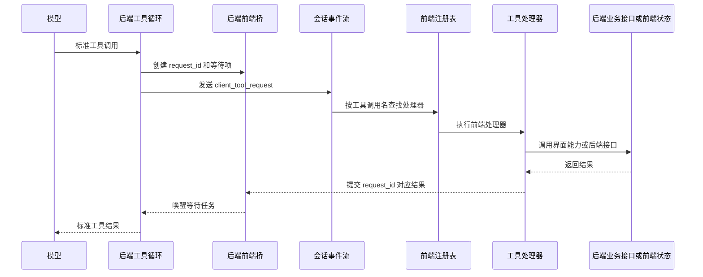

# 前端能力桥耦合审查与后续改进

> 审查日期：2026-08-17
>
> 落实日期：2026-08-18
>
> 文档性质：保留原始问题证据，并记录对应改进和验证结果。
> 关联文档：`07_工具系统与标准工具.md`、`09_前端能力桥与会话管理工具.md`。

## 一、审查目标

本次审查不是否定前端能力桥，也不是把所有 client 工具迁移到后端。真正目标是确认以下边界是否仍然成立：

1. 前端桥只负责传递和执行经过登记的前端能力，不解释具体工具业务；
2. 工具可以依赖稳定能力合同，但不应依赖某个 React 页面、Hook 或临时界面状态；
3. 软件不应按具体工具名称写特殊逻辑；
4. 工具包、前端能力和后端等待过程必须能够在安装、升级、刷新、断线和多窗口场景下明确校验；
5. 多 AI 会话协作不能因为聊天面板是否挂载、当前打开哪个项目或页面刷新而失去正确性；
6. 并发、超时、取消、重放和结果回填属于通用执行合同，不能由某个工具名称触发隐藏策略。

下文“当前实现”保留 2026-08-17 审查时的现场，便于追溯问题来源；实际状态以本节落实表为准。

## 一点一、落实结果

| 原问题 | 落实结果 |
| --- | --- |
| 工具包与前端处理器只靠名称暗配 | client 工具必须声明前端能力名称和最小版本；前端随模型请求上报能力清单，不兼容工具不会注入模型。 |
| 会话工具混入页面刷新和当前项目回退 | 删除刷新回调和当前可见项目业务回退；项目归属来自调用请求，数据变化走统一项目事件。显示会话仍保留为明确的界面能力。 |
| 后台会话运行反向依赖聊天面板内部文件 | 请求构建、运行参数和流副作用已提取到独立 `conversation-runtime` 边界，聊天面板和会话工具共同使用。 |
| 停止父会话后前端工具仍长期等待 | 后端在停止运行前发布标准取消事件；前端按 request_id 释放等待。已经开始的动作不被伪装成已回滚，子会话后台运行仍可继续。 |
| 防重复只覆盖单个前端进程 | 增加后端原子领取；同一 request_id 在多个窗口中只有一个执行者。 |
| 聊天流硬编码主题工具名称 | 工具返回受限的通用资源失效通知，聊天流只理解资源类别，不理解工具名和动作。 |
| 来源信息污染用户正文 | 来源改为结构化消息元数据；原始用户正文保持原样，模型上下文由统一组装层注入稳定来源标记。 |
| project_id 缺失时猜当前项目 | 项目内 client 请求缺少项目身份时直接失败，不再猜测。 |
| 编辑器工具依赖整个 Hook 和固定两帧等待 | 改为小型编辑器标签能力接口；状态引用与状态提交同步更新，不再猜渲染帧数。 |
| 工具依赖只写在提示文字中 | 删除不必要的前置工具编排要求；目标工具自行读取和校验所需状态。 |
| 个体工具固定减 5 秒 | 删除固定时间差；等待与工具清单声明的生命周期一致。 |

当前合同仍坚持一条明确边界：停止调用会话意味着停止等待和停止接收结果，不等于回滚已经发生的文件、界面或子会话动作。系统会明确记录取消，不制造“动作已撤销”的假象。

## 二、当前实际链路

当前 client 工具调用链如下：



当前共有三个 `runtime.type = client` 的工具：

| 工具 | 当前职责 | 是否真正依赖前端实时状态 |
| --- | --- | --- |
| `editor_tabs_manager` | 列出、打开、聚焦和关闭编辑器标签 | 是 |
| `manage_ai_conversations` | 查询、创建、配置、停止、删除、显示会话和查询模型 | 只有显示会话及部分界面反馈真正依赖前端 |
| `interact_ai_conversation` | 向目标会话发送消息、启动或续接后台运行、等待回复 | 当前实现依赖前端运行注册表和聊天面板事件处理 |

## 三、健康且应保留的设计

### 3.1 通用注册表没有按工具名称写分支

`clientToolBridge.ts` 使用显式注册表把名称映射到处理器。注册时检查空名称、首尾空白和重复所有权，执行时对未注册名称返回稳定错误。注册顺序不会改变执行结果。

这部分边界清楚，可以保留。问题不在 `Map` 或按名称分派本身，而在工具包与编译进前端的能力之间缺少安装前校验和版本合同。

### 3.2 后端请求和结果使用唯一 request_id

后端为每次 client 工具调用生成唯一请求 ID，只接受一次结果。未知、过期、已经提交或已经结束的请求不会再次接收结果。

### 3.3 单窗口内的重放不会重复执行

前端 `ClientToolRequestSingleFlight` 按 `request_id` 保存执行 Promise 和结果。SSE 断线重放同一请求时，会复用原执行或已完成结果；提交失败可以重试提交，但不会在同一个前端进程里再次执行工具。

### 3.4 连接恢复只重放仍待处理的 client 请求

后端会在会话流重连时检查对应 request_id 是否仍然存在、尚未提交且 Future 尚未结束。已经完成的请求不会再次进入重放事件。

### 3.5 并行 client 请求可以先全部派发

工具执行层能够为允许并发的 client 工具先建立多个请求，再分别等待结果，不必创建一个、等待一个、再创建下一个。该能力属于通用调度合同，不依赖某个会话工具名称。

## 四、主要耦合问题

## 4.1 工具包与前端处理器只靠名称暗中配对

### 当前实现

后端读取工具 `.tool/tool.json` 中的 `runtime.type = client`，并把工具调用名发送给前端。前端再用同名字符串查找本地处理器。

当前不存在以下校验：

- 工具需要哪项前端能力；
- 当前前端是否提供该能力；
- 能力合同版本是否兼容；
- 市场安装的 client 工具能否由当前软件版本执行；
- 工具改名后是否仍能找到原处理器。

### 影响

client 工具包在目录和在线市场中看起来可以独立安装，实际上仍要求相应处理器已经编译进前端。缺少处理器时，工具仍可能进入注册表并注入模型，直到真正调用才返回“前端未注册客户端工具”。

这不是普通的运行失败，而是安装合同缺失：用户和模型在调用前都不知道工具不可执行。

### 建议方向

不必取消稳定调用名，但需要为 client 工具增加明确的前端能力合同，例如：

- `required_client_capability`；
- `capability_version` 或最小版本；
- 当前前端启动后登记的能力清单；
- 工具扫描或启用时进行兼容性校验；
- 不满足能力要求的工具不进入可调用集合，并在工具看板明确显示原因。

不要为每个工具在后端写 `if tool_name == ...`。兼容判断应只理解通用能力字段。

### 验收标准

1. 安装一个前端不支持的 client 工具时，启用阶段即可发现；
2. 工具不会在不可执行时注入模型；
3. 错误中明确指出缺少的能力和版本；
4. 前端处理器改名或升级不会依靠静默字符串约定。

## 4.2 会话管理工具混合业务动作和界面动作

### 当前实现

`conversationManagementClientTool.ts` 同时处理：

- 查询模型；
- 列出和读取会话；
- 创建、配置、停止和删除会话；
- 自动命名父会话；
- 在聊天面板显示会话；
- 通知列表刷新和更新当前界面状态。

其中只有“显示某个会话”必须操作当前前端界面。其余动作虽然复用了前端现有 API 服务，但本质上是项目会话业务。

### 影响

会话业务的可用性被绑定到聊天面板生命周期：

- client 工具注册发生在 `ChatPanelController` 相关 Hook 中；
- 处理器读取当前前端项目作为缺失 project_id 时的回退；
- 业务完成后同时触发全局事件和页面刷新回调；
- 页面卸载、重建或未挂载时，核心会话能力可能无法执行或无法返回。

需要强调：问题不是“前端不能调用后端接口”，也不是要给 AI 另建一套私有会话体系。问题是同一个文件和同一个 client 工具同时承担业务合同、界面选择和 React 刷新职责。

### 建议方向

保留人与 AI 使用同一套会话服务和业务规则，但拆开能力边界：

1. 会话查询、创建、配置、停止、删除和消息提交继续调用同一套应用服务接口；
2. 这些动作不依赖 ChatPanel 是否挂载，也不读取当前可见项目作为业务事实；
3. `show_session`、聚焦面板等纯界面动作保留为 client 能力；
4. 数据变化通过统一项目数据变更事件驱动界面更新，不由会话工具保存 React 回调；
5. “不能删除或停止调用自身”等业务不变量必须由应用服务保证，前端可以提前提示，但不能成为唯一防线。

这不会形成“人走前端、AI 走私有后端”的两套规则。两者仍调用同一个会话应用服务，只是 AI 工具不再依赖某个页面组件才能调用它。

## 4.3 多 AI 后台运行反向依赖聊天面板实现

### 当前实现

`features/client-tools/model/conversationBackgroundRun.ts` 直接导入：

- `features/ai-panel/model/conversationRunRequest`；
- `features/ai-panel/model/chatStreamEventSideEffects`。

它还维护模块级单例 `ConversationBackgroundRunRegistry`，负责：

- 构建目标会话请求；
- 启动或恢复会话流；
- 处理目标会话产生的嵌套 client 工具；
- 跟踪浏览器内的活动运行；
- 结束后读取精确持久化轮次；
- 触发界面状态和用量刷新。

### 影响

形成了职责上的环：

```text
client 工具
  -> 聊天面板请求构建
  -> 会话运行流
  -> 聊天流副作用处理
  -> 再执行 client 工具
```

它未必形成 TypeScript 直接循环引用，但已经让多 AI 核心调度依赖聊天面板内部实现。聊天面板重构、页面卸载、前端刷新或多窗口运行都会影响后台协作行为。

### 建议方向

提取独立的“会话运行客户端”边界，负责：

- 从稳定会话配置构建请求；
- 启动、恢复和停止运行；
- 处理流事件；
- 返回稳定运行终态；
- 把 client 工具请求交给通用前端桥。

聊天面板和 AI 会话交互工具都依赖这项能力，而不是 client-tools 反向导入 ai-panel。界面只订阅状态和消息，不拥有运行事实。

## 4.4 取消只结束后端等待，不能取消已经开始的前端动作

### 当前实现

当用户停止当前会话时，后端取消工具循环。等待 client 工具结果的协程退出，并从后端待处理表中删除 request_id。

但桥中没有从后端到前端的取消通知，也没有传给处理器的 `AbortSignal`。前端已经开始的动作仍会继续，完成后再提交结果；此时后端只会返回该请求已经关闭。

对于 `interact_ai_conversation`，父会话停止等待但目标子会话继续运行可能是正确语义。对于创建、删除、打开文件或未来带外部副作用的 client 工具，这种默认行为未必正确。

### 风险

- 用户看到工具已取消，但实际动作稍后仍发生；
- 结果被拒收，调用历史里缺少动作真实终态；
- 工具作者无法声明“随调用者取消”或“启动后独立运行”；
- 不同工具只能依靠内部偶然行为决定取消结果。

### 建议方向

建立通用生命周期语义，而不是按工具名特殊判断：

- 后端请求关闭时可向执行端发送取消事件；
- 前端执行器收到标准 `AbortSignal`；
- 能安全取消的 UI 请求、等待和网络请求立即停止；
- “一旦启动便独立运行”的动作通过稳定合同明确声明或返回已接管的运行标识；
- 调用历史区分“执行被取消”“只停止等待”“动作已转为后台运行”。

具体默认策略需要单独确定，本文不把尚未决定的值写成正式默认配置。

## 4.5 防重复机制只覆盖单个前端进程

### 当前实现

`ClientToolRequestSingleFlight` 是浏览器窗口中的模块级内存对象。它能保证同一窗口中一个 request_id 只执行一次，但刷新后记录会消失，不同窗口也不共享。

后端只保证同一 request_id 的结果被接受一次，不保证副作用只发生一次。

### 可能场景

如果两个前端连接都订阅同一运行，二者都可能收到仍在等待的 client 请求：

1. 两个窗口分别执行创建、删除或打开动作；
2. 第一个结果被后端接受；
3. 第二个结果被拒绝；
4. 但第二次副作用可能已经发生。

这是依据当前进程内单飞和后端一次接收机制作出的风险推断，当前常规单窗口流程不一定触发，但架构上没有阻止它。

### 建议方向

可采用通用执行领取机制：

- 前端先用 request_id 向后端领取执行权；
- 同一请求只有一个前端实例取得有效租约；
- 其他实例只负责观察或等待结果；
- 变更型后端接口同时接收幂等键，在执行层之外再防止重复副作用；
- 刷新后可以凭 request_id 恢复结果提交，而不是重新开始不可逆动作。

## 4.6 聊天流按 `theme_designer` 工具名执行特殊刷新

### 当前实现

`chatStreamEventSideEffects.ts` 写死以下内容：

- `theme_designer`；
- `execute_dynamic_tool`；
- 主题工具的 `derive_palette`、`edit`、`switch`、`restore` 动作；
- 主题工具结果内部的数据结构。

聊天流收到普通工具结果后，会解析具体工具名和参数，然后请求前端刷新主题。

### 影响

这是最直接的软件层与工具个体耦合：

- 主题工具改名或改变返回结构时必须修改聊天面板；
- 动态加载和标准加载路径各要解析一次；
- 删除主题工具后，聊天面板仍保留其知识；
- 以后每出现一种需要刷新界面的工具，都可能继续往这里增加名称和动作分支。

这与 `07_工具系统与标准工具.md` 中“后端和聊天层不按具体工具名解释业务结果”的规则不一致。

### 建议方向

优先考虑两种通用方式：

1. 主题文件或主题仓库自身产生版本变更事件，界面订阅资源变化，与谁修改它无关；
2. 工具结果允许返回受白名单约束的通用资源失效通知，例如“主题资源已更新”，前端只理解资源类别和变更范围，不理解具体工具名。

不能把工具返回任意事件直接当作前端命令执行，否则会把工具结果变成新的无边界前端遥控入口。

## 4.7 来源会话信息被写入用户正文

### 当前实现

`interact_ai_conversation` 会在实际用户消息末尾追加中文文字：

```text
本条消息来源会话名称：...
本条消息来源会话 ID：...
```

### 影响

- 机器关系信息污染用户正文；
- 改变模型缓存前缀和 token 使用；
- 来源字段只能依赖中文自然语言被模型理解；
- 用户查看原始消息时无法区分用户任务和系统附加信息；
- 后续修改文案可能改变 AI 协作行为；
- 结构化检索需要重新解析自然语言。

### 建议方向

来源关系应作为结构化消息元数据保存，例如来源项目、来源会话、来源工具请求和委派关系。模型上下文组装层再按稳定格式注入必要信息，界面也可单独展示来源，不修改原始用户正文。

具体字段名和迁移方式需要结合会话消息合同另行设计，本文不把示意名称当作已确定 Schema。

## 4.8 project_id 缺失时回退到当前界面项目

### 当前实现

三个 client 工具均存在类似逻辑：请求没有项目 ID 时，使用当前前端打开的项目。

正常情况下，后端创建 client 请求时已经附带工具调用所属项目。因此回退主要会掩盖上游合同错误。

### 风险

当项目切换、旧事件重放或调用上下文错误时，工具可能把“缺少明确项目”转换成“操作当前可见项目”。对于标签操作尚可能被用户察觉，对于创建、删除和配置会话则风险更高。

### 建议方向

- 项目内工具请求必须携带 project_id；
- 缺失时明确失败，不猜当前项目；
- 只有明确设计为全局操作的工具可以不带项目；
- 当前可见项目只用于纯 UI 动作的显示约束，不能作为业务归属事实。

## 4.9 编辑器标签工具依赖 Hook 内部结构和渲染时序

### 当前实现

`editorTabsClientTool.ts` 的能力参数直接使用 `ReturnType<typeof useDocumentTabs>`。执行完成后等待两次 `requestAnimationFrame`，再读取界面状态验证结果。

当前项目和后台项目又走两条实现：

- 当前项目直接操作 React 标签状态；
- 非当前项目调用后端工作区标签接口，再拼装成前端 `DocumentTab` 结果。

### 影响

- `useDocumentTabs` 返回结构变化会直接影响工具；
- 两帧等待只是渲染时序猜测，不是动作完成合同；
- 前台和后台路径可能返回不同字段或不同状态；
- 后端工作区状态与前端标签展示模型存在重复适配。

### 建议方向

定义一个小而稳定的编辑器标签能力接口，只暴露工具真正需要的动作和序列化结果。React Hook、后台工作区接口分别作为适配器实现它。动作 Promise 应在状态提交完成时结束，不依赖固定帧数。

同时为前台和后台路径增加同一组合同测试，保证相同输入获得语义一致的输出。

## 4.10 工具间依赖只写在说明文字中

### 当前实现

`interact_ai_conversation` 的说明要求先调用 `manage_ai_conversations` 检查状态，目标运行时还要求调用 `wait`；`manage_ai_conversations` 又在说明中引导调用交互工具。

但这种依赖只存在于描述和案例中，工具包没有可校验的工具依赖合同。

### 影响

- 相关工具被禁用、删除或版本不兼容时仍会向模型注入无法完成的流程；
- 在线市场可以单独更新其中一个工具，使说明与真实能力不一致；
- 模型只能通过文字猜测缺少哪项能力。

### 建议方向

先判断这些依赖是否真的必要。能够由目标工具自身检查的状态，不要要求模型额外编排。仍然必须存在的工具依赖，应进入通用依赖合同并在启用阶段校验，而不是只写在自然语言说明中。

## 4.11 隐藏的时间耦合

`interact_ai_conversation` 等待目标回复时，会用工具超时时间减去固定 5 秒，提前返回 `still_running`，为结果提交预留时间。

这个做法能降低“目标刚完成但工具结果来不及提交”的概率，但它是未在合同中说明的时间策略，并把后端工具超时、前端等待时间和结果提交时间绑在一起。

后续应由通用桥明确区分：

- 工具请求总生命周期；
- 前端动作执行截止；
- 结果提交截止；
- 已转后台运行后的返回语义。

不应由个体工具减去固定秒数自行协调。

## 五、必要依赖与不合理耦合的界线

不是所有前端依赖都应消除。

### 合理且必要

- 打开、聚焦和关闭当前编辑器标签；
- 在当前窗口显示指定会话；
- 读取真实可见标签和未保存状态；
- 将经过白名单登记的前端能力执行结果回填给后端；
- 断线后恢复仍未完成的 client 请求。

### 不应存在

- 聊天流知道 `theme_designer` 的名称、动作和返回结构；
- client 工具直接依赖整个 React Hook 返回类型；
- 会话归属缺失时猜测当前打开项目；
- 来源关系写成用户正文；
- 安装 client 工具时不校验前端是否有对应能力；
- 核心会话运行只能在聊天面板 Hook 中注册和维护；
- 通用取消和超时依靠个体工具内部固定秒数协调；
- 工具依赖只存在于提示文字中。

## 六、建议改进顺序

### 第一阶段：先补合同，不改变现有功能路径

1. 为 client 工具增加前端能力和版本校验；
2. 启动或启用时发现处理器缺失，不再等到调用时失败；
3. 项目内 client 请求缺少 project_id 时明确失败；
4. 移除聊天流对 `theme_designer` 的个体名称识别，改为通用资源刷新机制；
5. 为三个 client 工具建立前端能力合同测试，特别补齐编辑器标签工具测试。

### 第二阶段：拆分会话业务和界面动作

1. 提取独立会话运行客户端；
2. 让聊天面板和会话交互工具共享它；
3. 将 `show_session` 与会话数据操作拆开；
4. 清除处理器对 ChatPanel 刷新回调和当前项目回退的依赖；
5. 保证人与 AI 仍调用同一会话应用服务。

### 第三阶段：完善生命周期与多实例正确性

1. 增加通用取消通知或执行状态合同；
2. 区分取消执行、停止等待和转为后台运行；
3. 增加前端实例执行领取机制；
4. 为变更动作增加跨刷新、跨窗口幂等保护；
5. 将来源会话改为结构化消息元数据。

## 七、验证要求

后续实施时至少覆盖：

### 能力兼容

- 安装一个前端不支持的 client 工具；
- 工具能力版本过高；
- 处理器重复注册；
- 工具改名但能力不变；
- 工具可用性发生变化后模型注入同步更新。

### 重放与多实例

- 同一窗口收到相同 request_id 多次；
- 提交暂时失败后重新提交；
- 页面刷新后恢复请求；
- 两个窗口同时订阅一个会话；
- 两个窗口同时收到有副作用的 client 请求；
- 后端已经关闭请求后前端才完成动作。

### 取消与超时

- 执行前取消；
- 执行中取消；
- 只停止等待但保持目标会话后台运行；
- 前端动作完成但结果提交超时；
- 用户停止父会话时，子会话继续运行的结果可追踪；
- 不允许后台继续的动作收到取消后确实停止。

### 项目和界面状态

- 工具执行期间切换项目；
- 调用请求缺少 project_id；
- 目标项目未打开；
- ChatPanel 卸载和重新挂载；
- 前台、后台标签操作返回一致结果；
- 未保存标签不会因重放被重复关闭。

### 个体工具解耦

- 删除或改名主题工具后聊天流无需修改；
- 新增一种需要资源刷新的工具时无需在聊天面板增加工具名判断；
- 禁用 `manage_ai_conversations` 后，交互工具给出安装或依赖层面的明确状态，而不是让模型靠文字绕路。

## 八、本次审查验证记录

已运行以下前端定向测试：

```text
client-tool-bridge.test.mjs
client-tool-request-single-flight.test.mjs
client-tool-stream-side-effects.test.mjs
conversation-management-client-tool-registration.test.mjs
conversation-interaction-client-tool-registration.test.mjs
```

合计 29 项通过，证明当前注册、单窗口单飞、结果重提、会话发送精确续接和部分会话管理行为符合现有实现。

后端已有 client 请求重放、并发提交、取消等待和并行派发相关测试，但当前嵌入式 Python 环境未安装 `pytest`，本次未重新执行这些后端测试。本文关于后端行为的结论来自代码审查和现有测试内容，不把未运行的测试写成已经通过。

## 九、实现证据索引

- 后端 client 工具识别与准备：`1_PythonServer/app/services/tools/tool_execution.py`
- 后端请求等待与结果提交：`1_PythonServer/app/services/tools/client_tool_bridge.py`
- 工具循环中的 client 请求派发：`1_PythonServer/app/services/project/conversation_tool_loop.py`
- 会话流重放判断：`1_PythonServer/app/services/project/conversation_run_manager.py`
- 前端通用注册表：`2_ReactWeb/src/features/client-tools/model/clientToolBridge.ts`
- 前端单窗口单飞：`2_ReactWeb/src/features/client-tools/model/clientToolRequestSingleFlight.ts`
- 聊天面板注册组合：`2_ReactWeb/src/features/ai-panel/model/useChatPanelClientToolRegistry.ts`
- 聊天流副作用和主题工具特殊判断：`2_ReactWeb/src/features/ai-panel/model/chatStreamEventSideEffects.ts`
- 会话管理工具：`2_ReactWeb/src/features/client-tools/model/conversationManagementClientTool.ts`
- 会话交互工具：`2_ReactWeb/src/features/client-tools/model/conversationInteractionClientTool.ts`
- 前端后台会话运行注册表：`2_ReactWeb/src/features/client-tools/model/conversationBackgroundRun.ts`
- 编辑器标签工具：`2_ReactWeb/src/features/client-tools/model/editorTabsClientTool.ts`
- 后台项目标签适配：`2_ReactWeb/src/features/client-tools/model/backgroundEditorTabsClientTool.ts`

## 十、落实结论

前端桥继续承担“把经过登记的产品能力接入标准工具循环”的单一职责，没有被改成任意界面遥控器，也没有为 AI 另造一套私有会话体系。

本次落实后的关键性质是：能力可在调用前校验、项目归属不猜测、跨窗口只有一个执行者、停止等待有明确事件、资源刷新不认识个体工具、原始用户正文不被系统元数据污染。会话运行公共逻辑也已离开聊天面板内部目录。

验证覆盖能力兼容、重复注册、并发领取、断线重放、取消等待、万条工具消息精确轮次、结构化来源、标签页状态和通用资源失效。后续新增 client 工具必须沿用能力合同与原子领取机制，不得重新引入工具名分支、页面当前状态回退或固定时间差。
